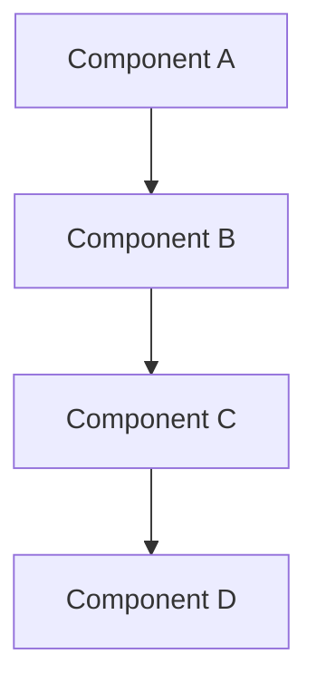
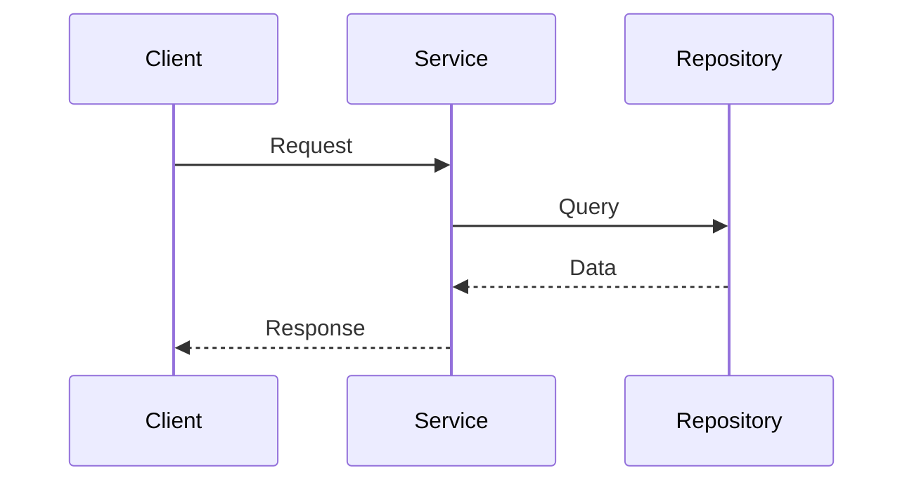

# Architecture Documentation Template

## Document Header
```markdown
<!-- filepath: d:\Users\Randy\Downloads\Git\analysis-toolkit\docs\architecture\<category>\<topic>.md -->
# <Topic Name> Architecture

**Document Version:** 1.0  
**Last Updated:** <YYYY-MM-DD>  
**Related Documents:** [Link to related architecture docs]
```

## 1. Overview

### Purpose
Brief description of what this architecture addresses and why it exists.

### Scope
- **In Scope:** What this document covers
- **Out of Scope:** What this document does not cover
- **Assumptions:** Key assumptions made in this architecture

### Key Stakeholders
- **Primary Users:** Developers working on this project
- **Maintainers:** Project lead

## 2. Problem Statement

### Business Context
Describe the business problem or requirement this architecture solves.

### Technical Challenges
- **Challenge 1:** Description and impact
- **Challenge 2:** Description and impact
- **Challenge 3:** Description and impact

### Constraints
- **Technical Constraints:** Platform, performance, compatibility requirements

## 3. Architecture Overview

### High-Level Design


### Core Principles
- **Principle 1:** Description and rationale
- **Principle 2:** Description and rationale
- **Principle 3:** Description and rationale

### Design Goals
- **Maintainability:** How the architecture supports long-term maintenance
- **Scalability:** How the architecture handles growth
- **Testability:** How the architecture enables effective testing
- **Performance:** Performance characteristics and targets

## 4. Detailed Design

### 4.1 Component Architecture

#### Component 1: [Name]
- **Purpose:** What this component does
- **Responsibilities:** Key responsibilities
- **Interfaces:** How other components interact with it
- **Dependencies:** What this component depends on

```python
# Example interface definition
from typing import Protocol

class ComponentProtocol(Protocol):
    def primary_method(self, param: str) -> Result:
        """Primary method description."""
        ...
```

#### Component 2: [Name]
[Similar structure as Component 1]

### 4.2 Data Flow



### 4.3 Key Patterns

#### Pattern 1: [Pattern Name]
- **Intent:** What problem this pattern solves
- **Structure:** How the pattern is organized
- **Implementation:** Code examples showing usage

```python
# AI-GEN: GitHub Copilot|2025-01-27|architecture-template|reviewed:no
class ExamplePattern:
    """Example implementation of the pattern."""
    
    def __init__(self, dependency: DependencyType) -> None:
        self._dependency = dependency
    
    def execute_pattern(self, input_data: InputType) -> OutputType:
        """Execute the pattern with given input."""
        # Pattern implementation
        return self._dependency.process(input_data)
# END AI-GEN
```

## 5. Implementation Guide

### 5.1 Directory Structure
```
src/kp_analysis_toolkit/
├── <category>/
│   ├── __init__.py
│   ├── models/
│   │   ├── __init__.py
│   │   └── <model_name>.py
│   ├── services/
│   │   ├── __init__.py
│   │   └── <service_name>.py
│   └── protocols/
│       ├── __init__.py
│       └── <protocol_name>.py
```

### 5.2 Key Files and Their Purposes

#### Models (`models/<model_name>.py`)
```python
# AI-GEN: GitHub Copilot|2025-01-27|architecture-template|reviewed:no
from pydantic import Field
from kp_analysis_toolkit.models.base import KPATBaseModel

class ExampleModel(KPATBaseModel):
    """Example data model following project conventions."""
    
    field_name: str = Field(
        description="Description of what this field represents"
    )
    optional_field: int | None = Field(
        default=None,
        description="Optional field with default value"
    )
# END AI-GEN
```

#### Services (`services/<service_name>.py`)
```python
# AI-GEN: GitHub Copilot|2025-01-27|architecture-template|reviewed:no
from typing import Protocol

class ServiceProtocol(Protocol):
    """Protocol defining service interface."""
    
    def primary_operation(self, input_data: InputType) -> OutputType:
        """Primary service operation."""
        ...

class DefaultService:
    """Default implementation of ServiceProtocol."""
    
    def __init__(self, dependency: DependencyType) -> None:
        self._dependency = dependency
    
    def primary_operation(self, input_data: InputType) -> OutputType:
        """Implementation of primary operation."""
        # Service logic here
        return self._dependency.process(input_data)
# END AI-GEN
```

### 5.3 Testing Strategy

#### Unit Testing
```python
# AI-GEN: GitHub Copilot|2025-01-27|architecture-template|reviewed:no
import pytest
from unittest.mock import MagicMock
from kp_analysis_toolkit.<category>.services.<service_name> import DefaultService

@pytest.mark.unit
class TestDefaultService:
    """Unit tests for DefaultService."""
    
    def test_primary_operation_success(self) -> None:
        """Test successful execution of primary operation."""
        # Arrange
        mock_dependency = MagicMock()
        service = DefaultService(mock_dependency)
        
        # Act
        result = service.primary_operation("test_input")
        
        # Assert
        assert result is not None
        mock_dependency.process.assert_called_once_with("test_input")
# END AI-GEN
```

#### Integration Testing
```python
# AI-GEN: GitHub Copilot|2025-01-27|architecture-template|reviewed:no
@pytest.mark.integration
class TestServiceIntegration:
    """Integration tests for service with real dependencies."""
    
    def test_end_to_end_workflow(self) -> None:
        """Test complete workflow with real dependencies."""
        # Integration test implementation
        pass
# END AI-GEN
```

## 6. Configuration and Dependencies

### 6.1 Dependency Injection Setup
```python
# AI-GEN: GitHub Copilot|2025-01-27|architecture-template|reviewed:no
from dependency_injector import containers, providers
from kp_analysis_toolkit.<category>.services.<service_name> import DefaultService

class Container(containers.DeclarativeContainer):
    """DI container for <category> services."""
    
    service = providers.Factory(
        DefaultService,
        dependency=providers.Dependency()
    )
# END AI-GEN
```

### 6.2 Configuration Models
```python
# AI-GEN: GitHub Copilot|2025-01-27|architecture-template|reviewed:no
from pydantic import Field
from kp_analysis_toolkit.models.base import KPATBaseModel

class ComponentConfig(KPATBaseModel):
    """Configuration model for component settings."""
    
    setting_name: str = Field(
        default="default_value",
        description="Description of configuration setting"
    )
    numeric_setting: int = Field(
        default=100,
        ge=1,
        le=1000,
        description="Numeric setting with validation"
    )
# END AI-GEN
```

### 7.1 Glossary
- **Term 1:** Definition
- **Term 2:** Definition

### 7.2 References
- [Reference 1]: Description and link
- [Reference 2]: Description and link

### 7.3 Decision Log
| Date | Decision | Rationale | Impact |
|------|----------|-----------|---------|
| YYYY-MM-DD | Decision made | Why this decision | What changed |

### 7.4 Review History
| Version | Date | Author | Changes |
|---------|------|--------|---------|
| 1.0 | YYYY-MM-DD | Author Name | Initial version |

---

<!-- END AI-GEN -->