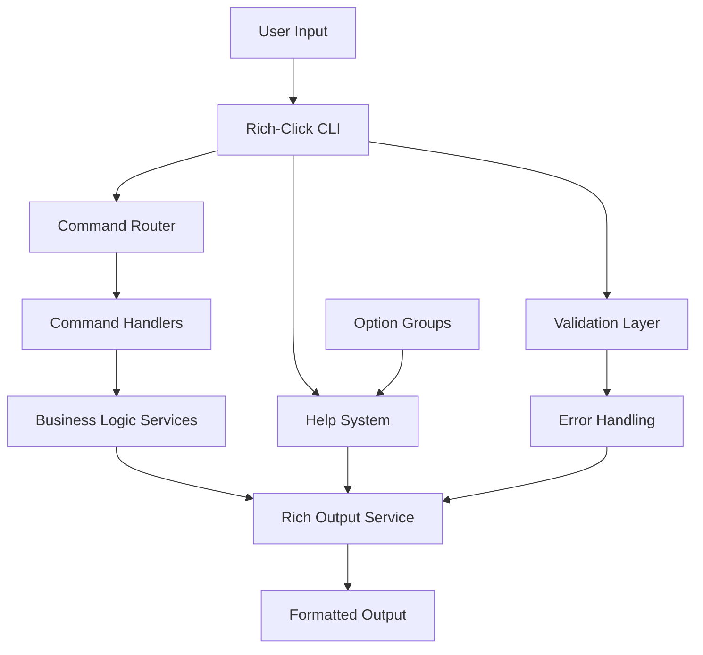
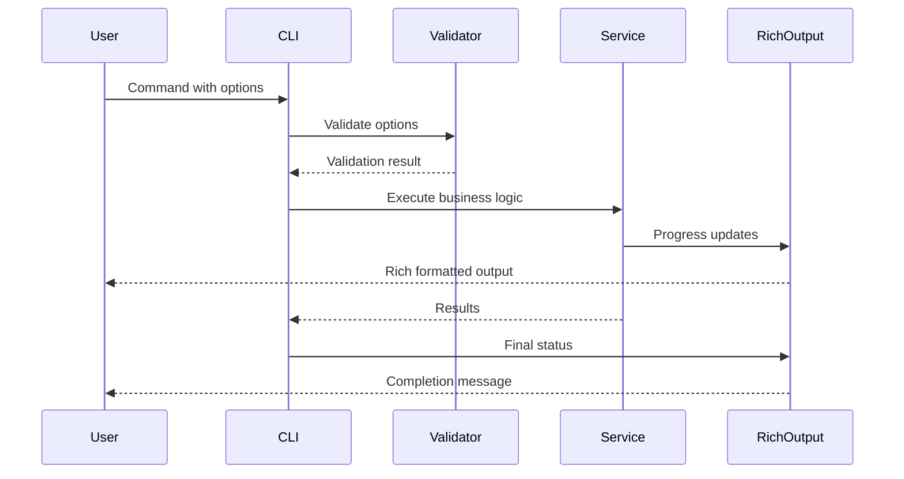

# CLI Architecture Patterns

**Document Version:** 1.0  
**Last Updated:** 2025-07-27  
**Status:** Draft  
**Stakeholders:** Development Team, Technical Lead, Product Owner  
**Related Documents:** [CLI Option Groups](cli-option-groups.md), [CLI Help System](cli-help-system.md)

## 1. Overview

### Purpose
This document describes the architectural patterns and design decisions for the Command Line Interface (CLI) of the KP Analysis Toolkit. The CLI serves as the primary user interaction layer, providing access to file processing, system analysis, and report generation capabilities.

### Scope

- **In Scope:** CLI command architecture, Rich-Click integration, help system design, option group patterns, dependency injection integration
- **Out of Scope:** Individual command business logic, file processing algorithms, Excel export details
- **Assumptions:** Users interact primarily through command-line interface, Rich output formatting is preferred over plain text

### Key Stakeholders

- **Primary Users:** Security analysts, system administrators, compliance auditors
- **Secondary Users:** Automation scripts, CI/CD pipelines
- **Maintainers:** Development team responsible for CLI consistency and user experience

## 2. Problem Statement

### Business Context
The KP Analysis Toolkit processes large volumes of system audit data across Windows, Linux, and macOS platforms. Users need a consistent, intuitive command-line interface that provides clear feedback, organized help displays, and efficient workflow patterns for batch processing operations.

### Technical Challenges

- **Consistency Challenge:** Ensuring uniform option patterns across multiple commands
- **User Experience Challenge:** Providing clear, organized help displays with grouped options
- **Integration Challenge:** Seamlessly integrating Rich output formatting with Click command structure
- **Extensibility Challenge:** Supporting easy addition of new commands while maintaining consistency

### Constraints

- **Technical Constraints:** Must work with Click 8.x and Rich-Click 1.8.x, maintain backward compatibility
- **Business Constraints:** Minimize learning curve for existing users, support both interactive and automated usage

## 3. Architecture Overview

### High-Level Design



### Core Principles

- **Consistency:** All commands follow identical patterns for options, help display, and error handling
- **Rich Interaction:** Use Rich library for enhanced visual feedback and professional output formatting
- **Dependency Injection:** Leverage DI container (`core.services.rich_output`) for service access and testability
- **Extensibility:** Design allows easy addition of new commands with minimal boilerplate

### Design Goals

- **Maintainability:** Centralized patterns reduce code duplication and simplify updates
- **Scalability:** Architecture supports addition of multiple new commands without structural changes
- **Testability:** Clear separation between CLI layer and business logic enables isolated testing
- **Performance:** Efficient initialization and responsive user feedback for large dataset operations

**NOTE:** An unspoken design goal is that no business logic service layers should directly access the Rich Output system, but this is not yet enforced.  A future refactoring effort will require that service layers report their errors and other status through the UI layer (e.g. CLI), probably implementing one of the solutions identified in [UI Service Layer Separation](../ui-service-layer-separation.md).  For now, a best effort should be made to minimize direct interactions the service layer and the Rich Output service.

## 4. Detailed Design

### 4.1 Component Architecture

#### Component 1: Multi-Command CLI Group

- **Purpose:** Root command group that orchestrates all sub-commands
- **Responsibilities:** Initialize dependency injection, handle global options, route to sub-commands
- **Interfaces:** Click Group interface, Rich-Click configuration
- **Dependencies:** Application container, Rich output service

```python
@click.group(context_settings=CONTEXT_SETTINGS, invoke_without_command=True)
@click.option("--version", is_flag=True, callback=_version_callback)
@click.option("--skip-update-check", is_flag=True, help="Skip version update check")
@click.option("--quiet", "-q", is_flag=True, help="Suppress non-error output")
def cli(ctx: click.Context, *, skip_update_check: bool, quiet: bool) -> None:
    """Command line interface for the KP Analysis Toolkit."""
    # Initialize dependency injection and global configuration
    initialize_dependency_injection(quiet=quiet, verbose=False)
    
    # Handle version checking and help display
    if not skip_update_check:
        check_and_prompt_update()
    
    # Show enhanced help if no subcommand invoked
    if ctx.invoked_subcommand is None:
        console = container.core.rich_output()
        _show_enhanced_help(console)
```

#### Component 2: Rich-Click Integration Layer

- **Purpose:** Provides enhanced Click functionality with Rich formatting
- **Responsibilities:** Configure Rich-Click settings, manage option group display
- **Interfaces:** Rich-Click configuration, Click command decorators
- **Dependencies:** Rich library, Click framework

```python
# Rich-Click global configuration
click.rich_click.USE_RICH_MARKUP = True
click.rich_click.USE_MARKDOWN = True
click.rich_click.SHOW_ARGUMENTS = True
click.rich_click.GROUP_ARGUMENTS_OPTIONS = True
click.rich_click.STYLE_OPTION = "bold cyan"
click.rich_click.MAX_WIDTH = 100
```

#### Component 3: Command Pattern Implementation

- **Purpose:** Consistent structure for all CLI commands
- **Responsibilities:** Option definition, validation, business logic delegation
- **Interfaces:** Click command protocol, standard option decorators
- **Dependencies:** Common decorators, validation utilities, business services

```python
@custom_help_option("scripts")
@module_version_option(process_scripts_version, "scripts")
@start_directory_option("source_files_path", "./")
@output_directory_option("out_path", "results/")
@verbose_option("verbose")
@click.command(name="scripts")
def process_command_line(
    source_files_path: str,
    out_path: str,
    verbose: bool,
    # ... other parameters
) -> None:
    """Process collector script results and generate Excel reports."""
    # Command implementation delegates to business logic
```

### 4.2 Data Flow



### 4.3 Key Patterns

#### Pattern 1: Shared Option Decorators

- **Intent:** Eliminate code duplication and ensure consistency across commands
- **Structure:** Centralized decorator functions with configurable parameters
- **Implementation:** Common decorators in `cli.common.decorators` module

```python
def module_version_option(
    module_version: str,
    command_name: str,
) -> Callable[[Callable[..., Any]], Callable[..., Any]]:
    """Standard version option decorator for CLI commands."""
    return click.version_option(
        version=module_version,
        prog_name=f"kpat_cli {command_name}",
        message="%(prog)s version %(version)s",
    )

def start_directory_option(
    param_name: str = "source_files_path",
    default: str = "./",
    help_text: str = "Default: the current working directory (./). Specify the path to start searching for files.",
) -> Callable[[Callable[..., Any]], Callable[..., Any]]:
    """Standard start directory option for file processing commands."""
    return click.option(
        "--start-dir", "-d",
        param_name,
        default=default,
        help=help_text,
    )
```

#### Pattern 2: Custom Help System

- **Intent:** Work around Rich-Click limitations and provide grouped option display
- **Structure:** Custom help callbacks that intercept --help requests
- **Implementation:** Help formatting utilities in `cli.common.output_formatting`

```python
def custom_help_option(
    command_name: str,
) -> Callable[[Callable[..., Any]], Callable[..., Any]]:
    """Decorator that adds custom grouped help display to a command."""
    
    def help_callback(ctx: click.Context, _param: click.Parameter, value: bool) -> None:
        if not value or ctx.resilient_parsing:
            return
        
        from kp_analysis_toolkit.cli.common.output_formatting import display_grouped_help
        display_grouped_help(ctx, command_name)
        ctx.exit()

    def decorator(func: Callable[..., Any]) -> Callable[..., Any]:
        help_option = click.option(
            "--help", "-h",
            is_flag=True,
            expose_value=False,
            is_eager=True,
            callback=help_callback,
            help="Show this message and exit",
        )
        return help_option(func)

    return decorator
```

#### Pattern 3: Rich Output Service Integration

- **Intent:** Provide consistent, professional output formatting across all commands
- **Structure:** Dependency injection of Rich output service into command handlers
- **Implementation:** Service access through application container

```python
def display_grouped_help(ctx: click.Context, command_name: str) -> None:
    """Display help with option groups for a specific command."""
    console = container.core.rich_output()
    
    # Show command header with emoji and description
    console.header(f"🔧 {command_name} Command")
    
    # Display option groups as separate Rich panels
    option_groups = getattr(click.rich_click, "OPTION_GROUPS", {}).get(command_name, [])
    for group in option_groups:
        display_option_group_panel(console, ctx, group)
```

## 5. Implementation Guide

### 5.1 Directory Structure

```
src/kp_analysis_toolkit/cli/
├── __init__.py                 # Main CLI entry point
├── main.py                     # Multi-command group definition
├── common/
│   ├── __init__.py            # Common utilities exports
│   ├── decorators.py          # Shared option decorators
│   ├── option_groups.py       # Option grouping configurations
│   ├── output_formatting.py   # Rich output formatting utilities
│   ├── config_validation.py   # Input validation and error handling
│   ├── file_selection.py      # File discovery and selection
│   └── progress.py            # Progress tracking displays
├── commands/
│   ├── __init__.py            # Command registration
│   ├── scripts.py             # Process scripts command
│   ├── nipper.py              # Nipper CSV processing command
│   └── rtf_to_text.py         # RTF conversion command
└── utils/
    ├── path_helpers.py         # Path manipulation utilities
    ├── system_utils.py         # System information gathering
    └── table_layouts.py        # Rich table layout definitions
```

### 5.2 Key Files and Their Purposes

#### Main CLI Entry (`main.py`)

```python
# Multi-command CLI group with global configuration
@click.group(context_settings=CONTEXT_SETTINGS, invoke_without_command=True)
@click.option("--version", is_flag=True, callback=_version_callback)
@click.option("--skip-update-check", is_flag=True)
@click.option("--quiet", "-q", is_flag=True)
def cli(ctx: click.Context, *, skip_update_check: bool, quiet: bool) -> None:
    """Command line interface for the KP Analysis Toolkit."""
    initialize_dependency_injection(quiet=quiet, verbose=False)
    
    if not skip_update_check:
        check_and_prompt_update()
    
    if ctx.invoked_subcommand is None:
        console = container.core.rich_output()
        _show_enhanced_help(console)
```

#### Command Implementation (`commands/<command>.py`)
```python
# Standard command structure with decorators
@custom_help_option("scripts")
@module_version_option(process_scripts_version, "scripts")
@start_directory_option("source_files_path", "./")
@output_directory_option("out_path", "results/")
@verbose_option("verbose")
@click.command(name="scripts")
def process_command_line(
    source_files_path: str,
    out_path: str,
    verbose: bool,
    # Additional parameters...
) -> None:
    """Process collector script results and generate Excel reports."""
    try:
        # Validate configuration
        program_config = validate_program_config(
            source_files_path=source_files_path,
            out_path=out_path,
            verbose=verbose,
        )
        
        # Execute business logic
        results = process_systems(program_config)
        
        # Display results using Rich output
        console = container.core.rich_output()
        console.success(f"Processing completed: {len(results)} systems processed")
        
    except Exception as e:
        handle_fatal_error(e, error_prefix="Scripts Processing Error")
```

### 5.3 Testing Strategy

#### Unit Testing

```python
import pytest
from click.testing import CliRunner
from kp_analysis_toolkit.cli.main import cli

@pytest.mark.unit
class TestCLICommands:
    """Unit tests for CLI command structure."""
    
    def test_help_display(self) -> None:
        """Test that help displays correctly."""
        runner = CliRunner()
        result = runner.invoke(cli, ["--help"])
        
        assert result.exit_code == 0
        assert "Available Commands" in result.output
    
    def test_command_validation(self) -> None:
        """Test command option validation."""
        runner = CliRunner()
        result = runner.invoke(cli, ["scripts", "--invalid-option"])
        
        assert result.exit_code != 0
        assert "No such option" in result.output
```

#### Integration Testing

```python
@pytest.mark.integration
class TestCLIIntegration:
    """Integration tests for CLI with real dependencies."""
    
    def test_full_command_workflow(self, tmp_path: Path) -> None:
        """Test complete command execution workflow."""
        # Setup test data
        test_file = tmp_path / "test_data.txt"
        test_file.write_text("test content")
        
        # Execute command
        runner = CliRunner()
        result = runner.invoke(cli, [
            "scripts",
            "--start-dir", str(tmp_path),
            "--out-path", str(tmp_path / "results"),
        ])
        
        # Verify results
        assert result.exit_code == 0
        assert (tmp_path / "results").exists()
```

## 6. Configuration and Dependencies

### 6.1 Dependency Injection Setup

Rich Output is provided as a singleton service to minimize state management issues, especially as future requirements for concurrency are implemented.

```python
# Application container configuration for CLI services
from dependency_injector import containers, providers
from kp_analysis_toolkit.core.services.rich_output import RichOutputService

class ApplicationContainer(containers.DeclarativeContainer):
    """Application container for CLI dependencies."""
    
    # Core configuration
    config = providers.Configuration()
    
    # Rich output service (singleton)
    rich_output = providers.Singleton(
        RichOutputService,
        quiet=config.quiet,
        verbose=config.verbose,
        console_width=config.console_width,
    )
```

### 6.2 Rich-Click Configuration
```python
# Global Rich-Click settings
click.rich_click.USE_RICH_MARKUP = True
click.rich_click.USE_MARKDOWN = True
click.rich_click.SHOW_ARGUMENTS = True
click.rich_click.GROUP_ARGUMENTS_OPTIONS = True
click.rich_click.STYLE_ERRORS_SUGGESTION = "magenta italic"
click.rich_click.STYLE_OPTION = "bold cyan"
click.rich_click.STYLE_COMMAND = "bold cyan"
click.rich_click.MAX_WIDTH = 100

# Context settings for consistent behavior
CONTEXT_SETTINGS: dict[str, Any] = {
    "max_content_width": 120,
    "terminal_width": 120,
}
```

## 7. Quality Attributes

### 7.1 Performance

- **Throughput:** CLI initialization under 500ms, command parsing under 100ms
- **Latency:** Help display under 200ms, error feedback immediate
- **Resource Usage:** Minimal memory overhead for CLI layer, efficient Rich rendering

### 7.2 Reliability

- **Availability:** CLI available whenever Python environment is functional
- **Error Handling:** Graceful handling of invalid inputs with clear error messages
- **Recovery:** Failed commands don't affect CLI state, immediate retry capability

### 7.3 Security

- **Authentication:** No authentication required for CLI usage
- **Authorization:** File system permissions control access to input/output paths
- **Data Protection:** No sensitive data stored in CLI layer, secure path validation

### 7.4 Maintainability

- **Code Organization:** Clear separation between CLI layer and business logic
- **Documentation:** Self-documenting help system with consistent patterns
- **Testing:** Isolated unit tests for CLI layer, integration tests for workflows

## 8. Appendices

### 8.1 Glossary
- **Rich-Click:** Enhanced Click library with Rich formatting support
- **Option Groups:** Logical grouping of related command-line options
- **Command Pattern:** Consistent structure for CLI command implementation
- **Dependency Injection:** Service provision pattern for loose coupling

### 8.2 References
- [Rich-Click Documentation](https://github.com/ewels/rich-click)
- [Click Documentation](https://click.palletsprojects.com/)
- [Rich Library Documentation](https://rich.readthedocs.io/)
- [CLI Option Groups Implementation](cli-option-groups.md)

### 8.3 Decision Log
| Date | Decision | Rationale | Impact |
|------|----------|-----------|---------|
| 2025-05-01 | Use Rich-Click for CLI | Enhanced user experience with professional formatting | All commands use Rich output |
| 2025-05-01 | Isolate all user interaction into CLI | Allows for easier implementation of alternate user interfaces | This is not yet 100%.  Some user status messages are still implemented in the service layer, but these will be replaced in a future effort. |
| 2025-07-27 | Implement custom help system | Work around Rich-Click multi-command limitation | Option groups display correctly |
| 2025-07-27 | Centralize option decorators | Reduce duplication and ensure consistency | Easier maintenance and updates |

### 10.4 Review History
| Version | Date | Author | Changes |
|---------|------|--------|---------|
| 1.0 | 2025-07-27 | GitHub Copilot | Initial architecture documentation |

