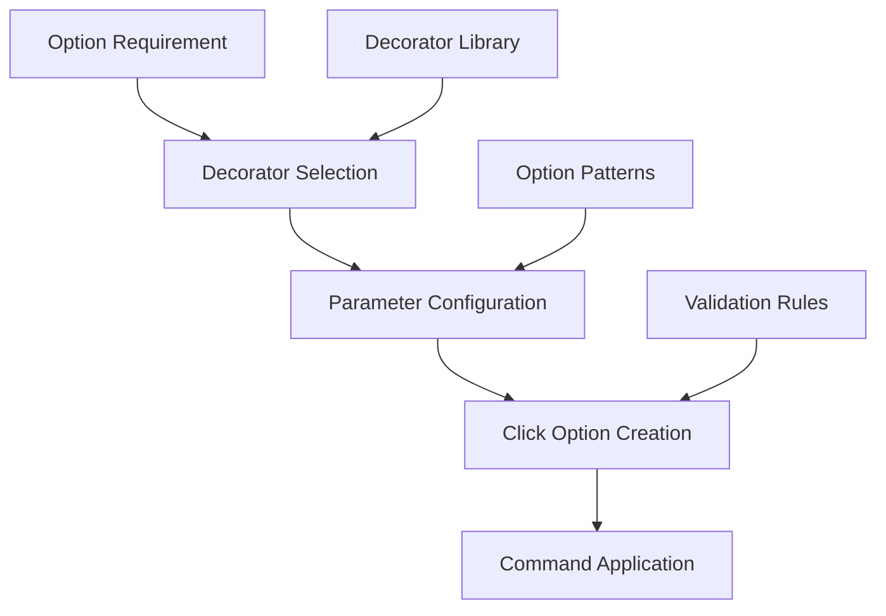

# CLI Decorator Patterns Architecture

**Document Version:** 1.0  
**Last Updated:** 2025-07-27  
**Status:** Draft  
**Stakeholders:** Development Team, Technical Lead, Product Owner  
**Related Documents:** [CLI Architecture Patterns](cli-architecture-patterns.md), [CLI Help System](cli-help-system.md)

## 1. Overview

### Purpose
This document describes the decorator patterns used for CLI option standardization in the KP Analysis Toolkit. The system provides reusable, consistent option definitions across all CLI commands.

### Scope

- **In Scope:** Shared option decorators, decorator composition patterns, option standardization
- **Out of Scope:** Individual command implementation, business logic, help system details
- **Assumptions:** Options should be consistent across commands, decorators reduce code duplication

### Key Stakeholders

- **Primary Users:** Developers adding new CLI commands
- **Secondary Users:** CLI users experiencing consistent interfaces
- **Maintainers:** Development team responsible for CLI consistency

## 2. Problem Statement

### Business Context

CLI commands need consistent option patterns for user familiarity and ease of use. Manual option definition leads to inconsistencies, duplication, and maintenance overhead.

### Technical Challenges

- **Consistency Challenge:** Ensuring identical options behave the same across commands
- **Duplication Challenge:** Eliminating repeated option definitions
- **Maintenance Challenge:** Updating option behavior across all commands simultaneously

### Constraints

- **Technical Constraints:** Must work with Click decorator system
- **Business Constraints:** Cannot break existing CLI interfaces
- **Compatibility Constraints:** Must integrate with Rich-Click formatting

## 3. Architecture Overview

### High-Level Design



### Core Principles

- **Reusability:** Single decorator definition used across multiple commands
- **Consistency:** Identical behavior for the same logical option
- **Configurability:** Decorators accept parameters for customization
- **Composability:** Multiple decorators can be combined on single commands

### Design Goals

- **Developer Experience:** Simple, intuitive decorator usage
- **Maintainability:** Centralized option behavior management
- **Consistency:** Uniform option patterns across all commands
- **Extensibility:** Easy addition of new standard options

## 4. Detailed Design

### 4.1 Component Architecture

#### Component 1: Core Option Decorators

- **Purpose:** Provide standard options used across multiple commands
- **Responsibilities:** Define common option patterns, ensure consistency
- **Interfaces:** Click decorator protocol, configurable parameters
- **Dependencies:** Click framework, Rich-Click integration

```python
def module_version_option(
    module_version: str,
    command_name: str,
) -> Callable[[Callable[..., Any]], Callable[..., Any]]:
    """Standard version option decorator for CLI commands."""
    return click.version_option(
        version=module_version,
        prog_name=f"kpat_cli {command_name}",
        message="%(prog)s version %(version)s",
    )

def start_directory_option(
    param_name: str = "source_files_path",
    default: str = "./",
    help_text: str = "Default: the current working directory (./). Specify the path to start searching for files.",
) -> Callable[[Callable[..., Any]], Callable[..., Any]]:
    """Standard start directory option for file processing commands."""
    return click.option(
        "--start-dir", "-d",
        param_name,
        default=default,
        help=help_text,
    )
```

#### Component 2: Specialized Option Decorators

- **Purpose:** Handle specific use cases and advanced functionality
- **Responsibilities:** Provide specialized options, maintain flexibility
- **Interfaces:** Extended parameter sets, custom validation
- **Dependencies:** Core decorators, validation utilities

```python
def input_file_option(
    param_name: str = "_infile",
    file_type: str = "file",
    file_extension: str | None = None,
    help_template: str = "Input {file_type} to process. If not specified, will search the current directory for {file_pattern} files.",
) -> Callable[[Callable[..., Any]], Callable[..., Any]]:
    """Flexible input file option with customizable help text."""
    
    # Build file pattern for help text
    if file_extension:
        file_pattern = f"*.{file_extension}"
        help_text = help_template.format(
            file_type=file_type,
            file_pattern=file_pattern,
        )
    else:
        help_text = help_template.format(
            file_type=file_type,
            file_pattern="matching",
        )
    
    return click.option(
        "--in-file", "-f",
        param_name,
        default=None,
        help=help_text,
    )
```

#### Component 3: Help Integration Decorators

- **Purpose:** Integrate with custom help system and option grouping
- **Responsibilities:** Provide enhanced help display, support option groups
- **Interfaces:** Help callback system, group configuration
- **Dependencies:** Help system, Rich output service

```python
def custom_help_option(
    command_name: str,
) -> Callable[[Callable[..., Any]], Callable[..., Any]]:
    """Decorator that adds custom grouped help display to a command."""
    
    def help_callback(ctx: click.Context, _param: click.Parameter, value: bool) -> None:
        if not value or ctx.resilient_parsing:
            return
        
        from kp_analysis_toolkit.cli.common.output_formatting import display_grouped_help
        display_grouped_help(ctx, command_name)
        ctx.exit()

    def decorator(func: Callable[..., Any]) -> Callable[..., Any]:
        help_option = click.option(
            "--help", "-h",
            is_flag=True,
            expose_value=False,
            is_eager=True,
            callback=help_callback,
            help="Show this message and exit",
        )
        return help_option(func)

    return decorator
```

### 4.2 Decorator Categories

#### High-Priority Decorators

```python
# Version information - used by all commands
@module_version_option(module_version, "command-name")

# File input - used by most commands
@input_file_option(file_type="CSV", file_extension="csv")

# Directory processing - used by file processing commands
@start_directory_option("source_path", "./input")

# Custom help - used by all commands
@custom_help_option("command-name")
```

#### Medium-Priority Decorators

```python
# Output control - used by commands generating files
@output_directory_option("results_path", "output/")

# Verbose output - used by commands with detailed output
@verbose_option("enable_verbose")
```

#### Specialized Decorators

```python
# Group metadata - for future Rich-Click integration
@grouped_option_decorator("Input Options")

# File validation - for commands requiring specific file types
@validated_file_option(required_extensions=[".txt", ".csv"])
```

### 4.3 Key Patterns

#### Pattern 1: Parameterized Decoration

- **Intent:** Allow customization while maintaining consistency
- **Structure:** Decorator factory functions with configurable parameters
- **Implementation:** Function returning Click decorator with parameters

```python
def configurable_option(
    option_name: str,
    param_name: str = None,
    default: Any = None,
    help_text: str = None,
    **click_kwargs: Any,
) -> Callable:
    """Parameterized decorator pattern."""
    
    # Use parameter name as option name if not specified
    actual_param = param_name or option_name.replace("-", "_")
    
    return click.option(
        f"--{option_name}",
        actual_param,
        default=default,
        help=help_text,
        **click_kwargs,
    )
```

#### Pattern 2: Decorator Composition

- **Intent:** Combine multiple decorators for complete command setup
- **Structure:** Multiple decorators applied to single command function
- **Implementation:** Stacked decorator application

```python
# Decorator composition example
@custom_help_option("scripts")
@module_version_option(process_scripts_version, "scripts")
@start_directory_option("source_files_path", "./")
@output_directory_option("out_path", "results/")
@verbose_option("verbose")
@click.command(name="scripts")
def process_command_line(...):
    """Command with composed decorators."""
    pass
```

#### Pattern 3: Decorator Inheritance

- **Intent:** Build specialized decorators from common base patterns
- **Structure:** Base decorator functions extended by specialized versions
- **Implementation:** Decorator functions calling other decorators

```python
def file_processing_command_decorators(
    module_version: str,
    command_name: str,
    file_type: str,
    **decorator_options: Any,
) -> Callable:
    """Composite decorator for file processing commands."""
    
    def decorator(func: Callable) -> Callable:
        # Apply standard decorators in order
        func = custom_help_option(command_name)(func)
        func = module_version_option(module_version, command_name)(func)
        func = input_file_option(file_type=file_type)(func)
        func = start_directory_option()(func)
        
        # Apply optional decorators based on parameters
        if decorator_options.get("include_output"):
            func = output_directory_option()(func)
        if decorator_options.get("include_verbose"):
            func = verbose_option()(func)
            
        return func
    
    return decorator
```

## 5. Implementation Guide

### 5.1 Decorator Library Structure

```python
# Core decorators - used by most commands
def module_version_option(module_version: str, command_name: str) -> Callable: ...
def start_directory_option(param_name: str = "source_files_path", ...) -> Callable: ...
def input_file_option(param_name: str = "_infile", ...) -> Callable: ...
def custom_help_option(command_name: str) -> Callable: ...

# Specialized decorators - used by specific commands
def output_directory_option(param_name: str = "out_path", ...) -> Callable: ...
def verbose_option(param_name: str = "verbose", ...) -> Callable: ...

# Future decorators - for advanced functionality
def grouped_option_decorator(group_name: str) -> Callable: ...
def validated_file_option(required_extensions: list[str]) -> Callable: ...

# Convenience aliases for backward compatibility
version_option = module_version_option
start_dir_option = start_directory_option
```

### 5.2 Command Implementation Pattern

#### Standard File Processing Command

```python
from kp_analysis_toolkit.cli.common.decorators import (
    custom_help_option,
    module_version_option,
    input_file_option,
    start_directory_option,
)

@custom_help_option("rtf-to-text")
@module_version_option(rtf_to_text_version, "rtf-to-text")
@input_file_option(file_type="RTF", file_extension="rtf")
@start_directory_option("source_files_path", "./")
@click.command(name="rtf-to-text")
def process_command_line(
    source_files_path: str,
    _infile: str | None,
) -> None:
    """Convert RTF files to text format."""
    # Command implementation
```

#### Advanced System Analysis Command

```python
from kp_analysis_toolkit.cli.common.decorators import (
    custom_help_option,
    module_version_option,
    start_directory_option,
    output_directory_option,
    verbose_option,
)

@custom_help_option("scripts")
@module_version_option(process_scripts_version, "scripts")
@start_directory_option("source_files_path", "./")
@output_directory_option("out_path", "results/")
@verbose_option("verbose")
@click.command(name="scripts")
def process_command_line(
    source_files_path: str,
    out_path: str,
    verbose: bool,
    # Additional parameters...
) -> None:
    """Process collector script results and generate Excel reports."""
    # Command implementation
```

### 5.3 Testing Strategy

#### Unit Testing

```python
@pytest.mark.unit
class TestCliDecorators:
    """Unit tests for CLI decorator functionality."""
    
    def test_module_version_option_creates_correct_option(self) -> None:
        """Test that module version option creates correct Click option."""
        @module_version_option("1.0.0", "test")
        @click.command()
        def test_command():
            pass
        
        # Verify option was added correctly
        assert any(param.name == "version" for param in test_command.params)
    
    def test_start_directory_option_with_custom_params(self) -> None:
        """Test start directory option with custom parameters."""
        @start_directory_option("custom_path", "/custom/default")
        @click.command()
        def test_command(custom_path: str):
            return custom_path
        
        # Test with Click testing runner
        runner = CliRunner()
        result = runner.invoke(test_command, ["--start-dir", "/test/path"])
        # Verify correct parameter handling
```

#### Integration Testing

```python
@pytest.mark.integration
class TestDecoratorIntegration:
    """Integration tests for decorator combinations."""
    
    def test_full_decorator_stack(self) -> None:
        """Test complete decorator stack on real command."""
        runner = CliRunner()
        
        # Test help display
        result = runner.invoke(cli, ["scripts", "--help"])
        assert result.exit_code == 0
        assert "Configuration & Input" in result.output
        
        # Test version display
        result = runner.invoke(cli, ["scripts", "--version"])
        assert result.exit_code == 0
        assert "kpat_cli scripts" in result.output
```

## 6. Configuration and Dependencies

### 6.1 Decorator Dependencies

```python
# Required imports for decorator implementation
from collections.abc import Callable
from typing import Any
import rich_click as click

# Integration with help system
from kp_analysis_toolkit.cli.common.output_formatting import display_grouped_help

# Integration with DI container
from kp_analysis_toolkit.core.containers.application import container
```

### 6.2 Click Integration Patterns

```python
# Standard Click option creation
return click.option(
    "--option-name", "-o",  # Long and short forms
    param_name,             # Parameter name in function
    default=default_value,  # Default value
    help=help_text,         # Help text
    type=click.STRING,      # Parameter type
    **additional_kwargs,    # Additional Click options
)

# Version option creation
return click.version_option(
    version=module_version,
    prog_name=f"kpat_cli {command_name}",
    message="%(prog)s version %(version)s",
)
```

## 7. Quality Attributes

### 7.1 Performance

- **Throughput:** Decorator application during module import, no runtime overhead
- **Latency:** No additional latency for decorated options
- **Resource Usage:** Minimal memory overhead for decorator definitions

### 7.2 Reliability

- **Availability:** Decorators always available when imported
- **Error Handling:** Invalid decorator parameters caught at definition time
- **Recovery:** Decorator failures prevent command registration

### 7.3 Security

- **Authentication:** No authentication required for decorator usage
- **Authorization:** No authorization needed for option decoration
- **Data Protection:** No sensitive data in decorator definitions

### 7.4 Maintainability

- **Code Organization:** Centralized option behavior in decorator library
- **Documentation:** Self-documenting decorator names and parameters
- **Testing:** Isolated testing of decorator functionality

## 8. Appendices

### 8.1 Glossary
- **Decorator Pattern:** Design pattern that adds behavior to functions
- **Click Decorator:** Click library's method for adding command options
- **Decorator Factory:** Function that returns configured decorators
- **Decorator Composition:** Applying multiple decorators to single function

### 8.2 References
- [Click Decorators Documentation](https://click.palletsprojects.com/en/8.1.x/decorators/)
- [Python Decorator Patterns](https://realpython.com/primer-on-python-decorators/)
- [CLI Architecture Patterns](cli-architecture-patterns.md)

### 8.3 Decision Log
| Date | Decision | Rationale | Impact |
|------|----------|-----------|---------|
| 2025-07-27 | Parameterized decorators | Flexibility while maintaining consistency | Customizable yet standardized options |
| 2025-07-27 | Decorator composition | Multiple decorators per command | Rich functionality with simple application |
| 2025-07-27 | Centralized decorator library | Single source of truth for options | Easier maintenance and updates |

### 10.4 Review History
| Version | Date | Author | Changes |
|---------|------|--------|---------|
| 1.0 | 2025-07-27 | GitHub Copilot | Initial CLI decorator patterns architecture documentation |
