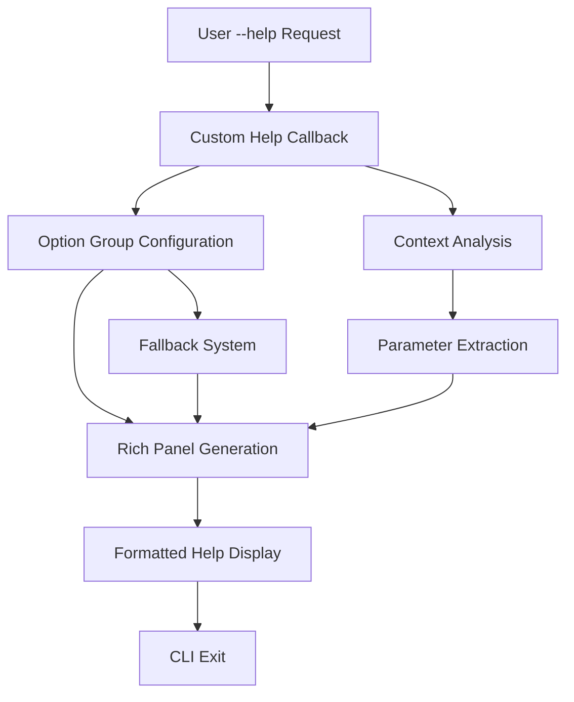
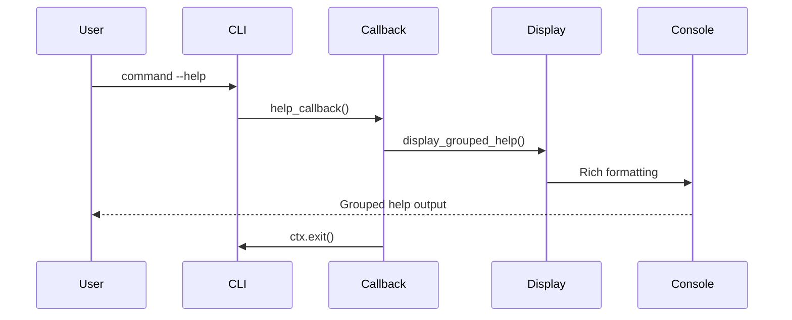

# CLI Help System Architecture

**Document Version:** 1.0  
**Last Updated:** 2025-07-27  
**Status:** Draft  
**Stakeholders:** Development Team, Technical Lead, Product Owner  
**Related Documents:** [CLI Architecture Patterns](cli-architecture-patterns.md), [CLI Option Groups](cli-option-groups.md)

## 1. Overview

### Purpose
This document describes the custom help system architecture implemented to provide grouped option help displays in the KP Analysis Toolkit CLI, working around Rich-Click limitations with multi-command structures.

### Scope

- **In Scope:** Custom help callback system, option group display patterns, Rich formatting integration
- **Out of Scope:** General CLI architecture, command business logic, Rich-Click configuration
- **Assumptions:** Rich-Click option grouping doesn't work with Click Groups, custom formatting is required

### Key Stakeholders

- **Primary Users:** CLI users requesting help information
- **Secondary Users:** Developers adding new CLI commands
- **Maintainers:** Development team responsible for CLI consistency

## 2. Problem Statement

### Business Context
Users need clear, organized help displays that group related options together for better usability. Standard Rich-Click option grouping fails in multi-command CLI structures, requiring a custom solution.

### Technical Challenges

- **Rich-Click Limitation:** OPTION_GROUPS configuration ignored in Click Group structures
- **Consistency Challenge:** Maintaining uniform help display across all commands
- **Integration Challenge:** Working within Click's callback system while providing Rich formatting

### Constraints

- **Technical Constraints:** Must work with existing Click command structure
- **Business Constraints:** Cannot break existing CLI functionality
- **Compatibility Constraints:** Must integrate with Rich-Click styling

## 3. Architecture Overview

### High-Level Design



### Core Principles

- **Interception:** Intercept help requests before Click's default processing
- **Configuration-Driven:** Use centralized option group configurations
- **Rich Integration:** Leverage Rich library for professional formatting
- **Fallback Support:** Provide fallback display when groups aren't configured

### Design Goals

- **User Experience:** Clear, organized help displays with grouped options
- **Maintainability:** Centralized help formatting logic
- **Extensibility:** Easy addition of new commands with grouped help
- **Consistency:** Uniform help display patterns across all commands

## 4. Detailed Design

### 4.1 Component Architecture

#### Component 1: Custom Help Decorator

- **Purpose:** Intercept --help requests and trigger custom formatting
- **Responsibilities:** Register help callback, manage Click context
- **Interfaces:** Click decorator protocol, callback function signature
- **Dependencies:** Click framework, custom help display functions

```python
def custom_help_option(
    command_name: str,
) -> Callable[[Callable[..., Any]], Callable[..., Any]]:
    """Decorator that adds custom grouped help display to a command."""
    
    def help_callback(ctx: click.Context, _param: click.Parameter, value: bool) -> None:
        if not value or ctx.resilient_parsing:
            return
        
        from kp_analysis_toolkit.cli.common.output_formatting import display_grouped_help
        display_grouped_help(ctx, command_name)
        ctx.exit()

    def decorator(func: Callable[..., Any]) -> Callable[..., Any]:
        help_option = click.option(
            "--help", "-h",
            is_flag=True,
            expose_value=False,
            is_eager=True,
            callback=help_callback,
            help="Show this message and exit",
        )
        return help_option(func)

    return decorator
```

#### Component 2: Group Display Engine

- **Purpose:** Generate Rich-formatted help displays with option groups
- **Responsibilities:** Parse option groups, create Rich panels, format option lines
- **Interfaces:** Click context, Rich console, option group configurations
- **Dependencies:** Rich library, application container

```python
def display_grouped_help(ctx: click.Context, command_name: str) -> None:
    """Display help with option groups for a specific command."""
    console = container.core.rich_output()

    # Show command header with emoji and description
    console.header(f"🔧 {command_name} Command")

    # Show command description
    if ctx.command.short_help:
        console.info(ctx.command.short_help)
    elif ctx.command.help:
        first_line = ctx.command.help.split("\n")[0].strip()
        console.info(first_line)

    console.print("")
    
    # Show usage information
    console.subheader("Usage:")
    usage = ctx.get_usage()
    console.print(f"  {usage}")
    console.print("")

    # Get option groups for this command
    option_groups = getattr(click.rich_click, "OPTION_GROUPS", {}).get(command_name, [])

    if option_groups:
        # Display each option group as a separate panel
        for group in option_groups:
            display_option_group_panel(console, ctx, group)
    else:
        # Fallback: display all options in a single panel
        display_fallback_options_panel(console, ctx)
```

#### Component 3: Option Group Panel Generator

- **Purpose:** Create individual Rich panels for each option group
- **Responsibilities:** Match options to groups, format option display, create Rich panels
- **Interfaces:** Rich console, Click context, group configuration
- **Dependencies:** Rich Panel, option formatting utilities

```python
def display_option_group_panel(
    console: RichOutputService,
    ctx: click.Context,
    group: dict[str, Any],
) -> None:
    """Display a single option group as a Rich panel."""
    group_name = group.get("name", "Options")
    group_options = group.get("options", [])

    # Build the options content for this group
    options_content = []

    for param in ctx.command.params:
        # Skip if this parameter is not an option
        if not hasattr(param, "opts") or not param.opts:
            continue

        # Check if this parameter matches any option in the group
        param_names = getattr(param, "opts", [])
        if any(opt_name in param_names for opt_name in group_options):
            option_line = format_option_line(param)
            if option_line:
                options_content.append(option_line)

    # Create and display the panel if there are options
    if options_content:
        panel_content = "\n".join(options_content)
        panel = Panel(
            panel_content,
            title=f"📋 {group_name}",
            border_style="blue",
            padding=(0, 1),
        )
        console.print(panel)
        console.print("")
```

### 4.2 Data Flow



### 4.3 Key Patterns

#### Pattern 1: Help Interception

- **Intent:** Capture --help requests before Click's default processing
- **Structure:** Eager callback decorator with immediate exit
- **Implementation:** Custom option decorator with callback function

```python
# Help interception pattern
@click.option(
    "--help", "-h",
    is_flag=True,
    expose_value=False,
    is_eager=True,  # Process before other options
    callback=help_callback,
    help="Show this message and exit",
)
```

#### Pattern 2: Option Group Matching

- **Intent:** Map Click parameters to configured option groups
- **Structure:** Parameter iteration with name matching
- **Implementation:** String matching against group configurations

```python
# Option matching pattern
param_names = getattr(param, "opts", [])
if any(opt_name in param_names for opt_name in group_options):
    option_line = format_option_line(param)
    if option_line:
        options_content.append(option_line)
```

#### Pattern 3: Rich Panel Display

- **Intent:** Create visually organized help sections
- **Structure:** Rich Panel with consistent styling
- **Implementation:** Panel generation with title and border styling

```python
# Panel display pattern
panel = Panel(
    panel_content,
    title=f"📋 {group_name}",
    border_style="blue",
    padding=(0, 1),
)
console.print(panel)
```

## 5. Implementation Guide

### 5.1 Directory Structure

```
src/kp_analysis_toolkit/cli/common/
├── decorators.py              # Custom help decorator
├── output_formatting.py       # Help display functions
└── option_groups.py          # Group configurations
```

### 5.2 Key Files and Their Purposes

#### Help Decorator (`decorators.py`)

```python
def custom_help_option(command_name: str) -> Callable:
    """Decorator that adds custom grouped help display to a command."""
    
    def help_callback(ctx: click.Context, _param: click.Parameter, value: bool) -> None:
        if not value or ctx.resilient_parsing:
            return
        
        display_grouped_help(ctx, command_name)
        ctx.exit()

    def decorator(func: Callable[..., Any]) -> Callable[..., Any]:
        return click.option(
            "--help", "-h",
            is_flag=True,
            expose_value=False,
            is_eager=True,
            callback=help_callback,
            help="Show this message and exit",
        )(func)

    return decorator
```

#### Display Engine (`output_formatting.py`)

```python
def display_grouped_help(ctx: click.Context, command_name: str) -> None:
    """Display help with option groups for a specific command."""
    console = container.core.rich_output()
    
    # Show command information
    console.header(f"🔧 {command_name} Command")
    
    # Show description and usage
    show_command_description(console, ctx)
    show_usage_information(console, ctx)
    
    # Display option groups
    display_option_groups(console, ctx, command_name)
    
    # Show additional information
    show_additional_information(console, ctx)

def display_option_group_panel(
    console: RichOutputService,
    ctx: click.Context,
    group: dict[str, Any],
) -> None:
    """Display a single option group as a Rich panel."""
    # Implementation details...

def format_option_line(param: click.Parameter) -> str | None:
    """Format a single option for display."""
    # Implementation details...
```

### 5.3 Testing Strategy

#### Unit Testing
```python
@pytest.mark.unit
class TestCustomHelpSystem:
    """Unit tests for custom help system."""
    
    def test_help_callback_triggers_display(self) -> None:
        """Test that help callback triggers custom display."""
        with patch("kp_analysis_toolkit.cli.common.output_formatting.display_grouped_help") as mock_display:
            # Test help callback
            pass
    
    def test_option_group_panel_creation(self) -> None:
        """Test option group panel creation."""
        # Test panel generation
        pass
```

#### Integration Testing

```python
@pytest.mark.integration
class TestHelpSystemIntegration:
    """Integration tests for help system with real commands."""
    
    def test_scripts_command_help_display(self) -> None:
        """Test help display for scripts command."""
        runner = CliRunner()
        result = runner.invoke(cli, ["scripts", "--help"])
        
        assert result.exit_code == 0
        assert "Configuration & Input" in result.output
        assert "Information Options" in result.output
```

## 6. Configuration and Dependencies

### 6.1 Option Group Configuration
```python
# Option groups defined in main.py
click.rich_click.OPTION_GROUPS["scripts"] = [
    {
        "name": "Configuration & Input",
        "options": ["--conf", "--start-dir", "--filespec"],
    },
    {
        "name": "Information Options",
        "options": [
            "--list-audit-configs",
            "--list-sections",
            "--list-source-files",
            "--list-systems",
        ],
    },
    {
        "name": "Output & Control",
        "options": ["--out-path", "--verbose"],
    },
    {
        "name": "Information & Control",
        "options": ["--version"],
    },
]
```

### 6.2 Rich Output Service Integration

```python
# Service access through DI container
console = container.core.rich_output()

# Rich formatting configuration
panel = Panel(
    content,
    title=f"📋 {group_name}",
    border_style="blue",
    padding=(0, 1),
)
```

## 7. Quality Attributes

### 7.1 Performance

- **Throughput:** Help display under 200ms for any command
- **Latency:** Immediate response to --help requests
- **Resource Usage:** Minimal memory overhead for help generation

### 7.2 Reliability

- **Availability:** Help always available when CLI is functional
- **Error Handling:** Graceful fallback when option groups not configured
- **Recovery:** Help display failures don't affect command functionality

### 7.3 Security

- **Authentication:** No authentication required for help display
- **Authorization:** No authorization required for help information
- **Data Protection:** No sensitive data exposed in help output

### 7.4 Maintainability

- **Code Organization:** Centralized help display logic
- **Documentation:** Self-documenting through clear function names
- **Testing:** Isolated testing of help display components

## 8. Deployment and Operations

### 8.1 Deployment Requirements

- **Environment Setup:** Rich library must be available
- **Dependencies:** Application container must provide Rich output service
- **Configuration:** Option groups must be configured before command registration

### 8.2 Monitoring and Observability

- **Logging:** Help requests logged through Rich output service
- **Metrics:** Help usage patterns tracked through CLI analytics
- **Alerting:** Help display errors captured in Rich error handling

### 8.3 Maintenance Procedures

- **Regular Maintenance:** Update option groups when commands change
- **Troubleshooting:** Verify option group configurations match command options
- **Updates:** Test help display after any CLI changes

## 9. Migration and Evolution

### 9.1 Migration Strategy

- **From Standard Help:** Replace Click's default help with custom system
- **Command Updates:** Add custom help decorator to all commands
- **Group Configuration:** Define option groups for each command

### 9.2 Future Evolution

- **Planned Enhancements:** Dynamic option group detection
- **Extension Points:** Plugin system for custom help formatters
- **Deprecation Policy:** Maintain backward compatibility with standard help

## 10. Appendices

### 10.1 Glossary

- **Help Callback:** Function triggered when --help option is used
- **Option Group:** Logical grouping of related command-line options
- **Rich Panel:** Styled container for displaying grouped content
- **Eager Option:** Option processed before other command options

### 10.2 References

- [Click Callbacks Documentation](https://click.palletsprojects.com/en/8.1.x/options/#callbacks-and-eager-options)
- [Rich Panels Documentation](https://rich.readthedocs.io/en/stable/panel.html)
- [CLI Architecture Patterns](cli-architecture-patterns.md)

### 10.3 Decision Log
| Date | Decision | Rationale | Impact |
|------|----------|-----------|---------|
| 2025-07-27 | Use callback interception | Rich-Click groups don't work with Click Groups | Custom help system required |
| 2025-07-27 | Rich panel display | Professional appearance and organization | Enhanced user experience |
| 2025-07-27 | Centralized formatting | Consistent help display across commands | Easier maintenance |

### 10.4 Review History
| Version | Date | Author | Changes |
|---------|------|--------|---------|
| 1.0 | 2025-07-27 | GitHub Copilot | Initial help system architecture documentation |
