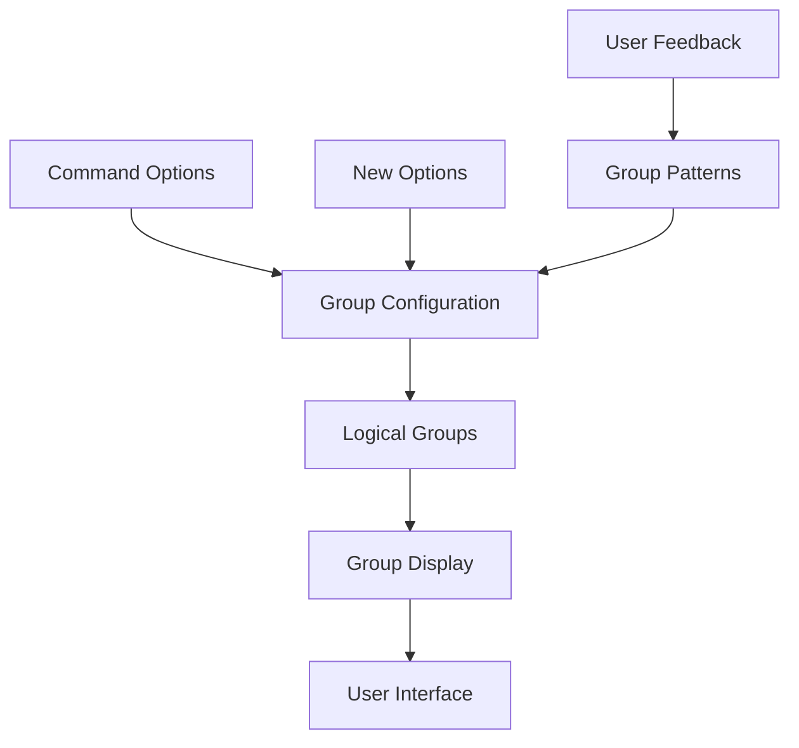

# CLI Option Groups Architecture

**Document Version:** 1.0  
**Last Updated:** 2025-07-27  
**Status:** Draft  
**Stakeholders:** Development Team, Technical Lead, Product Owner  
**Related Documents:** [CLI Architecture Patterns](cli-architecture-patterns.md), [CLI Help System](cli-help-system.md)

## 1. Overview

### Purpose
This document describes the option grouping architecture for organizing CLI help displays in the KP Analysis Toolkit. The system provides logical grouping of related command-line options for improved user experience.

### Scope

- **In Scope:** Option group configuration, group display patterns, command organization
- **Out of Scope:** Individual option implementation, help system mechanics, Rich formatting details
- **Assumptions:** Options should be logically grouped by function, consistent patterns across commands

### Key Stakeholders

- **Primary Users:** CLI users viewing help information
- **Secondary Users:** Developers adding new CLI options
- **Maintainers:** Development team responsible for CLI organization

## 2. Problem Statement

### Business Context
CLI commands with many options become difficult to use when options are displayed in a single flat list. Users need logical grouping to quickly find relevant options for their use case.

### Technical Challenges

- **Organization Challenge:** Determining logical groupings for diverse option types
- **Consistency Challenge:** Maintaining consistent grouping patterns across commands
- **Scalability Challenge:** Managing groups as new options are added

### Constraints

- **Technical Constraints:** Must work with Click parameter system
- **Business Constraints:** Groups must be intuitive to users
- **Maintenance Constraints:** Easy to update as commands evolve

## 3. Architecture Overview

### High-Level Design



### Core Principles

- **Logical Organization:** Group options by functional purpose
- **Consistency:** Use similar grouping patterns across commands
- **Discoverability:** Make related options easy to find
- **Maintainability:** Simple configuration management

### Design Goals

- **User Experience:** Intuitive option organization for faster discovery
- **Scalability:** Easy addition of new options and groups
- **Consistency:** Uniform grouping patterns across all commands
- **Maintainability:** Centralized group configuration management

## 4. Detailed Design

### 4.1 Component Architecture

#### Component 1: Group Configuration System

- **Purpose:** Centralized definition of option groups for all commands
- **Responsibilities:** Store group definitions, manage group membership
- **Interfaces:** Dictionary-based configuration, command name mapping
- **Dependencies:** Rich-Click option group system

```python
# Group configuration structure
OPTION_GROUPS = {
    "command-name": [
        {
            "name": "Group Name",
            "options": ["--option1", "--option2"],
        },
        # Additional groups...
    ]
}
```

#### Component 2: Standard Group Patterns

- **Purpose:** Define consistent grouping patterns across commands
- **Responsibilities:** Provide reusable group templates, ensure consistency
- **Interfaces:** Template functions, pattern definitions
- **Dependencies:** Command analysis, option categorization

```python
def get_standard_groups() -> list[dict[str, Any]]:
    """Get standard option groups used across commands."""
    return [
        {
            "name": "Input & Processing Options",
            "options": ["--in-file", "--start-dir"],
        },
        {
            "name": "Information & Control",
            "options": ["--version"],
        },
    ]
```

#### Component 3: Command-Specific Groups

- **Purpose:** Handle unique grouping requirements for specific commands
- **Responsibilities:** Define command-specific groups, extend standard patterns
- **Interfaces:** Command name dispatch, custom group definitions
- **Dependencies:** Standard group patterns, command option analysis

```python
def get_scripts_groups() -> list[dict[str, Any]]:
    """Get option groups specific to the scripts command."""
    return [
        {
            "name": "Configuration & Input",
            "options": ["--conf", "--start-dir", "--filespec"],
        },
        {
            "name": "Information Options",
            "options": [
                "--list-audit-configs",
                "--list-sections",
                "--list-source-files",
                "--list-systems",
            ],
        },
        {
            "name": "Output & Control",
            "options": ["--out-path", "--verbose"],
        },
        {
            "name": "Information & Control",
            "options": ["--version"],
        },
    ]
```

### 4.2 Group Organization Strategy

#### File Processing Commands Pattern

```python
# Standard pattern for file processing commands
FILE_PROCESSING_GROUPS = [
    {
        "name": "Input & Processing Options",
        "options": ["--in-file", "--start-dir"],
    },
    {
        "name": "Information & Control", 
        "options": ["--version"],
    },
]
```

#### System Analysis Commands Pattern

```python
# Extended pattern for commands with many information options
SYSTEM_ANALYSIS_GROUPS = [
    {
        "name": "Configuration & Input",
        "options": ["--conf", "--start-dir", "--filespec"],
    },
    {
        "name": "Information Options",
        "options": ["--list-*"],  # List-type options
    },
    {
        "name": "Output & Control",
        "options": ["--out-path", "--verbose"],
    },
    {
        "name": "Information & Control",
        "options": ["--version"],
    },
]
```

### 4.3 Key Patterns

#### Pattern 1: Functional Grouping

- **Intent:** Group options by their functional purpose
- **Structure:** Related functionality in the same group
- **Implementation:** Analysis of option purposes and user workflows

| Group Type | Purpose | Common Options |
|------------|---------|----------------|
| Input & Processing | File inputs and processing control | `--in-file`, `--start-dir`, `--filespec` |
| Configuration | Configuration and setup | `--conf`, `--config` |
| Information | Discovery and listing | `--list-*`, `--show-*` |
| Output & Control | Output control and verbosity | `--out-path`, `--verbose` |
| Information & Control | Standard utilities | `--version`, `--help` |

#### Pattern 2: Hierarchical Organization

- **Intent:** Organize groups from most to least commonly used
- **Structure:** Primary workflow groups first, utility groups last
- **Implementation:** Order groups by typical user workflow

```python
# Group ordering pattern
COMMAND_GROUPS = [
    # 1. Primary workflow groups
    {"name": "Configuration & Input", "options": [...]},
    {"name": "Processing Options", "options": [...]},
    
    # 2. Secondary workflow groups  
    {"name": "Information Options", "options": [...]},
    {"name": "Output & Control", "options": [...]},
    
    # 3. Utility groups
    {"name": "Information & Control", "options": [...]},
]
```

#### Pattern 3: Consistency Enforcement

- **Intent:** Ensure similar options appear in similarly named groups
- **Structure:** Standard group names and option categorization
- **Implementation:** Group name standards and option classification rules

```python
# Consistency patterns
STANDARD_GROUP_NAMES = {
    "input": "Input & Processing Options",
    "config": "Configuration & Input", 
    "info": "Information Options",
    "output": "Output & Control",
    "util": "Information & Control",
}
```

## 5. Implementation Guide

### 5.1 Group Configuration Structure

```python
# Complete group configuration example
click.rich_click.OPTION_GROUPS = {
    "scripts": [
        {
            "name": "Configuration & Input",
            "options": ["--conf", "--start-dir", "--filespec"],
        },
        {
            "name": "Information Options",
            "options": [
                "--list-audit-configs",
                "--list-sections", 
                "--list-source-files",
                "--list-systems",
            ],
        },
        {
            "name": "Output & Control",
            "options": ["--out-path", "--verbose"],
        },
        {
            "name": "Information & Control",
            "options": ["--version"],
        },
    ],
    "rtf-to-text": [
        {
            "name": "Input & Processing Options",
            "options": ["--in-file", "--start-dir"],
        },
        {
            "name": "Information & Control",
            "options": ["--version"],
        },
    ],
    "nipper": [
        {
            "name": "Input & Processing Options", 
            "options": ["--in-file", "--start-dir"],
        },
        {
            "name": "Information & Control",
            "options": ["--version"],
        },
    ],
}
```

### 5.2 Adding New Commands

#### Step 1: Analyze Command Options

```python
# Analyze options by category
INPUT_OPTIONS = ["--in-file", "--start-dir", "--config"]
PROCESSING_OPTIONS = ["--format", "--encoding"] 
INFO_OPTIONS = ["--list-formats", "--show-config"]
OUTPUT_OPTIONS = ["--out-path", "--verbose"]
UTILITY_OPTIONS = ["--version", "--help"]
```

#### Step 2: Apply Grouping Pattern

```python
# Choose appropriate pattern based on command complexity
if len(all_options) <= 4:
    # Simple pattern for basic commands
    groups = get_simple_command_groups()
elif has_many_list_options:
    # Extended pattern for information-heavy commands
    groups = get_system_analysis_groups()
else:
    # Standard pattern for file processing
    groups = get_file_processing_groups()
```

#### Step 3: Configure Groups

```python
# Add to option groups configuration
click.rich_click.OPTION_GROUPS["new-command"] = [
    {
        "name": "Input & Processing Options",
        "options": ["--input", "--process-mode"],
    },
    {
        "name": "Information & Control",
        "options": ["--version"],
    },
]
```

### 5.3 Testing Strategy

#### Unit Testing

```python
@pytest.mark.unit
class TestOptionGroups:
    """Unit tests for option group configuration."""
    
    def test_all_commands_have_groups(self) -> None:
        """Test that all commands have option group configurations."""
        commands = ["scripts", "rtf-to-text", "nipper"]
        groups = click.rich_click.OPTION_GROUPS
        
        for command in commands:
            assert command in groups
            assert len(groups[command]) > 0
    
    def test_group_structure_validity(self) -> None:
        """Test that all groups have required structure."""
        for command, command_groups in click.rich_click.OPTION_GROUPS.items():
            for group in command_groups:
                assert "name" in group
                assert "options" in group
                assert isinstance(group["options"], list)
```

#### Integration Testing

```python
@pytest.mark.integration
class TestOptionGroupDisplay:
    """Integration tests for option group display."""
    
    def test_scripts_command_groups(self) -> None:
        """Test that scripts command displays correct groups."""
        runner = CliRunner()
        result = runner.invoke(cli, ["scripts", "--help"])
        
        assert "Configuration & Input" in result.output
        assert "Information Options" in result.output
        assert "Output & Control" in result.output
```

## 6. Configuration and Dependencies

### 6.1 Group Configuration Location

```python
# Primary configuration in main.py
click.rich_click.OPTION_GROUPS = {
    # Command group definitions
}

# Alternative: Utility function approach
from kp_analysis_toolkit.cli.common.option_groups import setup_command_option_groups
setup_command_option_groups("command-name")
```

### 6.2 Integration with Help System

```python
# Help system retrieves groups for display
option_groups = getattr(click.rich_click, "OPTION_GROUPS", {}).get(command_name, [])

if option_groups:
    for group in option_groups:
        display_option_group_panel(console, ctx, group)
else:
    display_fallback_options_panel(console, ctx)
```

## 7. Quality Attributes

### 7.1 Performance

- **Throughput:** Group configuration loaded once at startup
- **Latency:** Minimal overhead for group lookup during help display
- **Resource Usage:** Small memory footprint for group configurations

### 7.2 Reliability

- **Availability:** Groups always available when configured
- **Error Handling:** Graceful fallback when groups not found
- **Recovery:** Help display works without groups

### 7.3 Security

- **Authentication:** No authentication required for group access
- **Authorization:** No authorization needed for group information
- **Data Protection:** No sensitive data in group configurations

### 7.4 Maintainability

- **Code Organization:** Centralized group configuration
- **Documentation:** Self-documenting group names and structure
- **Testing:** Automated validation of group structure

## 8. Appendices

### 8.1 Glossary
- **Option Group:** Logical collection of related command-line options
- **Group Pattern:** Reusable template for organizing options
- **Functional Grouping:** Organization strategy based on option purpose
- **Hierarchical Organization:** Ordering groups by usage frequency

### 8.2 References
- [Rich-Click Option Groups](https://github.com/ewels/rich-click#option-groups)
- [Click Option Documentation](https://click.palletsprojects.com/en/8.1.x/options/)
- [CLI Help System Architecture](cli-help-system.md)

### 8.3 Decision Log
| Date | Decision | Rationale | Impact |
|------|----------|-----------|---------|
| 2025-07-27 | Functional grouping strategy | Groups options by user workflow | Improved option discoverability |
| 2025-07-27 | Standard group patterns | Consistency across similar commands | Easier user learning curve |
| 2025-07-27 | Hierarchical group ordering | Primary workflow groups first | Better user experience |

### 10.4 Review History
| Version | Date | Author | Changes |
|---------|------|--------|---------|
| 1.0 | 2025-07-27 | GitHub Copilot | Initial option groups architecture documentation |
