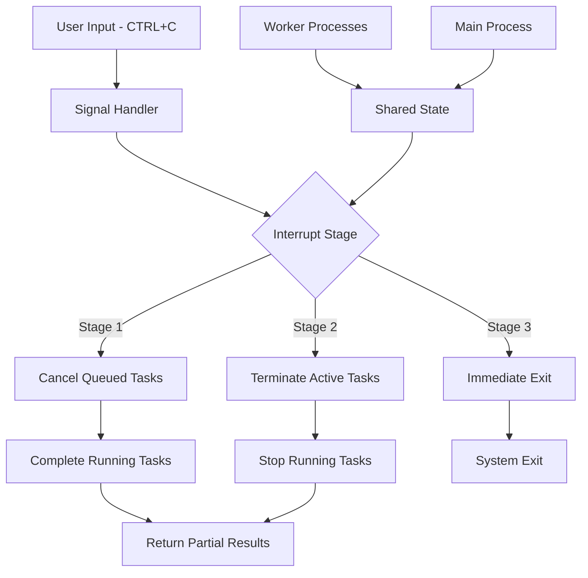
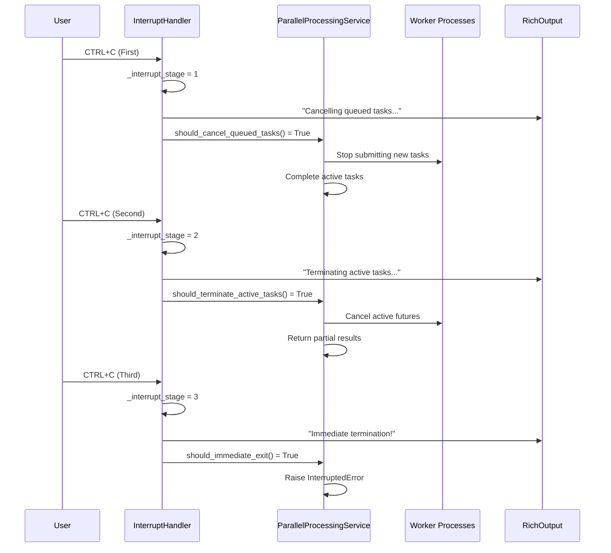

# Interrupt Handling Architecture

**Document Version:** 1.0  
**Last Updated:** 2025-07-27  
**Status:** Implementation Complete  
**Stakeholders:** Development Team, Technical Lead, Product Owner  
**Related Documents:** [Parallel Processing Architecture](parallel-processing-architecture.md), [Task Batching Patterns](task-batching-patterns.md)

## 1. Overview

### Purpose
This document describes the multi-stage interrupt handling architecture implemented for graceful cancellation of parallel processing operations. The system provides three escalating levels of interruption to balance user responsiveness with data preservation.

### Scope

- **In Scope:** Multi-stage interrupt handling, signal management, process-safe state coordination, user feedback patterns
- **Out of Scope:** Individual task cancellation mechanisms, platform-specific signal handling, Rich output implementation details
- **Assumptions:** Users may need different levels of cancellation urgency, partial results are valuable, process boundaries complicate interrupt coordination

### Key Stakeholders

- **Primary Users:** End users running long-running parallel operations
- **Secondary Users:** CLI commands implementing parallel processing
- **Maintainers:** Development team responsible for user experience and system stability

## 2. Problem Statement

### Business Context
Users processing large datasets often need to cancel operations that are taking longer than expected or when higher-priority work arises. Simple termination loses all progress, while blocked operations provide poor user experience.

### Technical Challenges

- **Process Boundary Coordination:** Signal handling across process pool workers requires shared state management
- **Progressive Cancellation:** Users need different levels of urgency from "finish current work" to "stop immediately"
- **State Consistency:** Partially completed operations must leave the system in a consistent state
- **User Feedback:** Clear communication about what level of cancellation is occurring

### Constraints

- **Technical Constraints:** Python signal handling limitations, multiprocessing state sharing constraints
- **Business Constraints:** Must preserve partial results when possible, maintain user trust in system reliability
- **Platform Constraints:** Cross-platform signal handling compatibility (Windows SIGINT vs Unix signals)

## 3. Architecture Overview

### High-Level Design



### Core Principles

- **Progressive Escalation:** Three stages of interrupt handling from graceful to immediate
- **Shared State Coordination:** Process-safe interrupt state sharing across worker boundaries
- **User Communication:** Clear feedback about current interrupt stage and expected behavior
- **Partial Result Preservation:** Maintain completed work whenever possible

### Design Goals

- **Responsiveness:** Immediate acknowledgment of interrupt requests with clear user feedback
- **Data Preservation:** Maximize retention of completed work during cancellation
- **System Stability:** Ensure consistent state after interrupt handling at any stage
- **Cross-Platform Compatibility:** Reliable interrupt handling across Windows, Linux, and macOS

## 4. Detailed Design

### 4.1 Component Architecture

#### Component 1: Multi-Stage Interrupt Handler

- **Purpose:** Coordinate interrupt handling across process boundaries with progressive escalation
- **Responsibilities:** Signal handler registration, shared state management, stage progression, user feedback
- **Interfaces:** InterruptHandler protocol, context manager support, signal callback functions
- **Dependencies:** RichOutputService for user feedback, multiprocessing for shared state

```python
class DefaultInterruptHandler(InterruptHandler):
    """Implementation of multi-stage interrupt handling."""
    
    def __init__(self, rich_output: RichOutputService) -> None:
        self._rich_output = rich_output
        self._interrupt_stage = 0
        self._original_sigint_handler = None
        self._setup_complete = False
    
    def setup(self) -> None:
        """Set up multi-stage interrupt handling for parallel operations."""
        if self._setup_complete:
            return
        
        # Store original handler for restoration
        self._original_sigint_handler = signal.signal(signal.SIGINT, self._signal_handler)
        
        # Suppress default KeyboardInterrupt traceback
        signal.signal(signal.SIGINT, self._signal_handler)
        
        self._setup_complete = True
        self._interrupt_stage = 0
    
    def cleanup(self) -> None:
        """Clean up interrupt handling resources."""
        if not self._setup_complete:
            return
        
        # Restore original signal handler
        if self._original_sigint_handler is not None:
            signal.signal(signal.SIGINT, self._original_sigint_handler)
            self._original_sigint_handler = None
        
        self._setup_complete = False
        self._interrupt_stage = 0
    
    def _signal_handler(self, signum: int, frame: Any) -> None:
        """Handle SIGINT signals with progressive escalation."""
        self._interrupt_stage += 1
        self.handle_interrupt_stage(self._interrupt_stage)
```

#### Component 2: Interrupt State Management

- **Purpose:** Provide process-safe interrupt state queries for coordination across workers
- **Responsibilities:** Stage tracking, boolean state queries, thread-safe state access
- **Interfaces:** Stage checking methods, boolean query methods
- **Dependencies:** Thread-safe state primitives, shared memory constructs

```python
class DefaultInterruptHandler(InterruptHandler):
    """Implementation with process-safe state management."""
    
    def get_interrupt_stage(self) -> int:
        """Get the current interrupt stage."""
        return self._interrupt_stage
    
    def is_interrupted(self) -> bool:
        """Check if any stage of interruption has been requested."""
        return self._interrupt_stage > 0
    
    def should_cancel_queued_tasks(self) -> bool:
        """Check if queued tasks should be cancelled (stage 1+)."""
        return self._interrupt_stage >= 1
    
    def should_terminate_active_tasks(self) -> bool:
        """Check if active tasks should be terminated (stage 2+)."""
        return self._interrupt_stage >= 2
    
    def should_immediate_exit(self) -> bool:
        """Check if immediate exit is required (stage 3)."""
        return self._interrupt_stage >= 3
    
    def handle_interrupt_stage(self, stage: int) -> None:
        """Handle interrupt at specified stage with user feedback."""
        if stage == 1:
            self._rich_output.warning(
                "🛑 Interrupt received: Cancelling queued tasks, completing active work..."
            )
            self._rich_output.info("Press Ctrl+C again to terminate active tasks")
        
        elif stage == 2:
            self._rich_output.warning(
                "⚠️  Second interrupt: Terminating active tasks, returning partial results..."
            )
            self._rich_output.info("Press Ctrl+C again for immediate exit")
        
        elif stage >= 3:
            self._rich_output.error("💥 Third interrupt: Immediate termination!")
            # Note: Immediate exit will be handled by calling code
```

#### Component 3: Context Manager Integration

- **Purpose:** Ensure proper setup and cleanup of interrupt handling resources
- **Responsibilities:** Automatic setup/cleanup, exception handling, resource management
- **Interfaces:** Context manager protocol (__enter__/__exit__)
- **Dependencies:** Signal handling utilities, cleanup procedures

```python
class DefaultInterruptHandler(InterruptHandler):
    """Context manager implementation for automatic resource management."""
    
    def __enter__(self) -> Self:
        """Context manager entry - sets up interrupt handling."""
        try:
            self.setup()
            return self
        except OSError as e:
            msg = f"Failed to set up interrupt handling: {e}"
            raise OSError(msg) from e
    
    def __exit__(
        self,
        exc_type: type[BaseException] | None,
        exc_val: BaseException | None,
        exc_tb: TracebackType | None,
    ) -> bool | None:
        """Context manager exit - ensures cleanup happens."""
        try:
            self.cleanup()
        except Exception as cleanup_error:
            # Log cleanup errors but don't suppress original exceptions
            self._rich_output.error(f"Error during interrupt handler cleanup: {cleanup_error}")
        
        # Don't suppress any exceptions
        return None
```

### 4.2 Interrupt Stage Flow



### 4.3 Key Patterns

#### Pattern 1: Progressive Interrupt Escalation

- **Intent:** Provide users with increasing levels of cancellation urgency
- **Structure:** Three-stage escalation with clear progression and feedback
- **Implementation:** Signal handler incrementing stage counter with user communication

```python
# Stage 1: Graceful cancellation
def handle_stage_1_interrupt(self) -> None:
    """Handle first interrupt - graceful cancellation."""
    # Stop accepting new tasks
    self._accepting_new_tasks = False
    
    # Inform user of current behavior
    self._rich_output.warning(
        "🛑 Graceful cancellation: Finishing current work, no new tasks started"
    )
    self._rich_output.info(
        "• Active tasks will complete normally\n"
        "• Queued tasks will be skipped\n"
        "• Press Ctrl+C again to stop active tasks"
    )

# Stage 2: Urgent cancellation
def handle_stage_2_interrupt(self) -> None:
    """Handle second interrupt - urgent cancellation."""
    # Request termination of active tasks
    self._terminate_active_tasks = True
    
    # Inform user of escalated behavior
    self._rich_output.warning(
        "⚠️  Urgent cancellation: Stopping active tasks, saving partial results"
    )
    self._rich_output.info(
        "• Active tasks will be cancelled\n"
        "• Completed results will be returned\n"
        "• Press Ctrl+C again for immediate exit"
    )

# Stage 3: Immediate termination
def handle_stage_3_interrupt(self) -> None:
    """Handle third interrupt - immediate termination."""
    # Set flag for immediate exit
    self._immediate_exit = True
    
    # Inform user of immediate termination
    self._rich_output.error(
        "💥 Immediate termination: Exiting without cleanup"
    )
    
    # This will cause InterruptedError to be raised
```

#### Pattern 2: Process-Safe State Queries

- **Intent:** Provide consistent interrupt state across process boundaries
- **Structure:** Boolean query methods for different interrupt conditions
- **Implementation:** Atomic state checks with clear semantic meaning

```python
# Usage in parallel processing service
def _submit_tasks_with_interrupt_handling(
    self,
    tasks: list[Callable[[], KPATBaseModel]],
    executor: Executor,
) -> dict[concurrent.futures.Future[KPATBaseModel], int]:
    """Submit tasks to executor with interrupt handling during submission."""
    future_to_index: dict[concurrent.futures.Future[KPATBaseModel], int] = {}
    
    # Submit tasks until interrupted
    for i, task in enumerate(tasks):
        # Check interrupt state before each submission
        if self._interrupt_handler.should_cancel_queued_tasks():
            self._rich_output.info(f"Stopping task submission at task {i + 1}/{len(tasks)}")
            break
        
        # Submit task if not interrupted
        future = executor.submit(self._execute_single_task, task)
        future_to_index[future] = i
    
    # Cancel any futures that were submitted but not yet started
    if self._interrupt_handler.should_cancel_queued_tasks():
        self._cancel_queued_futures(future_to_index)
    
    return future_to_index

# Usage in result collection
def _collect_results_with_interrupt_handling(
    self,
    futures: dict[Future[KPATBaseModel], int],
) -> list[KPATBaseModel]:
    """Collect results with interrupt handling during collection."""
    results: list[KPATBaseModel | None] = [None] * len(futures)
    
    for future in concurrent.futures.as_completed(futures.keys()):
        # Check for immediate exit before processing each result
        if self._interrupt_handler.should_immediate_exit():
            msg = "Immediate termination requested during result collection"
            raise InterruptedError(msg)
        
        # Process result if not terminated
        task_index = futures[future]
        try:
            results[task_index] = future.result()
        except Exception as e:
            self._handle_task_error(e, task_index)
        
        # Check if we should stop collecting results
        if self._interrupt_handler.should_terminate_active_tasks():
            self._rich_output.info("Stopping result collection due to urgent cancellation")
            break
    
    return [r for r in results if r is not None]
```

#### Pattern 3: User Feedback Integration

- **Intent:** Provide clear, actionable feedback about interrupt handling state
- **Structure:** Rich console output with emoji indicators and detailed explanations
- **Implementation:** Integration with RichOutputService for consistent formatting

```python
class InterruptFeedbackManager:
    """Manages user feedback for interrupt handling stages."""
    
    def __init__(self, rich_output: RichOutputService) -> None:
        self._rich_output = rich_output
    
    def show_interrupt_help(self) -> None:
        """Display interrupt handling instructions to user."""
        self._rich_output.info(
            "🛑 Interrupt Handling:\n"
            "• First Ctrl+C: Graceful cancellation (finish active work)\n"
            "• Second Ctrl+C: Urgent cancellation (stop active work)\n"
            "• Third Ctrl+C: Immediate termination (no cleanup)"
        )
    
    def show_stage_transition(self, from_stage: int, to_stage: int) -> None:
        """Show transition between interrupt stages."""
        stage_names = {
            0: "Normal Operation",
            1: "Graceful Cancellation",
            2: "Urgent Cancellation", 
            3: "Immediate Termination"
        }
        
        self._rich_output.warning(
            f"Interrupt escalation: {stage_names[from_stage]} → {stage_names[to_stage]}"
        )
    
    def show_partial_results_info(self, completed: int, total: int) -> None:
        """Show information about partial results being returned."""
        completion_rate = (completed / total) * 100 if total > 0 else 0
        
        self._rich_output.info(
            f"📊 Returning partial results: {completed}/{total} tasks completed ({completion_rate:.1f}%)"
        )
```

## 5. Implementation Guide

### 5.1 Directory Structure

```
src/kp_analysis_toolkit/core/services/parallel_processing/
├── interrupt_handler.py       # Main interrupt handler implementation
├── protocols.py              # InterruptHandler protocol definition
├── service.py                # Parallel processing service with interrupt integration
├── executor_factory.py       # Process/thread pool executor factories
└── progress_tracker.py       # Progress tracking for parallel operations
```

### 5.2 Key Files and Their Purposes

#### Interrupt Handler Implementation (`interrupt_handler.py`)

```python
class DefaultInterruptHandler(InterruptHandler):
    """
    Default implementation of multi-stage interrupt handling.
    
    Provides three-stage escalation:
    1. Cancel queued tasks, complete active work
    2. Terminate active tasks, return partial results  
    3. Immediate exit with no cleanup
    """
    
    def __init__(self, rich_output: RichOutputService) -> None:
        self._rich_output = rich_output
        self._interrupt_stage = 0
        self._original_sigint_handler = None
        self._setup_complete = False
    
    def setup(self) -> None:
        """Configure signal handlers and shared state."""
        # Signal handler registration
        # Shared state initialization
        # Error handling setup
    
    def cleanup(self) -> None:
        """Restore original handlers and clean up state."""
        # Handler restoration
        # State cleanup
        # Resource deallocation
    
    def _signal_handler(self, signum: int, frame: Any) -> None:
        """Process SIGINT signals with stage escalation."""
        # Stage increment
        # User feedback
        # State coordination
```

#### Cross-Platform Signal Handling (`interrupt_handler.py`)

```python
# AI-GEN: GitHub Copilot|2025-07-27|interrupt-handling-architecture|reviewed:no
import signal
import sys
from typing import Any, Callable

class DefaultInterruptHandler(InterruptHandler):
    """Implementation with cross-platform signal handling built-in."""
    
    def setup(self) -> None:
        """Configure signal handlers with cross-platform compatibility."""
        if self._setup_complete:
            return
        
        try:
            # Store original signal handlers for restoration
            self._original_sigint_handler = signal.signal(
                signal.SIGINT,
                self._signal_handler,
            )
            
            # SIGTERM is not supported on Windows
            if sys.platform != "win32":
                self._original_sigterm_handler = signal.signal(
                    signal.SIGTERM,
                    self._signal_handler,
                )
            
            self._setup_complete = True
            self._interrupt_stage = _STAGE_NO_INTERRUPT
            
        except (OSError, ValueError) as e:
            msg = f"Failed to set up interrupt handling: {e}"
            raise OSError(msg) from e
    
    def cleanup(self) -> None:
        """Restore original signal handlers."""
        if not self._setup_complete:
            return
        
        try:
            # Restore original SIGINT handler
            if self._original_sigint_handler is not None:
                signal.signal(signal.SIGINT, self._original_sigint_handler)
                self._original_sigint_handler = None
            
            # Restore original SIGTERM handler (Unix-like systems only)
            if (
                sys.platform != "win32"
                and self._original_sigterm_handler is not None
            ):
                signal.signal(signal.SIGTERM, self._original_sigterm_handler)
                self._original_sigterm_handler = None
                
        except (OSError, ValueError):
            # Best effort cleanup - don't raise exceptions during cleanup
            pass
        finally:
            self._setup_complete = False
            self._interrupt_stage = _STAGE_NO_INTERRUPT

    def is_interrupt_signal_supported(self, signal_num: int) -> bool:
        """Check if signal is supported on current platform."""
        if signal_num == signal.SIGINT:
            return True  # SIGINT supported on all platforms
        elif signal_num == signal.SIGTERM:
            return sys.platform != "win32"  # SIGTERM not supported on Windows
        else:
            return False
```

### 5.3 Testing Strategy

#### Unit Testing

```python
import pytest
from unittest.mock import MagicMock, patch
from kp_analysis_toolkit.core.services.parallel_processing.interrupt_handler import (
    DefaultInterruptHandler,
)

@pytest.mark.unit
class TestDefaultInterruptHandler:
    """Unit tests for interrupt handler."""
    
    def test_initial_state_is_not_interrupted(self) -> None:
        """Test that handler starts in non-interrupted state."""
        rich_output = MagicMock()
        handler = DefaultInterruptHandler(rich_output)
        
        assert not handler.is_interrupted()
        assert handler.get_interrupt_stage() == 0
        assert not handler.should_cancel_queued_tasks()
    
    @patch('signal.signal')
    def test_setup_installs_signal_handler(self, mock_signal: MagicMock) -> None:
        """Test that setup installs SIGINT handler."""
        rich_output = MagicMock()
        handler = DefaultInterruptHandler(rich_output)
        
        handler.setup()
        
        mock_signal.assert_called_once_with(signal.SIGINT, handler._signal_handler)
    
    def test_signal_handler_increments_stage(self) -> None:
        """Test that signal handler increments interrupt stage."""
        rich_output = MagicMock()
        handler = DefaultInterruptHandler(rich_output)
        
        # Simulate first SIGINT
        handler._signal_handler(signal.SIGINT, None)
        assert handler.get_interrupt_stage() == 1
        assert handler.should_cancel_queued_tasks()
        
        # Simulate second SIGINT  
        handler._signal_handler(signal.SIGINT, None)
        assert handler.get_interrupt_stage() == 2
        assert handler.should_terminate_active_tasks()

@pytest.mark.unit  
class TestInterruptStageLogic:
    """Test interrupt stage decision logic."""
    
    def test_stage_1_cancels_queued_only(self) -> None:
        """Test that stage 1 only cancels queued tasks."""
        handler = DefaultInterruptHandler(MagicMock())
        handler._interrupt_stage = 1
        
        assert handler.should_cancel_queued_tasks()
        assert not handler.should_terminate_active_tasks()
        assert not handler.should_immediate_exit()
    
    def test_stage_2_terminates_active_tasks(self) -> None:
        """Test that stage 2 terminates active tasks."""
        handler = DefaultInterruptHandler(MagicMock())
        handler._interrupt_stage = 2
        
        assert handler.should_cancel_queued_tasks()
        assert handler.should_terminate_active_tasks()
        assert not handler.should_immediate_exit()
    
    def test_stage_3_requires_immediate_exit(self) -> None:
        """Test that stage 3 requires immediate exit."""
        handler = DefaultInterruptHandler(MagicMock())
        handler._interrupt_stage = 3
        
        assert handler.should_cancel_queued_tasks()
        assert handler.should_terminate_active_tasks()
        assert handler.should_immediate_exit()
```

#### Integration Testing

```python
@pytest.mark.integration
class TestInterruptHandlerIntegration:
    """Integration tests for interrupt handler with real signal handling."""
    
    def test_context_manager_setup_and_cleanup(self) -> None:
        """Test that context manager properly sets up and cleans up handlers."""
        rich_output = MagicMock()
        handler = DefaultInterruptHandler(rich_output)
        
        # Verify initial state
        assert not handler._setup_complete
        
        with handler:
            # Verify setup occurred
            assert handler._setup_complete
            assert handler._original_sigint_handler is not None
        
        # Verify cleanup occurred
        assert not handler._setup_complete
        assert handler._original_sigint_handler is None
    
    def test_interrupt_handling_with_parallel_service(
        self,
        real_interrupt_handler: DefaultInterruptHandler,
        cpu_intensive_tasks: list[Callable[[], KPATBaseModel]],
    ) -> None:
        """Test interrupt handling during actual parallel execution."""
        # This test would require careful timing and signal sending
        # Implementation would depend on test framework capabilities
        pass
```

## 6. Configuration and Dependencies

### 6.1 Signal Handler Configuration

```python
# AI-GEN: GitHub Copilot|2025-07-27|interrupt-handling-architecture|reviewed:no
# Cross-platform signal configuration built into DefaultInterruptHandler
import signal
import sys

# Interrupt stage constants (defined in interrupt_handler.py)
_STAGE_NO_INTERRUPT: int = 0
_STAGE_CANCEL_QUEUED: int = 1
_STAGE_TERMINATE_ACTIVE: int = 2
_STAGE_IMMEDIATE_EXIT: int = 3

class InterruptSignalConfig:
    """Configuration for cross-platform interrupt signal handling."""
    
    @staticmethod
    def get_supported_interrupt_signals() -> list[int]:
        """Get list of interrupt signals supported on current platform."""
        signals = [signal.SIGINT]  # SIGINT supported on all platforms
        
        # SIGTERM only supported on Unix-like systems
        if sys.platform != "win32":
            signals.append(signal.SIGTERM)
        
        return signals
    
    @staticmethod
    def is_signal_supported(signal_num: int) -> bool:
        """Check if specific signal is supported on current platform."""
        return signal_num in InterruptSignalConfig.get_supported_interrupt_signals()

# Interrupt stage configuration
INTERRUPT_STAGE_CONFIG = {
    'stage_1_message': "Cancelling queued tasks, completing active work...",
    'stage_2_message': "Terminating active tasks, returning partial results...", 
    'stage_3_message': "Immediate termination requested!",
    'max_stage': _STAGE_IMMEDIATE_EXIT,
    'feedback_enabled': True,
}
```

### 6.2 Rich Output Integration

```python
class InterruptHandlerConfig:
    """Configuration for interrupt handler behavior."""
    
    def __init__(self, rich_output: RichOutputService) -> None:
        self.rich_output = rich_output
        self.show_interrupt_help = True
        self.emoji_indicators = True
        self.detailed_feedback = True
    
    def get_stage_message(self, stage: int) -> str:
        """Get user message for interrupt stage."""
        messages = {
            1: "🛑 Graceful cancellation in progress...",
            2: "⚠️  Urgent cancellation - stopping active work...",
            3: "💥 Immediate termination requested!",
        }
        return messages.get(stage, f"Unknown interrupt stage: {stage}")
    
    def should_show_progress_info(self, stage: int) -> bool:
        """Determine if progress information should be shown."""
        # Show progress info for stages 1 and 2, not for immediate exit
        return stage < 3 and self.detailed_feedback
```

## 7. Quality Attributes

### 7.1 Performance

- **Responsiveness:** Signal handler execution under 1ms, immediate user feedback
- **Overhead:** Minimal performance impact during normal operation, signal checks are O(1)
- **Resource Usage:** Small memory footprint for shared state, efficient signal handler registration

### 7.2 Reliability

- **Signal Handling:** Robust cross-platform signal handling with graceful degradation
- **State Consistency:** Process-safe interrupt state with atomic operations
- **Error Recovery:** Automatic cleanup on errors, original signal handlers restored

### 7.3 Security

- **Signal Security:** Proper signal handler registration and cleanup
- **State Protection:** Thread-safe interrupt state management
- **Resource Cleanup:** Guaranteed cleanup of signal handlers and shared resources

### 7.4 Maintainability

- **Clear Semantics:** Well-defined interrupt stages with clear behavioral expectations
- **Testability:** Mockable signal handling and isolated stage logic testing
- **Cross-Platform:** Abstracted signal handling with platform-specific implementations

## 8. Deployment and Operations

### 8.1 Deployment Requirements

- **Signal Support:** Platform must support SIGINT (all platforms) and optionally SIGTERM (Unix-like)
- **Process Model:** Compatible with ProcessPoolExecutor and shared state mechanisms
- **Rich Output:** Integration with Rich console library for user feedback

### 8.2 Monitoring and Observability

- **Interrupt Tracking:** Stage progression logged through Rich output service
- **User Guidance:** Real-time feedback about current interrupt behavior
- **Completion Status:** Partial result information displayed during cancellation

### 8.3 Maintenance Procedures

- **Signal Handler Testing:** Verify signal handling behavior during deployment testing
- **Platform Compatibility:** Test interrupt handling on all supported platforms
- **User Experience Validation:** Ensure clear, helpful interrupt messages

## 9. Migration and Evolution

### 9.1 Migration Strategy

- **From Simple Cancellation:** Replace basic KeyboardInterrupt handling with multi-stage system
- **Signal Handler Integration:** Integrate with existing signal handling if present
- **User Communication:** Add progressive feedback for better user experience

### 9.2 Future Evolution

- **Planned Enhancements:** Configurable stage behavior, custom interrupt strategies
- **Extension Points:** Pluggable interrupt handlers for different operation types
- **Advanced Features:** Time-based escalation, interrupt handling analytics

## 10. Appendices

### 10.1 Glossary

- **Multi-Stage Interruption:** Progressive interrupt escalation with different urgency levels
- **Signal Handler:** Function registered to handle operating system signals like SIGINT
- **Process-Safe State:** Shared state that can be safely accessed across process boundaries
- **Graceful Cancellation:** Interrupt handling that preserves completed work

### 10.2 References

- [Python Signal Handling Documentation](https://docs.python.org/3/library/signal.html)
- [Multiprocessing Signal Handling](https://docs.python.org/3/library/multiprocessing.html#multiprocessing.Process.terminate)
- [Parallel Processing Architecture](parallel-processing-architecture.md)

### 10.3 Decision Log

| Date | Decision | Rationale | Impact |
|------|----------|-----------|---------|
| 2025-07-27 | Three-stage interrupt escalation | Users need different levels of cancellation urgency | Improved user control and data preservation |
| 2025-07-27 | Rich output integration for feedback | Consistent user interface and clear messaging | Better user experience during cancellation |
| 2025-07-27 | Context manager pattern | Automatic setup and cleanup of signal handlers | Reduced resource leaks and more reliable cleanup |

### 10.4 Review History

| Version | Date | Author | Changes |
|---------|------|--------|---------|
| 1.0 | 2025-07-27 | GitHub Copilot | Initial interrupt handling architecture documentation |