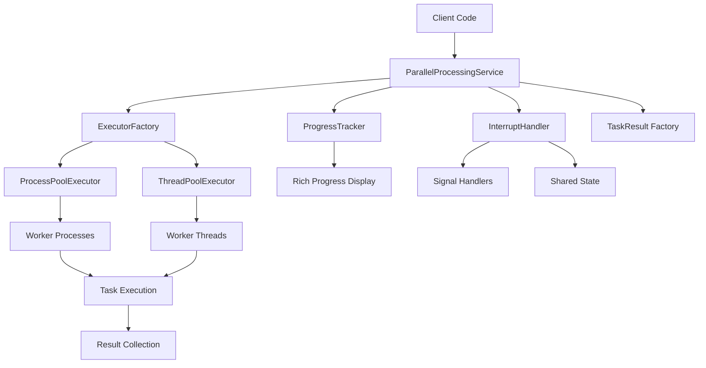
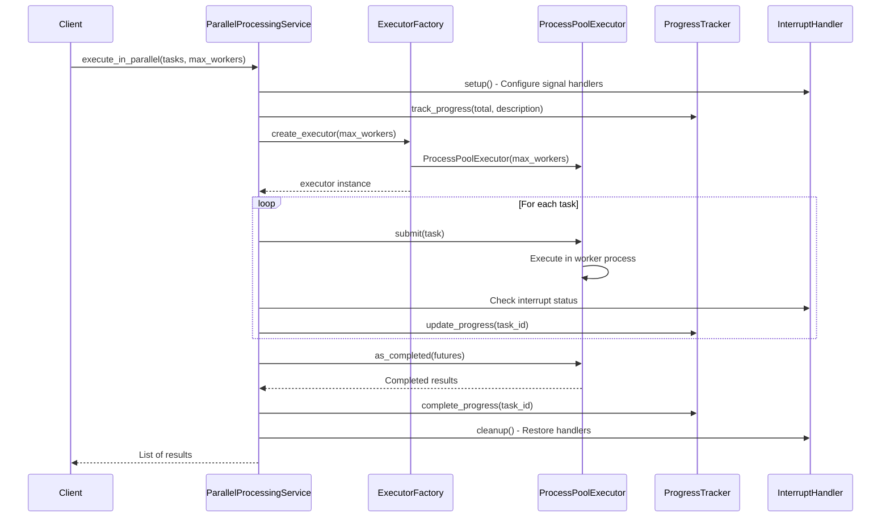

# Parallel Processing Architecture

**Document Version:** 1.0  
**Last Updated:** 2025-07-27  
**Status:** Implementation Complete  
**Stakeholders:** Development Team, Technical Lead, Product Owner  
**Related Documents:** [Interrupt Handling](interrupt-handling.md), [Task Batching Patterns](task-batching-patterns.md), [Thread vs Process Pool Strategy](thread-vs-process-pool-strategy.md)

## 1. Overview

### Purpose
This document describes the parallel processing architecture implemented in the KP Analysis Toolkit. The primary use case is for CPU-bound operations like search engine execution and Excel export generation. The system provides process-based parallelism with multi-stage interrupt handling and progress tracking.

A secondary use case provides for IO-bound operations where a Python thread-based approach is more appropriate.

### Scope

- **In Scope:** Parallel processing service design, executor factory patterns, progress tracking, interrupt handling, task batching strategies
- **Out of Scope:** Individual business logic implementations, file I/O patterns, Rich output formatting details
- **Assumptions:** Tasks are CPU-bound and independent, ProcessPoolExecutor is preferred for Python GIL bypass, graceful interruption is required

### Key Stakeholders

- **Primary Users:** Search engine service, Excel export service, batch processing operations
- **Secondary Users:** CLI commands requiring parallel execution
- **Maintainers:** Development team responsible for performance and reliability

## 2. Problem Statement

### Business Context
The KP Analysis Toolkit processes large datasets from security audit scripts across multiple systems and configurations. Users need responsive parallel processing that can efficiently utilize modern multi-core systems while providing clear progress feedback and graceful cancellation capabilities.

### Technical Challenges

- **Python GIL Limitation:** Threading ineffective for CPU-bound operations requiring true parallelism
- **Memory Management:** Large task queues can exhaust system memory without batching strategies
- **Interrupt Handling:** Users need graceful cancellation with multiple stages of urgency
- **Progress Coordination:** Process boundaries complicate progress tracking across workers

### Constraints

- **Technical Constraints:** Must work with Python's multiprocessing limitations including pickle-compatible task functions
- **Business Constraints:** Support single-process fallback, maintain responsive user feedback; controlled through CLI `-p 1` option.
- **Platform Constraints:** Cross-platform compatibility (Windows, Linux, macOS)

## 3. Architecture Overview

### High-Level Design



### Core Principles

- **Process-Based Parallelism:** Use `ProcessPoolExecutor` for CPU-bound tasks to bypass Python GIL
- **Thread-Based Parallelism:** Use `ThreadPoolExecutor` for IO-bound tasks
- **Dependency Injection:** All parallel processing components are injected for testability and flexibility through `core.services.parallel_processing` service
- **Multi-Stage Interruption:** Support graceful, urgent, and immediate cancellation strategies
- **Memory Efficiency:** Implement batching strategies to prevent memory exhaustion with large task sets

### Design Goals

- **Performance:** Efficient utilization of multi-core systems for CPU-bound operations
- **Responsiveness:** Real-time progress feedback and responsive interrupt handling
- **Reliability:** Robust error handling and recovery from process failures
- **Testability:** Mockable dependencies and isolated component testing

## 4. Detailed Design

### 4.1 Component Architecture

#### Component 1: ParallelProcessingService

- **Purpose:** Orchestrate parallel task execution with progress tracking and interrupt handling
- **Responsibilities:** Task distribution, result collection, interrupt coordination, progress management
- **Interfaces:** ParallelProcessingService protocol, context manager support
- **Dependencies:** ExecutorFactory, ProgressTracker, InterruptHandler, TaskResult factory
- **Assumptions:** Task results will be collated in the main process as returned by `futures` / minimizes process-safety concerns for inter-process communication

```python
class DefaultParallelProcessingService(ParallelProcessingService):
    """Default implementation with multi-stage interrupt support."""
    
    def __init__(
        self,
        executor_factory: ExecutorFactory,
        progress_tracker: ProgressTracker,
        interrupt_handler: InterruptHandler,
        task_result_factory: Callable[[], TaskResult],
    ) -> None:
        self._executor_factory = executor_factory
        self._progress_tracker = progress_tracker
        self._interrupt_handler = interrupt_handler
        self._task_result_factory = task_result_factory
    
    def execute_in_parallel(
        self,
        tasks: list[Callable[[], KPATBaseModel]],
        max_workers: int,
        description: str = "Processing...",
    ) -> list[KPATBaseModel]:
        """Execute tasks in parallel with progress tracking and interruption."""
        # Implementation handles setup, execution, and cleanup
```

#### Component 2: ExecutorFactory Pattern

- **Purpose:** Abstract executor creation for different concurrency strategies
- **Responsibilities:** Create configured executors, handle resource allocation errors
- **Interfaces:** ExecutorFactory protocol, concrete process/thread implementations
- **Dependencies:** Standard library concurrent.futures executors
- **Returns:** Either a `ProcessPoolExecutor` or a `ThreadPoolExecutor` as determined during dependency injection wiring

```python
class ProcessPoolExecutorFactory(ExecutorFactory):
    """Factory for creating ProcessPoolExecutor instances optimized for CPU-bound tasks."""
    
    def create_executor(self, max_workers: int) -> concurrent.futures.Executor:
        """Create ProcessPoolExecutor with validation and error handling."""
        if max_workers <= 0:
            msg = f"max_workers must be greater than 0, got {max_workers}"
            raise ValueError(msg)
        
        try:
            return concurrent.futures.ProcessPoolExecutor(
                max_workers=max_workers,
                mp_context=None,  # Use default multiprocessing context
            )
        except OSError as e:
            error_msg = f"Failed to create ProcessPoolExecutor with {max_workers} workers: {e}"
            raise OSError(error_msg) from e

class ThreadPoolExecutorFactory(ExecutorFactory):
    """Factory for creating ThreadPoolExecutor instances optimized for I/O-bound tasks."""
    
    def create_executor(self, max_workers: int) -> concurrent.futures.Executor:
        """Create ThreadPoolExecutor with validation and error handling."""
        if max_workers <= 0:
            msg = f"max_workers must be greater than 0, got {max_workers}"
            raise ValueError(msg)
        
        try:
            return concurrent.futures.ThreadPoolExecutor(
                max_workers=max_workers,
                thread_name_prefix="kpat-worker",
            )
        except OSError as e:
            error_msg = f"Failed to create ThreadPoolExecutor with {max_workers} workers: {e}"
            raise OSError(error_msg) from e
```

#### Component 3: Progress Tracking System

- **Purpose:** Coordinate progress display across process boundaries
- **Responsibilities:** Create progress tasks, update progress state, manage Rich console output
- **Interfaces:** ProgressTracker protocol, context manager support
- **Dependencies:** Rich progress library, RichOutputService (as a singleton)

```python
class DefaultProgressTracker(ProgressTracker):
    """Default implementation using Rich progress display."""
    
    def __init__(self, rich_output: RichOutputService) -> None:
        self._rich_output = rich_output
        self._progress_context: Progress | None = None
    
    def track_progress(self, total: int, description: str) -> rich.progress.TaskID:
        """Create and track a progress task for parallel operations."""
        if total <= 0:
            msg = f"Total must be greater than 0, got {total}"
            raise ValueError(msg)
        
        # Create progress context if not already active
        if self._progress_context is None:
            self._progress_context = self._rich_output.create_progress_context()
            self._progress_context.__enter__()
        
        return self._progress_context.add_task(description, total=total)
    
    def update_progress(self, task_id: rich.progress.TaskID, advance: int = 1) -> None:
        """Update progress for a tracked task."""
        if self._progress_context is None:
            msg = "No active progress context"
            raise ValueError(msg)
        
        self._progress_context.update(task_id, advance=advance)
```

### 4.2 Data Flow



### 4.3 Key Patterns

#### Pattern 1: Multi-Stage Interrupt Handling

- **Intent:** Provide progressive interrupt escalation for different user urgency levels
- **Structure:** Three-stage escalation with shared state coordination
- **Implementation:** 
    - `InterruptHandler`s track state using process-safe mechanisms
    - `parallel_processing.service` orchestration checks `InterruptHandler` state during each execution loop to determine if user has requested interruption
    - Orchestration gracefully handles interrupt escalation by implementing necessary actions to clear job queues, return results, etc.

```python
class DefaultInterruptHandler(InterruptHandler):
    """Implementation of multi-stage interrupt handling."""
    
    def __init__(self, rich_output: RichOutputService) -> None:
        self._rich_output = rich_output
        self._interrupt_stage = 0
        self._original_sigint_handler = None
    
    def get_interrupt_stage(self) -> int:
        """Get current interrupt stage (0=none, 1=graceful, 2=urgent, 3=immediate)."""
        return self._interrupt_stage
    
    def should_cancel_queued_tasks(self) -> bool:
        """Check if queued tasks should be cancelled (stage 1+)."""
        return self._interrupt_stage >= 1
    
    def should_terminate_active_tasks(self) -> bool:
        """Check if active tasks should be terminated (stage 2+)."""
        return self._interrupt_stage >= 2
    
    def should_immediate_exit(self) -> bool:
        """Check if immediate exit is required (stage 3)."""
        return self._interrupt_stage >= 3
    
    def handle_interrupt_stage(self, stage: int) -> None:
        """Handle interrupt at specified stage with user feedback."""
        self._interrupt_stage = stage
        
        if stage == 1:
            self._rich_output.warning("Interrupt received: Cancelling queued tasks...")
        elif stage == 2:
            self._rich_output.warning("Second interrupt: Terminating active tasks...")
        elif stage == 3:
            self._rich_output.error("Third interrupt: Immediate termination!")
```

#### Pattern 2: Memory-Efficient Task Batching

- **Intent:** Process large task sets without exhausting system memory
- **Structure:** Batch-based execution with configurable batch sizes
- **Implementation:** Automatic batch size calculation based on task count

```python
def execute_with_batching(
    self,
    tasks: list[Callable[[], KPATBaseModel]],
    max_workers: int,
    batch_size: int | None = None,
    description: str = "Processing...",
) -> list[KPATBaseModel]:
    """Execute large numbers of tasks in parallel with memory-efficient batching."""
    
    # Calculate optimal batch size if not provided
    if batch_size is None:
        # Use heuristic: 4 batches per worker, minimum 10 tasks per batch
        batch_size = max(10, len(tasks) // (max_workers * 4))
    
    # Process tasks in batches to prevent memory exhaustion
    all_results: list[KPATBaseModel] = []
    total_batches = math.ceil(len(tasks) / batch_size)
    
    with self._interrupt_handler, self._progress_tracker:
        task_id = self._progress_tracker.track_progress(total_batches, description)
        
        for batch_num in range(total_batches):
            if self._interrupt_handler.should_cancel_queued_tasks():
                break
            
            # Extract current batch
            start_idx = batch_num * batch_size
            end_idx = min(start_idx + batch_size, len(tasks))
            batch_tasks = tasks[start_idx:end_idx]
            
            # Execute batch with same parallel processing logic
            batch_results = self._execute_single_batch(batch_tasks, max_workers, task_id)
            all_results.extend(batch_results)
            
            # Check for higher-priority interrupts
            if self._interrupt_handler.should_terminate_active_tasks():
                break
        
        return all_results
```

#### Pattern 3: Process-Safe Result Collection

- **Intent:** Safely collect and aggregate results from multiple processes
- **Structure:** Future-based collection with interrupt-aware waiting
- **Implementation:** concurrent.futures.as_completed with interrupt polling collects all results in the main process, avoiding inter-process communication challenges

```python
def _process_task_results_with_interrupt_handling(
    self,
    future_to_index: dict[concurrent.futures.Future[KPATBaseModel], int],
    tasks: list[Callable[[], KPATBaseModel]],
    task_id: rich.progress.TaskID,
) -> list[KPATBaseModel]:
    """Collect results from futures with interrupt handling."""
    
    # Initialize results list with None placeholders to maintain order
    results: list[KPATBaseModel | None] = [None] * len(tasks)
    
    # Process completed futures as they finish
    for future in concurrent.futures.as_completed(future_to_index.keys()):
        # Check for interrupts before processing each result
        if self._interrupt_handler.should_immediate_exit():
            # Cancel all remaining futures
            for remaining_future in future_to_index.keys():
                if not remaining_future.done():
                    remaining_future.cancel()
            msg = "Immediate termination requested"
            raise InterruptedError(msg)
        
        # Collect result and maintain original order
        task_index = future_to_index[future]
        try:
            result = future.result()
            results[task_index] = result
        except Exception as e:
            # Handle task execution errors according to strategy
            self._handle_task_error(e, task_index, tasks[task_index])
        
        # Update progress
        self._progress_tracker.update_progress(task_id)
        
        # Stop collecting if urgent termination requested
        if self._interrupt_handler.should_terminate_active_tasks():
            break
    
    # Filter out None results and return completed ones
    return [result for result in results if result is not None]
```

## 5. Implementation Guide

### 5.1 Directory Structure

```
src/kp_analysis_toolkit/core/services/parallel_processing/
├── __init__.py                 # Package exports
├── protocols.py                # Protocol definitions
├── service.py                  # Main service implementation
├── executor_factory.py         # Executor factory implementations
├── progress_tracker.py         # Progress tracking implementation
├── interrupt_handler.py        # Interrupt handling implementation
└── task_result.py             # Task result wrapper implementation
```

### 5.2 Key Files and Their Purposes

#### Service Implementation (`service.py`)

```python
class DefaultParallelProcessingService(ParallelProcessingService):
    """
    Default implementation with multi-stage interrupt support.
    
    Orchestrates parallel task execution using injected dependencies.
    Provides both basic parallel execution and memory-efficient batching.
    """
    
    def execute_in_parallel(
        self,
        tasks: list[Callable[[], KPATBaseModel]],
        max_workers: int,
        description: str = "Processing...",
    ) -> list[KPATBaseModel]:
        """Primary method for parallel execution with progress tracking."""
        # Validation and setup
        # Task submission with interrupt handling
        # Result collection with progress updates
        # Cleanup and error handling
    
    def execute_with_batching(
        self,
        tasks: list[Callable[[], KPATBaseModel]],
        max_workers: int,
        batch_size: int | None = None,
        description: str = "Processing...",
    ) -> list[KPATBaseModel]:
        """Memory-efficient execution for large task sets."""
        # Batch size calculation
        # Batch-by-batch processing
        # Result aggregation across batches
```

#### Protocol Definitions (`protocols.py`)

```python
class ParallelProcessingService(Protocol):
    """Protocol for the main parallel processing service."""
    
    def execute_in_parallel(
        self,
        tasks: list[Callable[[], KPATBaseModel]],
        max_workers: int,
        description: str = "Processing...",
    ) -> list[KPATBaseModel]:
        """Execute callable tasks in parallel with progress tracking."""
        ...
    
    def execute_with_batching(
        self,
        tasks: list[Callable[[], KPATBaseModel]],
        max_workers: int,
        batch_size: int | None = None,
        description: str = "Processing...",
    ) -> list[KPATBaseModel]:
        """Execute large numbers of tasks with memory-efficient batching."""
        ...

class ExecutorFactory(Protocol):
    """Protocol for creating concurrent execution contexts."""
    
    def create_executor(self, max_workers: int) -> concurrent.futures.Executor:
        """Create a configured executor for parallel processing."""
        ...
```

### 5.3 Testing Strategy

#### Unit Testing

```python
import pytest
from unittest.mock import MagicMock, patch
from kp_analysis_toolkit.core.services.parallel_processing import (
    DefaultParallelProcessingService,
    ProcessPoolExecutorFactory,
)

@pytest.mark.unit
class TestDefaultParallelProcessingService:
    """Unit tests for parallel processing service."""
    
    def test_execute_in_parallel_validates_empty_tasks_list(self) -> None:
        """Test that empty tasks list raises ValueError."""
        service = DefaultParallelProcessingService(
            executor_factory=MagicMock(),
            progress_tracker=MagicMock(),
            interrupt_handler=MagicMock(),
            task_result_factory=MagicMock(),
        )
        
        with pytest.raises(ValueError, match="Tasks list cannot be empty"):
            service.execute_in_parallel([], max_workers=2)
    
    def test_execute_in_parallel_validates_max_workers(self) -> None:
        """Test that invalid max_workers raises ValueError."""
        service = DefaultParallelProcessingService(
            executor_factory=MagicMock(),
            progress_tracker=MagicMock(),
            interrupt_handler=MagicMock(),
            task_result_factory=MagicMock(),
        )
        
        with pytest.raises(ValueError, match="max_workers must be positive"):
            service.execute_in_parallel([lambda: "test"], max_workers=0)

@pytest.mark.unit
class TestProcessPoolExecutorFactory:
    """Unit tests for ProcessPoolExecutor factory."""
    
    def test_create_executor_returns_process_pool_executor(self) -> None:
        """Test that factory creates ProcessPoolExecutor instances."""
        factory = ProcessPoolExecutorFactory()
        
        executor = factory.create_executor(2)
        
        assert isinstance(executor, concurrent.futures.ProcessPoolExecutor)
        executor.shutdown(wait=False)
```

#### Integration Testing

```python
@pytest.mark.integration
class TestParallelProcessingIntegration:
    """Integration tests with real parallel processing."""
    
    def test_cpu_intensive_tasks_with_process_pool(
        self,
        cpu_intensive_tasks: list[Callable[[], KPATBaseModel]],
        real_parallel_processing_service: DefaultParallelProcessingService,
    ) -> None:
        """Test CPU-intensive tasks execute correctly with process pool."""
        max_workers = 2
        
        results = real_parallel_processing_service.execute_in_parallel(
            tasks=cpu_intensive_tasks,
            max_workers=max_workers,
            description="Testing CPU tasks",
        )
        
        # Verify all tasks completed successfully
        assert len(results) == len(cpu_intensive_tasks)
        for result in results:
            assert isinstance(result, KPATBaseModel)
    
    def test_batching_execution_with_large_task_set(
        self,
        real_parallel_processing_service: DefaultParallelProcessingService,
    ) -> None:
        """Test memory-efficient batching with large task sets."""
        # Create many simple tasks
        tasks = [lambda i=i: SimpleTestModel(value=i) for i in range(100)]
        
        results = real_parallel_processing_service.execute_with_batching(
            tasks=tasks,
            max_workers=4,
            batch_size=10,
            description="Testing batched execution",
        )
        
        assert len(results) == len(tasks)
```

## 6. Configuration and Dependencies

### 6.1 Dependency Injection Setup

```python
from dependency_injector import containers, providers
from kp_analysis_toolkit.core.services.parallel_processing import (
    DefaultParallelProcessingService,
    ProcessPoolExecutorFactory,
    DefaultProgressTracker,
    DefaultInterruptHandler,
    DefaultTaskResult,
)

class ParallelProcessingContainer(containers.DeclarativeContainer):
    """DI container for parallel processing services."""
    
    # Configuration
    config = providers.Configuration()
    
    # Core dependencies
    rich_output = providers.Dependency()
    
    # Factories
    executor_factory = providers.Factory(
        ProcessPoolExecutorFactory,
    )
    
    progress_tracker = providers.Factory(
        DefaultProgressTracker,
        rich_output=rich_output,
    )
    
    interrupt_handler = providers.Factory(
        DefaultInterruptHandler,
        rich_output=rich_output,
    )
    
    task_result_factory = providers.Factory(DefaultTaskResult)
    
    # Main service
    parallel_processing = providers.Factory(
        DefaultParallelProcessingService,
        executor_factory=executor_factory,
        progress_tracker=progress_tracker,
        interrupt_handler=interrupt_handler,
        task_result_factory=task_result_factory,
    )
```

### 6.2 Process Pool Configuration

```python
# Optimal worker count calculation
import multiprocessing
import os

def calculate_optimal_workers() -> int:
    """Calculate optimal number of worker processes."""
    cpu_count = multiprocessing.cpu_count()
    
    # Use environment variable override if provided
    if "KPAT_MAX_WORKERS" in os.environ:
        try:
            return int(os.environ["KPAT_MAX_WORKERS"])
        except ValueError:
            pass  # Fall back to automatic calculation
    
    # Conservative approach: use 75% of available cores
    # Leave some cores for system and main process
    return max(1, int(cpu_count * 0.75))

# ProcessPoolExecutor configuration
PROCESS_POOL_CONFIG = {
    "max_workers": calculate_optimal_workers(),
    "mp_context": None,  # Use default multiprocessing context
}
```

## 7. Quality Attributes

### 7.1 Performance

- **Throughput:** Process pool execution scales with CPU cores, typically 2-4x speedup on quad-core systems
- **Latency:** Process startup overhead ~100-200ms, amortized across batch operations
- **Resource Usage:** Memory usage scales with batch size and worker count, configurable limits

### 7.2 Reliability

- **Availability:** Graceful degradation to single-process execution if process pool creation fails
- **Error Handling:** Individual task failures don't stop overall processing, configurable error strategies
- **Recovery:** Process pool automatically recreated on fatal worker failures

### 7.3 Security

- **Process Isolation:** Worker processes isolated from main process memory space
- **Resource Limits:** Configurable limits on worker count and memory usage
- **Signal Handling:** Safe signal handler registration and cleanup

### 7.4 Maintainability

- **Code Organization:** Clear separation of concerns with protocol-based design
- **Testing:** Comprehensive unit and integration test coverage with real and mock executors
- **Monitoring:** Progress tracking and interrupt status provide operational visibility

## 8. Deployment and Operations

### 8.1 Deployment Requirements

- **Environment Setup:** Python 3.11+ with multiprocessing support
- **Dependencies:** Rich library for progress display, concurrent.futures standard library
- **Configuration:** Environment variables for worker count tuning

### 8.2 Monitoring and Observability

- **Progress Tracking:** Real-time progress display through Rich console output
- **Interrupt Status:** Multi-stage interrupt handling with user feedback
- **Error Reporting:** Individual task failures logged with context information

### 8.3 Maintenance Procedures

- **Performance Tuning:** Adjust worker count based on system capacity and workload characteristics
- **Memory Monitoring:** Monitor batch size impact on memory usage, adjust for available system memory
- **Error Analysis:** Review task failure patterns and adjust error handling strategies

## 9. Migration and Evolution

### 9.1 Migration Strategy

- **From Sequential Processing:** Replace sequential task execution with parallel service calls
- **Batch Size Optimization:** Start with automatic batch sizing, tune based on memory usage patterns
- **Worker Count Tuning:** Begin with conservative CPU count calculation, adjust based on performance metrics

### 9.2 Future Evolution

- **Planned Enhancements:** Adaptive batch sizing based on task execution time, dynamic worker pool scaling
- **Extension Points:** Custom executor factories for specialized execution environments
- **Deprecation Policy:** Maintain backward compatibility for sequential execution fallback

## 10. Appendices

### 10.1 Glossary

- **Process Pool:** Collection of worker processes for parallel task execution
- **Executor Factory:** Pattern for creating and configuring concurrent execution contexts
- **Multi-Stage Interruption:** Progressive interrupt escalation with different urgency levels
- **Task Batching:** Memory-efficient processing of large task sets in smaller chunks

### 10.2 References

- [Python ProcessPoolExecutor Documentation](https://docs.python.org/3/library/concurrent.futures.html#processpoolexecutor)
- [Multiprocessing Best Practices](https://docs.python.org/3/library/multiprocessing.html#programming-guidelines)
- [Interrupt Handling Architecture](interrupt-handling.md)

### 10.3 Decision Log

| Date | Decision | Rationale | Impact |
|------|----------|-----------|---------|
| 2025-07-27 | ProcessPoolExecutor over ThreadPoolExecutor | CPU-bound tasks benefit from process isolation and GIL bypass | Better performance for search and Excel operations |
| 2025-07-27 | Multi-stage interrupt handling | Users need different levels of cancellation urgency | Improved user experience with responsive cancellation |
| 2025-07-27 | Dependency injection architecture | Testability and flexibility requirements | Easier testing and future extensibility |

### 10.4 Review History

| Version | Date | Author | Changes |
|---------|------|--------|---------|
| 1.0 | 2025-07-27 | GitHub Copilot | Initial parallel processing architecture documentation |