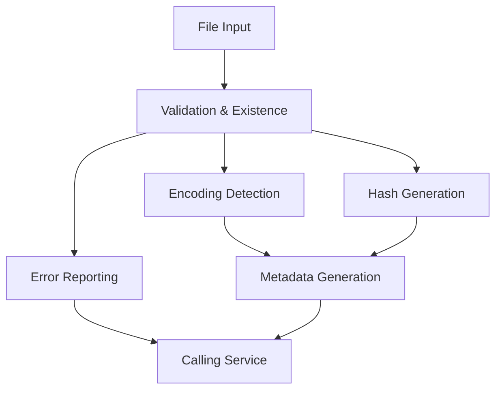
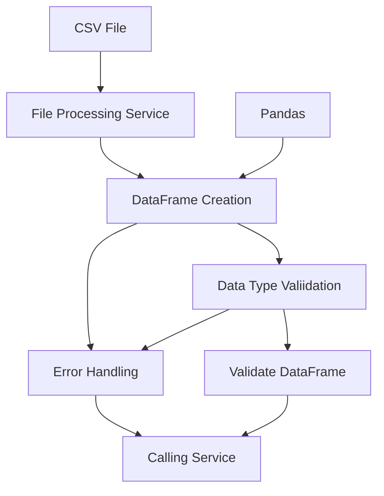
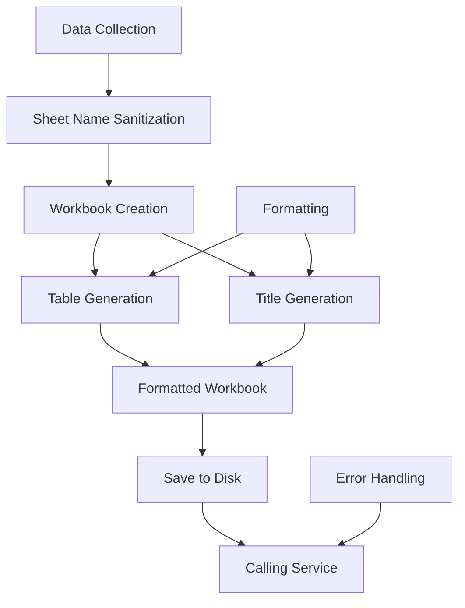
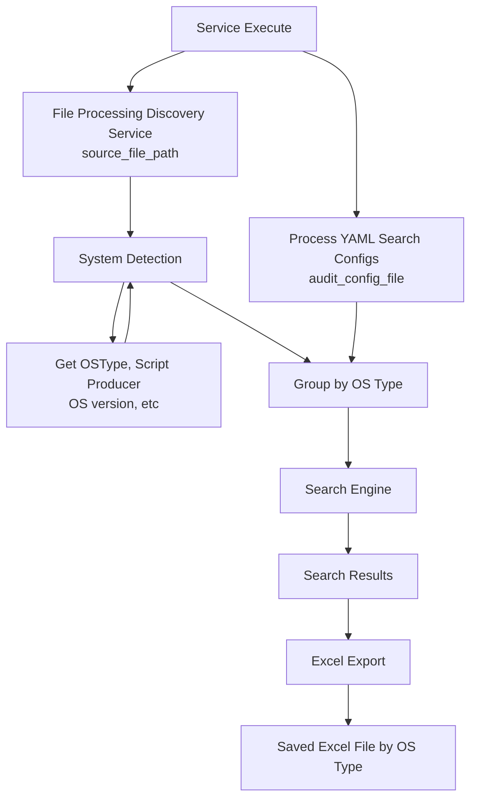
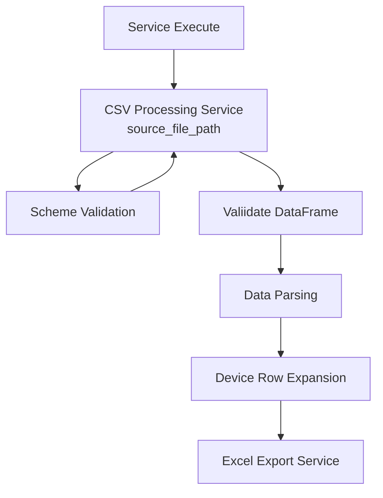
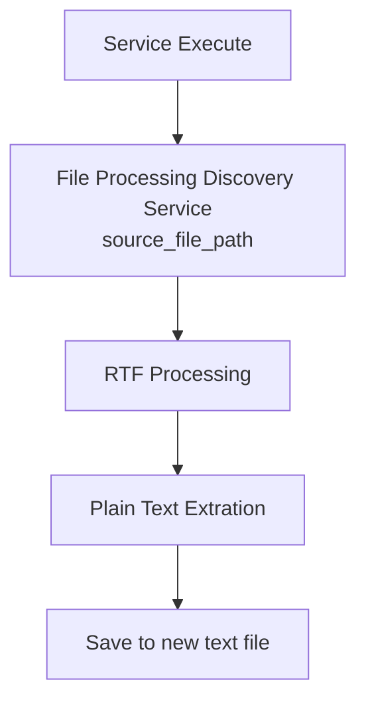
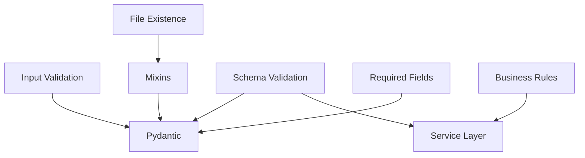

# Data Flows Architecture

## Overview

The KP Analysis Toolkit implements sophisticated data flow patterns that orchestrate data transformation, validation, and output generation across multiple service layers. The architecture emphasizes pipeline-based processing with clear separation of concerns and robust error handling.

## Data Flow Principles

### Pipeline-Based Processing

Data flows through well-defined pipelines with discrete stages:

- **Input Validation**: File existence, format validation, encoding detection
- **Data Ingestion**: CSV parsing, DataFrame creation, schema validation
- **Data Transformation**: Filtering, expansion, enrichment, aggregation
- **Output Generation**: Excel export, formatting, multi-sheet coordination

### Service Orchestration

Data flows coordinate multiple services through dependency injection:

- Core services provide foundational capabilities
- Module-specific services extend core functionality
- Service composition enables complex data processing workflows
- Clear service boundaries maintain data integrity

## Core Data Flow Patterns

### File Processing Pipeline

The foundational data flow for all file-based operations:



#### Implementation Flow

```python
# AI-GEN: gpt-4o|2024-12-19|data-architecture|reviewed:no
class FileProcessingFlow:
    def __init__(self, file_processing: FileProcessingService):
        self.file_processing = file_processing
    
    def process_file(self, file_path: Path) -> ProcessedFileResult:
        # Stage 1: Validation
        if not self.file_processing.validate_file_exists(file_path):
            raise FileNotFoundError(f"File not found: {file_path}")
        
        # Stage 2: Encoding Detection
        encoding = self.file_processing.detect_encoding(file_path)
        
        # Stage 3: Metadata Generation
        file_hash = self.file_processing.generate_hash(file_path)
        
        # Stage 4: Content Processing
        return self._process_content(file_path, encoding, file_hash)
```

### CSV Processing Pipeline

Specialized pipeline for CSV data processing with validation:



#### Service Integration

```python
# AI-GEN: gpt-4o|2024-12-19|data-architecture|reviewed:no
class CSVProcessingFlow:
    def __init__(
        self,
        csv_processor: CSVProcessor,
        file_processing: FileProcessingService,
        rich_output: RichOutputService,
    ):
        self.csv_processor = csv_processor
        self.file_processing = file_processing
        self.rich_output = rich_output
    
    def process_csv_file(
        self,
        file_path: Path,
        required_columns: list[str],
    ) -> pd.DataFrame:
        try:
            # File validation through file processing service
            self.file_processing.validate_file_exists(file_path)
            
            # CSV-specific processing
            df = self.csv_processor.read_csv_file(file_path)
            self.csv_processor.validate_required_columns(df, required_columns)
            
            self.rich_output.success(f"Successfully processed CSV: {file_path}")
            return df
            
        except Exception as e:
            self.rich_output.error(f"CSV processing failed: {e}")
            raise
```

### Excel Export Pipeline

Complex pipeline for Excel workbook generation with multiple sheets:



## Module-Specific Data Flows

### Process Scripts Data Flow

Complex data flow coordinating search operations, system detection, and Excel export:



#### Process Scripts Flow Implementation
TBD

### Nipper Expander Data Flow

Specialized flow for CSV expansion and data transformation:



### RTF to Text Data Flow

Simple but robust ETF flow for document conversion:



## Error Handling in Data Flows

### Progressive Error Handling

All errors requiring user notification should propogate back up to the CLI for user handling.

All other errors can be handled at the service layer with fall back strategies, suppression or other strategies appropriate to the situation.

A set of methods are provided in `cli.common` for handling fatal and other errors.

### Error Aggregation Patterns

Complex flows aggregate errors for comprehensive reporting:

## Data Validation Flows

### Multi-Stage Validation

Data validation occurs at multiple stages with different validation rules, including:

- **Input Validation:** Primarily the domain of Pydantic data models
- **File Existence:** Validated by Pydantic using mixins
- **Schema Validation:** Cross-field validation can be implemented in Pydantic, but more complex scenarios should be modeled in the service layer
- **Required Fields:** Validated by Pydantic
- **Business Rules:** Always validated at the service layer or, if apppriate, at the user interface



