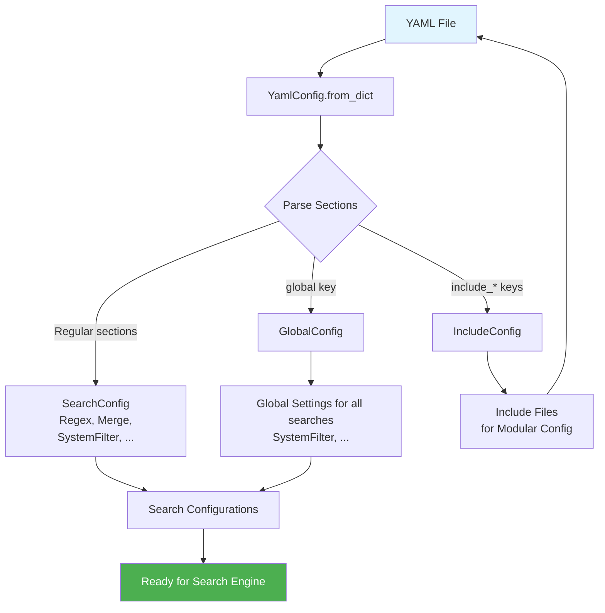

# Process Scripts Data Models

This document provides comprehensive documentation for all data models used in the Process Scripts command, including their structure, validation rules, relationships, and usage patterns.

## Overview

The Process Scripts module uses a sophisticated hierarchy of Pydantic models to manage search configurations, system detection, YAML processing, and results handling. All models inherit from `KPATBaseModel` and provide comprehensive data validation and type safety.

## Core Data Models

The Process Scripts command use four primary groups of data models:

1. **Program Config:** Main configuration model for the Process Scripts command
2. **Systems:** Represents the invidual systems captured in each of source files
3. **Search Configs`:** Includes models for handling raw YAML files, include operations, and defining individual searches
4. **Results:** Represents the search results collect by the search engine and eventually written out to Excel output files

### ProgramConfig

**Purpose**: Main configuration model for the Process Scripts command

**Location**: `src/kp_analysis_toolkit/process_scripts/models/program_config.py`

**Description**:
The primary configuration model that orchestrates all process script operations. It validates input parameters, manages file paths, and coordinates search configuration.

- File path validation with existence checks
- Integration with search configuration models
- Output settings coordination
- Cross-field validation support

### Systems

**Purpose**: Operating system detection and configuration model

**Location**: `src/kp_analysis_toolkit/process_scripts/models/systems.py`

**Description**:
Handles operating system detection, path conventions, and system-specific processing logic. Provides cross-platform compatibility and system-aware processing.

**Key Features**:

- Includes properties common to all OS types as well as those unique to just Windows, Linux or MacOS
- Captures all details relevant to each OS
- Field names are consistent with those used in `SysFilters` to allow selective execution of search configs

### Search Configs
The main data model is the `YamlConfig`, which then relies on a number of supporting models to finally produce a single `SearchConfig` as the final output.



#### YamlConfig

**Purpose**: Complete YAML configuration file structure

**Location**: `src/kp_analysis_toolkit/process_scripts/models/search/yaml.py`

**Description**:
Represents the complete structure of a YAML configuration file including global settings, search configurations, and include directives. Handles the parsing and organization of YAML-based search configurations.

**Key Features**:

- Global configuration support for shared settings
- Dictionary-based search configuration storage
- Include directive support for modular configuration files
- Factory method for YAML dictionary parsing
- Automatic Excel sheet name generation from section names

##### Supporting Models

###### GlobalConfig

**Purpose**: Global configuration that can be applied to all search sections

**Location**: `src/kp_analysis_toolkit/process_scripts/models/search/base.py`

**Description**:
Defines global settings that are inherited by all search configurations unless overridden at the individual search level.  Usually only the `sys_filter` would be set, but other paramters can also be applied globally if the need arises.

**NOTE:** "Global" in this context means that it applies to all other searches within the same YAML file.  Global scope does not inherit across YAML files.

```python
class GlobalConfig(KPATBaseModel, ConfigModel):
    """Global configuration that can be applied to all search sections."""

    sys_filter: list[SystemFilter] | None = None
    max_results: int | None = None
    only_matching: bool | None = None
    unique: bool | None = None
    full_scan: bool | None = None
```

###### IncludeConfig

**Purpose**: Configuration for including other YAML files

**Location**: `src/kp_analysis_toolkit/process_scripts/models/search/yaml.py`

**Description**:
Enables modular YAML configuration by allowing inclusion of other configuration files.

```python
class IncludeConfig(KPATBaseModel):
    """Configuration for including other YAML files."""

    files: list[str] = Field(
        description="List of file paths to include in the configuration"
    )
```

###### SystemFilter

**Purpose**: System-specific filtering criteria for searches

**Location**: `src/kp_analysis_toolkit/process_scripts/models/search/sys_filters.py`

**Description**:
Defines criteria for filtering searches based on operating system, file types, and system-specific patterns. Enables targeted processing based on system characteristics.

```python
class SystemFilter(KPATBaseModel):
    """System filter configuration for limiting search applicability."""

    attr: SysFilterAttr
    comp: SysFilterComparisonOperators
    value: SysFilterValueType

    @field_validator("value")
    @classmethod
    def validate_value_for_operator(
        cls,
        value: SysFilterValueType,
        info: dict,
    ) -> SysFilterValueType:
        """Validate that the value type is appropriate for the comparison operator."""
        comp: str = info.data.get("comp")

        if comp == SysFilterComparisonOperators.IN:
            if not isinstance(value, list | set):
                message: str = "'in' operator requires a list or set value"
                raise ValueError(message)
        elif comp in [
            SysFilterComparisonOperators.GREATER_THAN,
            SysFilterComparisonOperators.LESS_THAN,
            SysFilterComparisonOperators.GREATER_EQUAL,
            SysFilterComparisonOperators.LESS_EQUAL,
        ] and isinstance(value, list | set):
            message: str = f"'{comp}' operator cannot be used with list or set values"
            raise ValueError(message)

        return value
```

**Key Features**:

- Common set of properties to selectively apply search configurations based on system attributes

###### MergeFieldConfig

**Purpose**: Configuration for merging multiple source columns into a single destination column

**Location**: `src/kp_analysis_toolkit/process_scripts/models/search/base.py`

**Description**:
Defines how multiple source columns should be merged into a single destination column during search result processing. Uses a simple "first non-empty value" strategy where the first non-empty value from the source columns becomes the destination column value.

```python
class MergeFieldConfig(KPATBaseModel):
    """Configuration for merging multiple source columns into a single destination column."""
    
    source_columns: list[str] = Field(
        description="List of source column names to merge (minimum 2 required)"
    )
    dest_column: str = Field(
        description="Destination column name for the merged result"
    )
    
    @field_validator('source_columns')
    @classmethod
    def validate_source_columns(cls, value: list[str]) -> list[str]:
        """Validate that at least two source columns are specified."""
        min_source_columns: int = 2
        if len(value) < min_source_columns:
            message: str = "merge_fields must specify at least two source_columns"
            raise ValueError(message)
        return value
```

**Key Features**:

- Simple field merging using field concetenation strategy
- Minimum validation requiring at least 2 source columns
- Source columns are removed from the result after merging
- New destination column includes all data from original source columns

#### SearchConfig

**Purpose**: Configuration for individual search operations within scripts

**Location**: `src/kp_analysis_toolkit/process_scripts/models/search/search_config.py`

**Description**:
Defines search parameters including regex patterns, system filters, and matching criteria. Supports complex search scenarios with validation and optimization.

```python
class SearchConfig(KPATBaseModel, ConfigModel):
    """Configuration for a single search operation."""

    name: str  # The YAML section name
    regex: str
    comment: str | None = None
    excel_sheet_name: str
    max_results: int = -1
    field_list: list[str] | None = None
    only_matching: bool = False
    unique: bool = False
    full_scan: bool = False
    rs_delimiter: str | None = None
    multiline: bool = False
    merge_fields: list[MergeFieldConfig] | None = None
    sys_filter: list[SystemFilter] | None = None

    @field_validator("regex")
    @classmethod
    def validate_regex(cls, value: str) -> str:
        """Validate that the regex pattern is valid."""
        import re

        try:
            re.compile(value)
        except re.error as e:
            message: str = f"Invalid regex pattern: {e}"
            raise ValueError(message) from e
        return value

    @field_validator("max_results")
    @classmethod
    def validate_max_results(cls, value: int) -> int:
        """Validate max_results is -1 (unlimited) or positive integer."""
        if value != -1 and value <= 0:
            message: str = "max_results must be -1 (unlimited) or a positive integer"
            raise ValueError(message)
        return value

    @field_validator("only_matching")
    @classmethod
    def validate_field_list_with_only_matching(cls, value: bool, info: dict) -> bool:  # noqa: FBT001
        """Validate that field_list is only used with only_matching=True."""
        if info.data.get("field_list") and not value:
            # Override only_matching to True if field_list is specified
            return True
        return value

    @field_validator("multiline")
    @classmethod
    def validate_multiline_with_field_list(cls, value: bool, info: dict) -> bool:  # noqa: FBT001
        """Validate that multiline is only used when field_list is specified."""
        if value and not info.data.get("field_list"):
            message: str = "multiline can only be used when field_list is specified"
            raise ValueError(message)
        return value

    @field_validator("multiline")
    @classmethod
    def validate_multiline_with_rs_delimiter(cls, value: bool, info: dict) -> bool:  # noqa: FBT001
        """Validate that rs_delimiter is only used with multiline=True."""
        if info.data.get("rs_delimiter") and not value:
            message = "rs_delimiter can only be used with multiline=True"
            raise ValueError(message)
        return value

    @field_validator("rs_delimiter")
    @classmethod
    def validate_rs_delimiter_with_field_list(
        cls,
        value: str | None,
        info: dict,
    ) -> str | None:
        """Validate that rs_delimiter is only used when field_list is specified."""
        if value is not None and not info.data.get("field_list"):
            message: str = "rs_delimiter can only be used when field_list is specified"
            raise ValueError(message)
        return value

    def merge_global_config(self, global_config: GlobalConfig) -> "SearchConfig":
        """Merge global configuration into this search config, with local config taking precedence."""
        merged_data = self.model_dump()

        # Apply global settings only if not already set locally
        if global_config.sys_filter and not merged_data.get("sys_filter"):
            merged_data["sys_filter"] = global_config.sys_filter
        elif global_config.sys_filter and merged_data.get("sys_filter"):
            # Combine global and local sys_filters
            merged_data["sys_filter"] = list(global_config.sys_filter) + list(
                merged_data["sys_filter"],
            )

        if global_config.max_results is not None and merged_data["max_results"] == -1:
            merged_data["max_results"] = global_config.max_results

        if global_config.only_matching is not None and not merged_data["only_matching"]:
            merged_data["only_matching"] = global_config.only_matching

        if global_config.unique is not None and not merged_data["unique"]:
            merged_data["unique"] = global_config.unique

        if global_config.full_scan is not None and not merged_data["full_scan"]:
            merged_data["full_scan"] = global_config.full_scan

        return SearchConfig(**merged_data)
```

**Key Features**:

- Regex pattern validation with compilation testing
- System filter integration
- Case sensitivity and multiline options
- Search name validation and constraints

### SearchResults

**Purpose**: Container for search operation results and metadata

**Location**: `src/kp_analysis_toolkit/process_scripts/models/results/search_results.py`

**Description**:
Stores search results with metadata, performance metrics, and structured data for reporting and analysis. Supports result aggregation and filtering.

```python
class SearchResult(KPATBaseModel):
    """Individual search result."""

    system_name: str
    line_number: int
    matched_text: str
    extracted_fields: dict[str, str | None | float] | None = None

    line_number: int = Field(gt=0, description="Line number must be a positive integer")


class SearchResults(KPATBaseModel):
    """Collection of results for a search configuration."""

    search_config: SearchConfig
    results: list[SearchResult]

    @computed_field
    @property
    def result_count(self) -> int:
        """Return the number of results."""
        return len(self.results)

    @computed_field
    @property
    def unique_systems(self) -> int:
        """Return the number of unique systems that had matches."""
        return len({result.system_name for result in self.results})

    @computed_field
    @property
    def has_extracted_fields(self) -> bool:
        """Check if any results have extracted fields."""
        return any(result.extracted_fields for result in self.results)
```

**Key Features**:

- Match count validation with cross-field checks
- Performance metrics with computed fields
- Filtering and result manipulation methods

## Supporting Enums and Types

Various enums and custom types to support the functions listed above, including:

### Toolkit Types
```python
# Generic TypeVar for type-preserving operations
T = TypeVar("T")

# Common value types that can be displayed in Rich output or exported to Excel
DisplayableValue = (
    str
    | int
    | float
    | bool
    | None
    | Path
    | list[Any]
    | tuple[Any, ...]
    | set[Any]
    | dict[str, Any]
)

# Configuration values (subset of DisplayableValue, typically simpler types)
ConfigValue = str | int | float | bool | None | Path | list[Any] | dict[str, Any]

# File path types (commonly used throughout the toolkit)
PathLike = str | Path

# Result data structures (used in search results, CSV processing, etc.)
ResultData = dict[str, DisplayableValue]
ResultList = list[ResultData]

# Excel export data types
ExcelData = dict[str, list[DisplayableValue]]
WorksheetData = dict[str, ExcelData]  # Multiple sheets
```

### Process Scripts Enums
```python
class DistroFamilyType(EnumStrMixin, StrEnum):
    """Enum to define the types of Linux families."""


class ProducerType(EnumStrMixin, StrEnum):
    """Enum to define the types of producers."""


class SysFilterAttr(EnumStrMixin, StrEnum):
    """System attributes that can be used in filters."""


class SysFilterComparisonOperators(EnumStrMixin, StrEnum):
    """Enum for sys_filter comparison operators."""


class OSFamilyType(EnumStrMixin, StrEnum):
    """Enum to define the types of systems."""
```

### Process Script Custom Types
```python
type PrimitiveType = str | int | float
type CollectionType = (
    list[str] | list[int] | list[float] | set[str] | set[int] | set[float]
)
type SysFilterValueType = PrimitiveType | CollectionType
```

## Usage Patterns
TBD

## Validation Features

### Field Validation

All models include comprehensive field validation:

- **File path validation**: Existence and accessibility checks
- **Regex validation**: Pattern compilation and syntax verification
- **System consistency**: OS-specific setting validation
- **Name uniqueness**: Preventing duplicate identifiers
- **Format validation**: Version numbers, extensions, etc.

### Error Handling

Models provide detailed, Pydantic-based error messages for validation failures:

- **Clear error descriptions**: Specific information about validation failures
- **Field context**: Which field caused the validation error
- **Suggested corrections**: Guidance on how to fix validation issues
- **Chained exceptions**: Preserve original error context when re-raising

