# Performance Architecture

This section covers performance optimization patterns, strategies, and implementations within the KP Analysis Toolkit.

## 🚀 Content Streaming Pattern

The **ContentStreamer** pattern provides efficient, targeted file content access across the entire toolkit, eliminating redundant file reads and providing significant performance improvements.

### Quick Stats
- **System Detection**: 99%+ performance improvement (10 lines vs 27K+ lines)
- **Multi-Module Processing**: 67-80% reduction in total file I/O
- **Memory Efficiency**: Only relevant content loaded at any time
- **Cross-Toolkit Benefits**: Every file processing module benefits

### Documentation
- **[Content Streaming Implementation](content-streaming.md)** - Technical details and architecture
- **[Migration Guide](content-streaming-migration.md)** - How to integrate ContentStreamer in your modules

## Key Performance Benefits

### "Read Once, Process Many" Architecture for Process Scripts


Total improvement: For 50+ regex patterns, reading 27K lines once instead of 50+ times (98%+ reduction in I/O)

### Performance Improvements for Process Scripts

| Scenario | Before (Lines Read) | After (Lines Read) | Improvement |
|--------|-------------------|-------------------|-------------|
| **10 Regex Patterns** | 10 × 27K = 270K lines | 1 × 27K = 27K lines | 90% reduction |
| **50 Regex Patterns** | 50 × 27K = 1.35M lines | 1 × 27K = 27K lines | 98% reduction |
| **100 Regex Patterns** | 100 × 27K = 2.7M lines | 1 × 27K = 27K lines | 99% reduction |
| **Header-Only Detection** | 27K+ full file | ~10 header lines | 99.9% reduction |

## Implementation Overview

### Core Components

The ContentStreamer pattern consists of:

1. **ContentStreamer Protocol** - Interface for streaming file content
2. **FileContentStreamer** - Basic streaming implementation with caching
3. **MultiPatternContentStreamer** - Advanced multi-pattern processing
4. **Enhanced FileProcessingService** - Factory for creating streamers

### Process Scripts Usage Patterns

#### Pattern 1: Multiple Regex Search (Primary Use Case)
```python
# Process Scripts - search for dozens of patterns in one pass
content_stream = file_processing.create_content_streamer(file_path)
patterns = {
    "password_policy": r"password.+(?:complexity|length|history)",
    "account_lockout": r"lockout.+(?:duration|threshold|attempts)",
    "audit_settings": r"audit.+(?:success|failure|enabled)",
    # Dozens more patterns...
}
results = content_stream.search_multiple_patterns(patterns)
# 98%+ performance improvement with 50+ patterns
```

#### Pattern 2: Header-Only Processing
```python
# Producer detection - only needs first 10 lines
content_stream = file_processing.create_content_streamer(file_path)
header_lines = content_stream.get_file_header(lines=10)
# 99%+ performance improvement
```

#### Pattern 3: Callback-Based Processing
```python
# Process scripts with event callbacks
def process_finding(line: str) -> None:
    # Process and record findings
    findings.append(parse_finding(line))

callbacks = {
    "firewall_rules": (r"firewall.+(?:allow|deny|reject)", process_finding),
    "system_patches": (r"patch.+(?:applied|failed|pending)", process_finding),
    # Many more patterns with callbacks...
}
content_stream.stream_with_multiple_callbacks(callbacks)
# 98%+ performance improvement for dozens of pattern callbacks
```

## Process Scripts Integration Status

```mermaid
graph TD
    subgraph Phase1["Phase 1: Core Infrastructure ✅"]
        A1["ContentStreamer Protocol<br>Definition"] --> A2["FileContentStreamer<br>Implementation"]
        A2 --> A3["MultiPatternContentStreamer<br>for Advanced Use Cases"]
        A3 --> A4["Integration with<br>FileProcessingService"]
    end
    
    subgraph Phase2["Phase 2: System Detection Migration ✅"]
        B1["Update SystemDetectionService<br>to Use Streaming"] --> B2["Modify Detector Protocols<br>to Accept ContentStreamer"]
        B2 --> B3["Update Existing<br>Detector Implementations"]
        B3 --> B4["Performance Testing<br>and Validation"]
    end
    
    subgraph Phase3["Phase 3: Process Scripts Integration 🔄"]
        C1["Process Scripts<br>Security Pattern Analysis"] --> C2["Multi-Pattern<br>Security Compliance Scanning"]
        C2 --> C3["Callback-Based<br>Finding Collection"]
        C3 --> C4["Performance Testing<br>and Optimization"]
    end
    
    subgraph Phase4["Phase 4: Performance Optimization ⏳"]
        D1["Add Metrics Collection<br>for Performance Monitoring"] --> D2["Implement Advanced<br>Caching Strategies"]
        D2 --> D3["Parallel Processing Support<br>for Multiple Files"]
        D3 --> D4["Memory Usage<br>Optimization"]
    end
    
    Phase1 --> Phase2
    Phase2 --> Phase3
    Phase3 --> Phase4
    
    classDef done fill:#ccffcc,stroke:#333;
    classDef progress fill:#ffffcc,stroke:#333;
    classDef todo fill:#ffcccc,stroke:#333;
    class Phase1,Phase2 done;
    class Phase3 progress;
    class Phase4 todo;
```



### Phase 1: Core Infrastructure ✅
- ContentStreamer protocol definition
- FileContentStreamer implementation  
- MultiPatternContentStreamer for advanced use cases
- Integration with FileProcessingService
- Documentation and examples

### Phase 2: System Detection Migration ✅
- Update system detection service to use streaming
- Modify detector protocols to accept ContentStreamer
- Update existing detector implementations
- Performance testing and validation

### Phase 3: Process Scripts Integration 🔄
- Process Scripts security pattern analysis
- Multi-pattern security compliance scanning 
- Callback-based finding collection
- Performance testing and optimization

### Phase 4: Performance Optimization ⏳
- Add metrics collection for performance monitoring
- Implement advanced caching strategies
- Parallel processing support for multiple files
- Memory usage optimization

## Future Performance Topics

Additional performance-related documentation will be added here:

- **Memory Optimization Strategies** - Best practices for memory-efficient processing
- **CPU vs. IO-Bound Task Handling** - Optimizing for different workload types
- **Parallel Processing Patterns** - Multi-core utilization strategies
- **Large File Handling** - Techniques for processing very large files
- **Performance Monitoring** - Metrics collection and analysis tools

## Getting Started

1. **For Architects**: Read the [Content Streaming Implementation](content-streaming.md) for technical details
2. **For Developers**: Follow the [Migration Guide](content-streaming-migration.md) to integrate ContentStreamer
3. **For Performance Analysis**: Use the benchmarks and metrics described in the implementation guide

The ContentStreamer pattern represents a fundamental shift toward more efficient file processing across the entire KP Analysis Toolkit, providing both immediate performance benefits and a foundation for future optimizations.