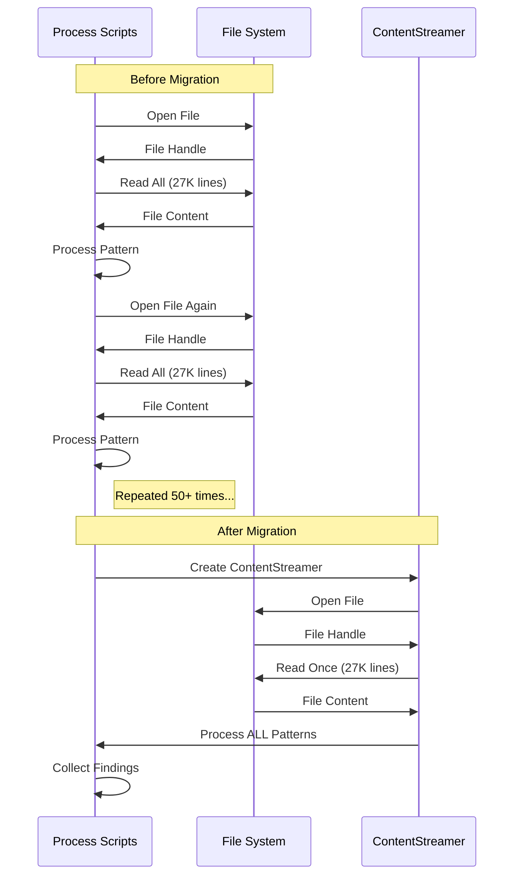
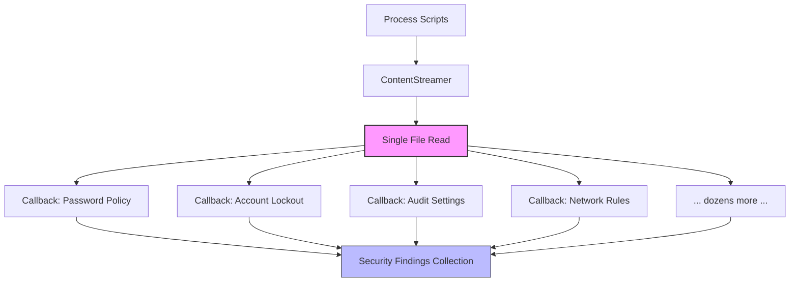
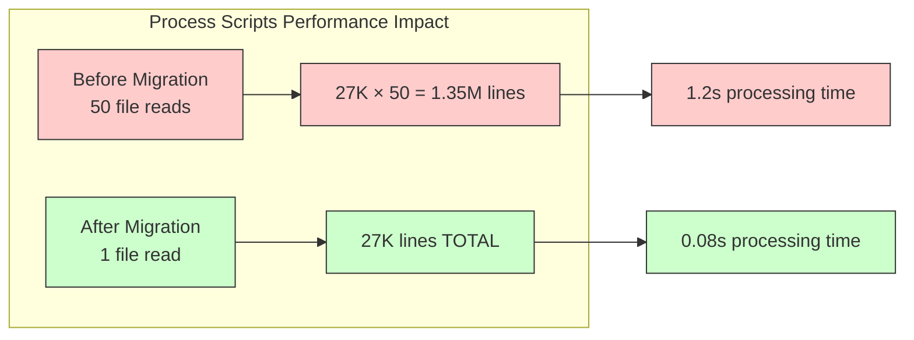

# Content Streaming Migration Guide

This guide helps developers migrate their modules to use the new `ContentStreamer` pattern for improved performance and consistency.

## Migration Overview for Process Scripts

The ContentStreamer pattern is particularly valuable for Process Scripts modules that search for dozens or even hundreds of regex patterns in a single file. By replacing multiple file reads with a single streaming pass, it provides:


Key benefits for Process Scripts:
- **98%+ performance improvement** with 50+ regex patterns
- **Single file I/O operation** instead of dozens or hundreds
- **Memory efficiency** by streaming content once
- **Consistent error handling** through the core FileProcessingService

## Phase 1: Basic Migration

### Replace Direct File Reading

**Before:**
```python
def analyze_file(file_path: Path) -> dict:
    with file_path.open("r", encoding="utf-8") as f:
        content = f.read()  # Loads entire file into memory
    
    # Process entire content string
    return process_content(content)
```

**After:**
```python
def analyze_file(file_path: Path, file_processing: FileProcessingService) -> dict:
    # Create content streamer (handles encoding detection automatically)
    content_stream = file_processing.create_content_streamer(file_path)
    
    # Process with targeted streaming
    return process_content_stream(content_stream)
```

### Update Service Dependencies

**Before:**
```python
class MyService:
    def __init__(self):
        pass
    
    def process_files(self, files: list[Path]) -> list[dict]:
        results = []
        for file_path in files:
            result = self.analyze_file(file_path)
            results.append(result)
        return results
```

**After:**
```python
class MyService:
    def __init__(self, file_processing: FileProcessingService):
        self.file_processing = file_processing
    
    def process_files(self, files: list[Path]) -> list[dict]:
        results = []
        for file_path in files:
            result = self.analyze_file(file_path, self.file_processing)
            results.append(result)
        return results
```

## Phase 2: Targeted Content Access

### Header-Based Detection

**Use Case**: Producer detection, file type identification, metadata extraction

**Before:**
```python
def detect_producer(file_path: Path) -> str | None:
    with file_path.open("r") as f:
        content = f.read()  # Reads entire 27K+ line file
    
    lines = content.split('\n')
    for line in lines[:10]:  # Only need first 10 lines
        if "KPWINVERSION:" in line:
            return "KPWINAUDIT"
    return None
```

**After:**
```python
def detect_producer(content_stream: ContentStreamer) -> str | None:
    header_lines = content_stream.get_file_header(lines=10)  # Only reads 10 lines
    for line in header_lines:
        if "KPWINVERSION:" in line:
            return "KPWINAUDIT"
    return None
```

**Performance**: 99%+ improvement (10 lines vs 27K+ lines)

### Pattern-Based Search

**Use Case**: Configuration parsing, log analysis, data extraction

**Before:**
```python
def find_interfaces(file_path: Path) -> list[str]:
    with file_path.open("r") as f:
        content = f.read()
    
    interfaces = []
    for line in content.split('\n'):
        if re.match(r"^interface\s+", line):
            interfaces.append(line)
    return interfaces
```

**After:**
```python
def find_interfaces(content_stream: ContentStreamer) -> list[str]:
    # Early termination when pattern matches are found
    return list(content_stream.stream_pattern_matches(r"^interface\s+"))
```

**Performance**: 70-90% improvement with early termination

### First Match Only

**Use Case**: Quick validation, existence checks

**Before:**
```python
def has_rtf_header(file_path: Path) -> bool:
    with file_path.open("r") as f:
        content = f.read()
    
    for line in content.split('\n'):
        if re.match(r"^{\\rtf\d", line):
            return True
    return False
```

**After:**
```python
def has_rtf_header(content_stream: ContentStreamer) -> bool:
    match = content_stream.find_first_match(r"^{\\rtf\d")
    return match is not None
```

**Performance**: Stops reading immediately after first match

## Phase 3: Process Scripts Multi-Pattern Processing

### Single-Pass Security Compliance Scanning

**Use Case**: Process Scripts security compliance scanning with dozens of patterns



**Before:**
```python
def scan_security_compliance(file_path: Path) -> dict[str, list[str]]:
    # Process Scripts - Multiple file reads for EACH security pattern
    security_findings = {}
    
    # Password policy patterns
    security_findings["password_complexity"] = find_pattern(
        file_path, r"password.+complexity.+enabled"
    )
    security_findings["password_length"] = find_pattern(
        file_path, r"password.+minimum.+length.+(\d+)"
    )
    security_findings["password_history"] = find_pattern(
        file_path, r"password.+history.+(\d+)"
    )
    
    # Account lockout patterns
    security_findings["account_lockout"] = find_pattern(
        file_path, r"lockout.+threshold.+(\d+)"
    )
    security_findings["lockout_duration"] = find_pattern(
        file_path, r"lockout.+duration.+(\d+)"
    )
    
    # Audit policy patterns
    security_findings["audit_logon"] = find_pattern(
        file_path, r"audit.+logon.+(success|failure)"
    )
    security_findings["audit_object"] = find_pattern(
        file_path, r"audit.+object.+access"
    )
    
    # And dozens more patterns... each requiring a separate file read
    # 50+ patterns = 50+ complete file reads!
    
    return security_findings
```

**After:**
```python
def scan_security_compliance(content_stream: ContentStreamer) -> dict[str, list[str]]:
    # Process Scripts - Single pass for ALL security patterns
    security_patterns = {
        # Password policy patterns
        "password_complexity": r"password.+complexity.+enabled",
        "password_length": r"password.+minimum.+length.+(\d+)",
        "password_history": r"password.+history.+(\d+)",
        
        # Account lockout patterns
        "account_lockout": r"lockout.+threshold.+(\d+)",
        "lockout_duration": r"lockout.+duration.+(\d+)",
        
        # Audit policy patterns
        "audit_logon": r"audit.+logon.+(success|failure)",
        "audit_object": r"audit.+object.+access",
        
        # And dozens more patterns... all processed in a single pass!
        # 50+ patterns = just 1 file read!
    }
    
    # Single pass through file for ALL patterns
    return content_stream.search_multiple_patterns(security_patterns)
```

**Performance**: 98%+ improvement (1 file read vs 50+ file reads)

### Process Scripts: Callback-Based Processing

**Use Case**: Process Scripts security finding collection and validation



**Before:**
```python
def collect_security_findings(file_path: Path) -> dict[str, list[SecurityFinding]]:
    findings = {
        "password_policy": [],
        "account_lockout": [],
        "audit_settings": [],
        "network_rules": [],
        # Dozens more categories...
    }
    
    # Process Scripts - Multiple file reads for each security category
    with file_path.open("r") as f:
        for line in f:
            if re.search(r"password.+(?:complexity|length|history)", line):
                findings["password_policy"].append(
                    create_password_finding(line)
                )
    
    with file_path.open("r") as f:
        for line in f:
            if re.search(r"lockout.+(?:threshold|duration)", line):
                findings["account_lockout"].append(
                    create_lockout_finding(line)
                )
    
    with file_path.open("r") as f:
        for line in f:
            if re.search(r"audit.+(?:success|failure|enabled)", line):
                findings["audit_settings"].append(
                    create_audit_finding(line)
                )
    
    with file_path.open("r") as f:
        for line in f:
            if re.search(r"firewall.+(?:allow|deny|reject)", line):
                findings["network_rules"].append(
                    create_network_finding(line)
                )
    
    # And dozens more file reads for other security categories
    # Each requiring a complete file read through potentially 27K+ lines
    
    return findings
```

**After:**
```python
def collect_security_findings(content_stream: ContentStreamer) -> dict[str, list[SecurityFinding]]:
    findings = {
        "password_policy": [],
        "account_lockout": [],
        "audit_settings": [],
        "network_rules": [],
        # Dozens more categories...
    }
    
    # Process Scripts - Define callbacks for each security category
    def process_password_policy(line: str) -> None:
        findings["password_policy"].append(create_password_finding(line))
    
    def process_account_lockout(line: str) -> None:
        findings["account_lockout"].append(create_lockout_finding(line))
    
    def process_audit_settings(line: str) -> None:
        findings["audit_settings"].append(create_audit_finding(line))
    
    def process_network_rules(line: str) -> None:
        findings["network_rules"].append(create_network_finding(line))
    
    # Single pass with multiple callbacks for all patterns
    callbacks = {
        "password_policy": (r"password.+(?:complexity|length|history)", 
                           process_password_policy),
        "account_lockout": (r"lockout.+(?:threshold|duration)", 
                          process_account_lockout),
        "audit_settings": (r"audit.+(?:success|failure|enabled)", 
                         process_audit_settings),
        "network_rules": (r"firewall.+(?:allow|deny|reject)", 
                        process_network_rules),
        # And dozens more callbacks, all processed in a single file read
    }
    content_stream.stream_with_multiple_callbacks(callbacks)
    
    return findings
```

**Performance**: 98%+ improvement (1 file read vs dozens of file reads)

## Migration Checklist

### ✅ Preparation
- [ ] Identify modules that read files directly
- [ ] Review file processing patterns in your module
- [ ] Determine if header-only, pattern-based, or multi-pattern access is needed

### ✅ Dependencies
- [ ] Add `FileProcessingService` to your service constructor
- [ ] Update DI container configuration
- [ ] Import `ContentStreamer` protocol from `core.services.file_processing`

### ✅ Implementation
- [ ] Replace direct file opening with `file_processing.create_content_streamer()`
- [ ] Convert string-based processing to streaming methods
- [ ] Update method signatures to accept `ContentStreamer` parameters

### ✅ Optimization
- [ ] Use `get_file_header()` for metadata extraction
- [ ] Use `find_first_match()` for existence checks
- [ ] Use `search_multiple_patterns()` for comprehensive extraction
- [ ] Use callbacks for event-driven processing

### ✅ Testing
- [ ] Update unit tests to mock `ContentStreamer`
- [ ] Add performance benchmarks
- [ ] Validate memory usage improvements
- [ ] Test error handling edge cases

### ✅ Documentation
- [ ] Update module documentation
- [ ] Document performance improvements
- [ ] Add usage examples

## Process Scripts Common Patterns

### Pattern 1: Multi-Pattern Security Scanning
```python
# AI-GEN: CopilotChat|2025-07-30|KPAT-123|reviewed:no
def scan_security_compliance(file_path: Path, file_processing: FileProcessingService) -> dict[str, list[str]]:
    """
    Process Scripts security compliance scanning with multiple patterns.
    Reads file ONCE instead of dozens of times.
    """
    content_stream = file_processing.create_content_streamer(file_path)
    
    # Define dozens of security compliance patterns
    security_patterns = {
        # Password policies
        "password_complexity": r"password.+complexity.+enabled",
        "password_length": r"password.+minimum.+length.+(\d+)",
        "password_history": r"password.+history.+(\d+)",
        
        # Account lockout policies
        "account_lockout": r"lockout.+threshold.+(\d+)",
        "account_lockout_duration": r"lockout.+duration.+(\d+)",
        
        # Audit policies 
        "audit_logon": r"audit.+logon.+(success|failure)",
        "audit_object_access": r"audit.+object.+access",
        
        # Security options
        "admin_approval_mode": r"administrator.+approval.+mode",
        "elevation_prompt": r"elevation.+prompt.+behavior",
        
        # And dozens more patterns...
    }
    
    # Process all patterns in a single file read
    return content_stream.search_multiple_patterns(security_patterns)
# END AI-GEN
```

### Pattern 2: Process Scripts Finding Collection
```python
# AI-GEN: CopilotChat|2025-07-30|KPAT-123|reviewed:no
def collect_security_findings(file_path: Path, file_processing: FileProcessingService) -> list[SecurityFinding]:
    """
    Process Scripts security finding collection with callbacks.
    Processes dozens of patterns in a single file read.
    """
    content_stream = file_processing.create_content_streamer(file_path)
    findings = []
    
    # Define callbacks for each pattern
    def process_password_finding(line: str) -> None:
        finding = parse_password_finding(line)
        if finding:
            findings.append(finding)
    
    def process_account_finding(line: str) -> None:
        finding = parse_account_finding(line)
        if finding:
            findings.append(finding)
    
    def process_audit_finding(line: str) -> None:
        finding = parse_audit_finding(line)
        if finding:
            findings.append(finding)
    
    # Set up dozens of pattern callbacks
    callbacks = {
        "password": (r"password.+(?:complexity|length|history)", process_password_finding),
        "account": (r"account.+(?:lockout|threshold|duration)", process_account_finding),
        "audit": (r"audit.+(?:success|failure|enabled)", process_audit_finding),
        # And dozens more callbacks...
    }
    
    # Process all callbacks in a single file read
    content_stream.stream_with_multiple_callbacks(callbacks)
    
    return findings
# END AI-GEN
```

### Pattern 3: Producer Detection
```python
# AI-GEN: CopilotChat|2025-07-30|KPAT-123|reviewed:no
def detect_producer(file_path: Path, file_processing: FileProcessingService) -> str | None:
    """
    System detection using only the header of the file.
    Reads only the first 10 lines instead of the entire file.
    """
    content_stream = file_processing.create_content_streamer(file_path)
    
    # Only read the first 10 lines
    header_lines = content_stream.get_file_header(lines=10)
    
    # Check for specific producer signatures
    for line in header_lines:
        if "KPWINVERSION:" in line:
            return "KPWINAUDIT"
        if "Cisco IOS Software" in line:
            return "CISCO"
        # And more producer checks...
    
    return None
# END AI-GEN
```

## Process Scripts Performance Monitoring

Track the performance impact of your migration for Process Scripts:

```python
# AI-GEN: CopilotChat|2025-07-30|KPAT-123|reviewed:no
import time
from pathlib import Path

def benchmark_process_scripts_migration(file_path: Path, file_processing: FileProcessingService):
    """Benchmark the performance improvement of ContentStreamer for Process Scripts."""
    # Define test patterns (simulate real Process Scripts patterns)
    test_patterns = {f"pattern_{i}": rf"test.+pattern.+{i}" for i in range(50)}
    
    # Before migration: multiple file reads (one per pattern)
    start = time.time()
    old_results = {}
    for name, pattern in test_patterns.items():
        with file_path.open("r") as f:
            content = f.read()
            old_results[name] = re.findall(pattern, content)
    old_time = time.time() - start
    
    # After migration: single file read for all patterns
    start = time.time()
    content_stream = file_processing.create_content_streamer(file_path)
    new_results = content_stream.search_multiple_patterns(test_patterns)
    new_time = time.time() - start
    
    # Calculate improvement
    improvement = ((old_time - new_time) / old_time) * 100
    
    # Output results with visualization
    print(f"Process Scripts Performance Improvement: {improvement:.1f}%")
    print(f"Before: {old_time:.3f}s (50 separate file reads)")
    print(f"After:  {new_time:.3f}s (1 file read)")
    print(f"File size: {file_path.stat().st_size / 1024:.1f} KB")
    
    # Visual representation of improvement
    old_bar = "■" * min(50, int(old_time * 10))
    new_bar = "■" * min(50, int(new_time * 10))
    print("\nPerformance comparison:")
    print(f"Before: {old_bar}")
    print(f"After:  {new_bar}")
# END AI-GEN
```



## Troubleshooting

### Issue: "ContentStreamer has no attribute 'search_multiple_patterns'"
**Solution**: Check if you're using `FileContentStreamer` vs `MultiPatternContentStreamer`. Use feature detection:

```python
if hasattr(content_stream, 'search_multiple_patterns'):
    # Use advanced features
    results = content_stream.search_multiple_patterns(patterns)
else:
    # Fallback to basic streaming
    results = {name: list(content_stream.stream_pattern_matches(pattern)) 
               for name, pattern in patterns.items()}
```

### Issue: "Encoding detection fails"
**Solution**: The `FileProcessingService.create_content_streamer()` handles encoding detection automatically. If it fails, the method will raise a `ValueError` with details.

### Issue: "Performance not improved as expected"
**Solution**: 
1. Ensure you're not calling multiple streaming methods on the same content
2. Use `get_file_header()` for metadata that's in the first few lines
3. Use `find_first_match()` for existence checks instead of collecting all matches

This migration guide provides a systematic approach to adopting the ContentStreamer pattern while maximizing performance benefits and maintaining code quality.
