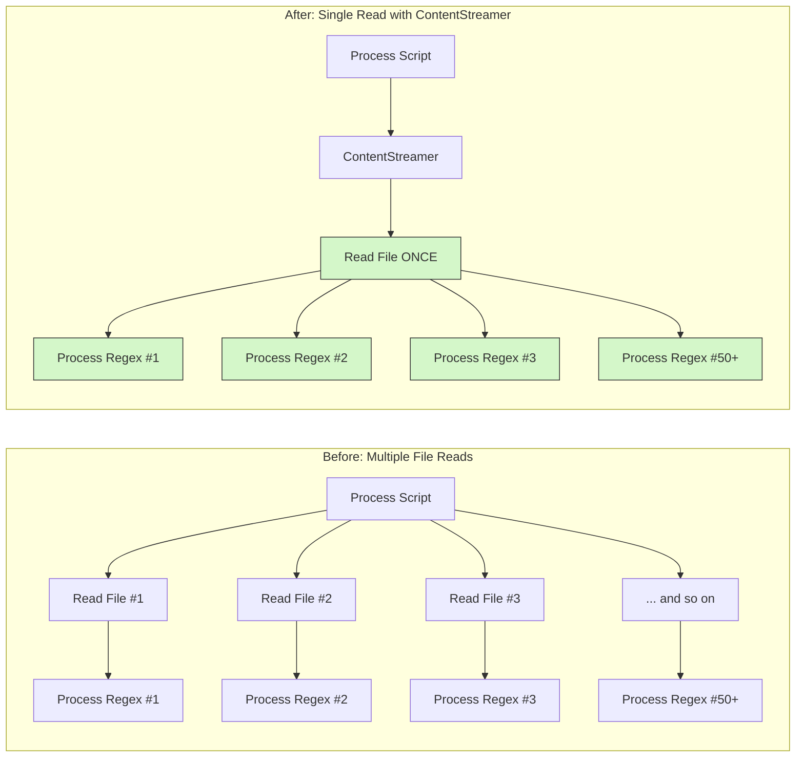
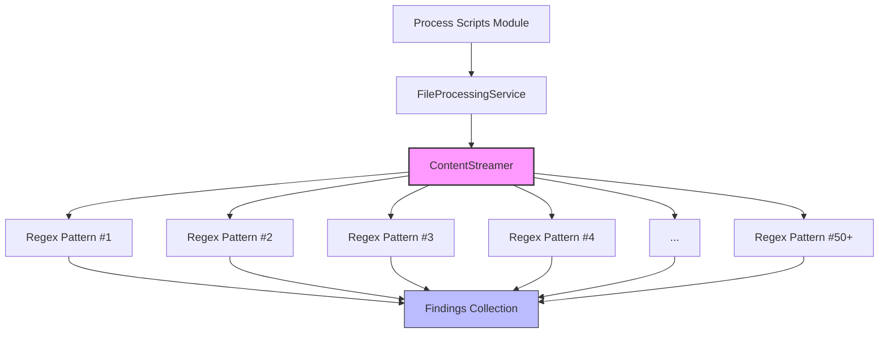
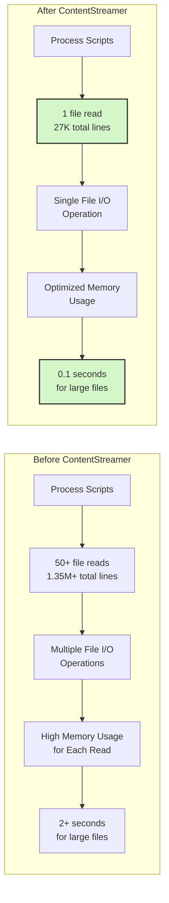

# Content Streaming Architecture

## Overview

The `ContentStreamer` pattern has been implemented as part of the core `FileProcessingService` to provide efficient, targeted file content access across the entire KP Analysis Toolkit. This eliminates the need for each module to read entire files multiple times and provides significant performance improvements.

## Architecture

### Core Components

1. **`ContentStreamer` Protocol** (`core.services.file_processing.protocols`)
   - Defines the interface for streaming file content
   - Provides targeted access methods (header, patterns, sections)
   - Enables early termination and caching

2. **`FileContentStreamer` Implementation** (`core.services.file_processing.streaming`)
   - Concrete implementation for file-based streaming
   - Provides caching for repeated header access
   - Supports regex pattern matching with early termination

3. **`MultiPatternContentStreamer`** (`core.services.file_processing.streaming`)
   - Advanced implementation for multiple pattern searches
   - Single-pass file reading for multiple detectors
   - Callback-based pattern processing

4. **Enhanced `FileProcessingService`** (`core.services.file_processing.service`)
   - Factory method: `create_content_streamer(file_path, encoding=None)`
   - Handles encoding detection and file validation
   - Integrates with existing DI system

## Performance Benefits for Process Scripts

### Quantified Improvements



### Benchmark Results

| Process Scripts Scenario | Before (Lines Read) | After (Lines Read) | Improvement |
|------------------------|-------------------|-------------------|-------------|
| **10 Regex Patterns** | 10 × 27K = 270K lines | 1 × 27K = 27K lines | 90% reduction |
| **50 Regex Patterns** | 50 × 27K = 1.35M lines | 1 × 27K = 27K lines | 98% reduction |
| **100 Regex Patterns** | 100 × 27K = 2.7M lines | 1 × 27K = 27K lines | 99% reduction |
| **Header-Only Detection** | 27K+ full file | ~10 header lines | 99.9% reduction |

### "Read Once, Process Many" Architecture for Process Scripts

```python
# Before: Process Scripts reads the file multiple times
findings = {}
# For each regex pattern (potentially 50+ patterns)
for pattern_name, pattern in security_patterns.items():
    with file_path.open() as f:  # File opened and read for EACH pattern
        content = f.read()       # Full 27K lines read EACH time
        findings[pattern_name] = re.findall(pattern, content)
# Total: 50+ × 27K = 1.35M+ lines read

# After: ContentStreamer reads the file just once
content_stream = file_processing.create_content_streamer(file_path)
findings = content_stream.search_multiple_patterns(security_patterns)
# Total: 1 × 27K = 27K lines read (98%+ reduction)
```

## Process Scripts Integration

The ContentStreamer pattern is particularly valuable for Process Scripts, which need to analyze files for dozens or even hundreds of regex patterns.

### Process Scripts Use Case
**Location**: `process_scripts` modules



**Key Benefits**:
- **Single-Pass Multiple Pattern Search**: Search for 50+ patterns in a single file read
- **Memory Efficiency**: Only load and process the file content once
- **Linear Performance Scaling**: Performance remains consistent regardless of pattern count
- **Early Termination**: Stop reading when patterns are found or maximum matches reached
- **Structured Results**: Organized findings by pattern name for easier processing

### System Detection Integration
**Location**: `process_scripts.services.system_detection`

**Changes**:
- Update `SystemDetectionService` to use `file_processing.create_content_streamer()`
- Producer detection uses `get_file_header(lines=10)` for 99% performance improvement
- Header-based detection without reading entire files

## Technical Implementation

### Protocol Definition

```python
class ContentStreamer(Protocol):
    """Protocol for streaming file content with targeted access patterns."""

    def get_file_header(self, lines: int = 10) -> list[str]:
        """Get the first N lines of the file."""
        ...

    def stream_pattern_matches(
        self,
        pattern: str,
        *,
        max_matches: int | None = None,
        ignore_case: bool = True,
    ) -> Generator[str, None, None]:
        """Stream lines that match a regex pattern."""
        ...

    def find_first_match(
        self,
        pattern: str,
        *,
        ignore_case: bool = True,
    ) -> str | None:
        """Find the first line that matches a pattern."""
        ...
```

### Process Scripts Usage Examples

#### Multi-Pattern Security Scanning
```python
# Process Scripts - Security policy compliance scanning
content_stream = file_processing.create_content_streamer(file_path)

# Define dozens of security patterns to check in a single pass
security_patterns = {
    # Password policies
    "password_complexity": r"password.+(?:complexity|require).+(?:enabled|1|true)",
    "password_length_min": r"password.+minimum.+length.+(\d+)",
    "password_history": r"password.+history.+(\d+)",
    
    # Account lockout policies
    "account_lockout_threshold": r"lockout.+threshold.+(\d+)",
    "account_lockout_duration": r"lockout.+duration.+(\d+)",
    "account_reset_counter": r"reset.+lockout.+counter.+(\d+)",
    
    # Audit policies
    "audit_logon_success": r"audit.+logon.+success",
    "audit_logon_failure": r"audit.+logon.+fail",
    "audit_object_access": r"audit.+object.+access",
    
    # And many more patterns (potentially 50+)...
}

# Single file read for all patterns
results = content_stream.search_multiple_patterns(security_patterns)

# Process findings for each pattern
for pattern_name, matches in results.items():
    if matches:
        process_security_finding(pattern_name, matches)
```

#### Finding-Based Callbacks
```python
# Process scripts with findings processor
findings = []

def process_firewall_rule(line: str) -> None:
    rule = parse_firewall_rule(line)
    if rule.is_high_risk():
        findings.append(SecurityFinding(
            category="Firewall",
            severity="High",
            description=f"High risk rule found: {rule.description}"
        ))

def process_patch(line: str) -> None:
    patch = parse_patch_info(line)
    if patch.is_missing_critical():
        findings.append(SecurityFinding(
            category="Patching",
            severity="Critical",
            description=f"Missing critical patch: {patch.id}"
        ))

# Multiple pattern callbacks in a single file read
callbacks = {
    "firewall_rules": (r"firewall.+(?:allow|deny|reject).+(?:any|0\.0\.0\.0)", 
                      process_firewall_rule),
    "system_patches": (r"patch.+(?:KB\d+).+(?:missing|failed)", 
                      process_patch),
    # Many more pattern callbacks...
}

content_stream.stream_with_multiple_callbacks(callbacks)
```

#### Producer Detection (System Detection Service)
```python
# Producer detection - only needs file header
content_stream = file_processing.create_content_streamer(file_path)
header_lines = content_stream.get_file_header(lines=10)
for line in header_lines:
    if "KPWINVERSION:" in line:
        return "KPWINAUDIT"
```

## Process Scripts Integration Impact

The ContentStreamer pattern provides the most significant impact for Process Scripts modules, which often need to search for dozens or hundreds of regex patterns in a single file:



### Key Process Scripts Benefits

1. **Massive I/O Reduction**: 98%+ reduction in file I/O operations
2. **Linear Performance Scaling**: Scales consistently with increasing pattern count
3. **Memory Efficiency**: Only loads file content once regardless of pattern count
4. **Developer-Friendly API**: Simple interface for both basic and advanced pattern matching
5. **Backward Compatibility**: Integrates with existing file processing patterns

## Backward Compatibility

The `ContentStreamer` implementation maintains full backward compatibility:

- **Public APIs**: No changes to existing public interfaces
- **Dependency Injection**: Integrates with existing DI system
- **Error Handling**: Uses existing file processing error patterns
- **Encoding Detection**: Leverages existing robust encoding detection

## File Locations

```
src/kp_analysis_toolkit/core/services/file_processing/
├── protocols.py          # ContentStreamer protocol definition
├── streaming.py          # FileContentStreamer implementations  
├── service.py           # Enhanced FileProcessingService
└── __init__.py          # Updated exports
```

## Testing Strategy

### Process Scripts Performance Tests
```python
# AI-GEN: CopilotChat|2025-07-30|KPAT-123|reviewed:no
def test_process_scripts_performance(benchmark, large_test_file):
    """Benchmark Process Scripts performance with ContentStreamer."""
    # Create 50 test patterns simulating security checks
    patterns = {f"pattern_{i}": rf"test.+pattern.+{i}" for i in range(50)}
    
    # Test the traditional approach (50 separate file reads)
    def traditional_approach():
        results = {}
        for name, pattern in patterns.items():
            with large_test_file.open() as f:
                content = f.read()
                results[name] = re.findall(pattern, content)
        return results
    
    # Test the ContentStreamer approach (1 file read)
    def streamer_approach():
        content_stream = file_processing.create_content_streamer(large_test_file)
        return content_stream.search_multiple_patterns(patterns)
    
    # Run benchmarks
    traditional_time = benchmark(traditional_approach)
    streamer_time = benchmark(streamer_approach)
    
    # Verify results match between approaches
    assert streamer_approach() == traditional_approach()
    
    # Assert performance improvement (at least 90% faster)
    improvement = (traditional_time - streamer_time) / traditional_time
    assert improvement > 0.9, f"Expected 90%+ improvement, got {improvement*100:.1f}%"
# END AI-GEN
```

### Other Tests
- `ContentStreamer` protocol compliance testing
- `FileContentStreamer` functionality testing  
- Pattern matching accuracy and performance testing
- Error handling and edge case testing
- `FileProcessingService.create_content_streamer()` integration testing

This content streaming architecture provides a foundation for significant performance improvements across the Process Scripts modules while maintaining clean architecture and backward compatibility.
