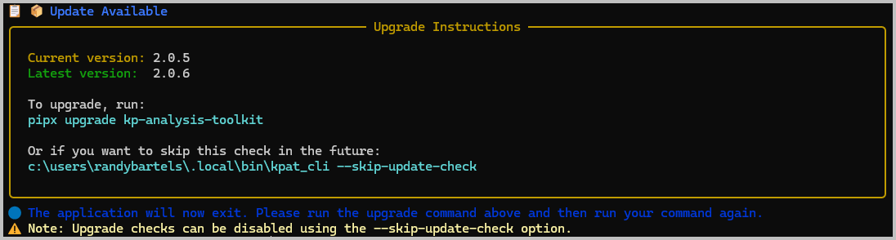
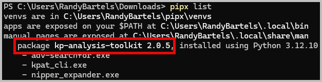

# Analysis Toolkit User Guide

## Overview

The KP Analysis Toolkit (KPAT) is a collection of tools for working with the data we collect in our audits.  Currently, this includes the following:

- [`scripts`](scripts.md) -- Working with the `kpmacaudit`, `kpnixaudit` and `kpwinaudit` system configuration collection scripts
- `rtf-to-text` -- Converting RTF-formatted files to plain text
- `nipper` -- Reformat Nipper CSV result files into a more usable format

Each of these tools are presented in their own user guide page.

## Prerequisites

### System Requirements
- Windows 10 or later (recommended: Windows 11)
- PowerShell 5.1 or later
- Python 3.12 or later
- KP Analysis Toolkit installed (see [Installation Guide](installation.md))
- Windows Terminal (recommended) as a replacement for the legacy Windows Console terminal

## Getting Started

`kpat_cli` is a command line tool, so you'll spend time at the command prompt (Powershell for Windows and Bash for Linux/MacOS).  If you neeed a refresher, some PowerShell basics are presented below

### PowerShell Basics
**Open the Command Prompt**

1. Run Windows Terminal from your Start Menu.
2. If Windows Terminal isn't installed, you can start `Powershell` directly.

    ```powershell
    # Powershell starts in your home folder
    PS C:\Users\YourNameHere> # Awaiting your next command

    # Change to a new folder
    cd "Downloads\Customers\Project Name"

    # Change to a new disk drive (N/A probably for KP laptops)
    D:

    # Change back to the C drive
    C:
    ```

    See the [PowerShell Primer](powershell-primer.md) for additional help on getting started with PowerShell.

**Running `kpat_cli`**

After [installation](installation.md), the `kpat_cli` command will be available.  Test it by displaying the help page.

```powershell
kpat_cli --help
```


#### Working with Files
KPAT is built around working with files and folders.  Each tool receives input file(s), transforms it, and produces output files.


See the [PowerShell Primer](powershell-primer.md) for additional help on getting started with PowerShell.

### Advanced Options

#### Automatic Updates
The toolkit will automatically check for an upgrade each time you run it.  If an update is found, it will provide instructions for how to upgrade and immediately exit



You can override this check by including `--skip-update-check` on the command line
```powershell
# Skip the upgdate check
kpat_cli --skip-update-check scripts
```

## Configuration
Each command comes with its own options that you can use to alter the default behavior.  Use the `--help` pages to see what those options are:

```powershell
# Options for script result processing
kpat_cli scripts --help

# Options for RTF-to-Text conversion
kpat_cli rtf-to-text --help

# Options for Nipper results expansion
kpat_cli nipper --help
```

## Troubleshooting

### Common Issues

#### Command not found
**Symptoms:** Powershell or Bash reports that it cannot find the `kpat_cli` command

**Solutions:** 

1. Reinstate the `pipx` system path variable with `py -m pipx ensurepath`
2. Restart your Terminal session
3. Check that KPAT is intalled with

```powershell
# Check for pipx-managed programs
pipx list
```



#### Slow Performance
**Symptoms:** Very slow performance in WSL

**Solutions:** 

1. Don't use WSL to access files from your Windows partition (e.g. through `/mnt/c/users/YourUserName/...`).  This isn't a KPAT limitation, but is a known problem with WSL accessing Windows files
2. Install the toolkit in Windows -- see [installation instructions](installation.md)


### Getting Help
An extensive help system is built into the tool and is involved by appending `--help` to any command.


```powershell
kpat_cli [module] --help
```

## Examples and Use Cases

### Example 1: Process results from one of the collector scripts
**Use Case:** Customer has returned their script results based on the sample chosen by the auditor

**Steps:**

1. Unzip and organize the files into the most meaningful arrangement based on your project.  For example, create folders for:
    - Different operating systems
    - Function group such as "Workstations", "Developers" or "HR"
2. Launch Windows Terminal
3. Change to your project folder and run `kpat_cli`

    ```powershell
    # Change to scripts folder
    cd "Downloads\Customers\Acme Corp\scripts"

    # Run kpat_cli
    kpat_cli scripts
    ```

4. Review the results

## Related Documentation

- [Installation Guide](installation.md)
- [Other Related Guides](index.md)

---