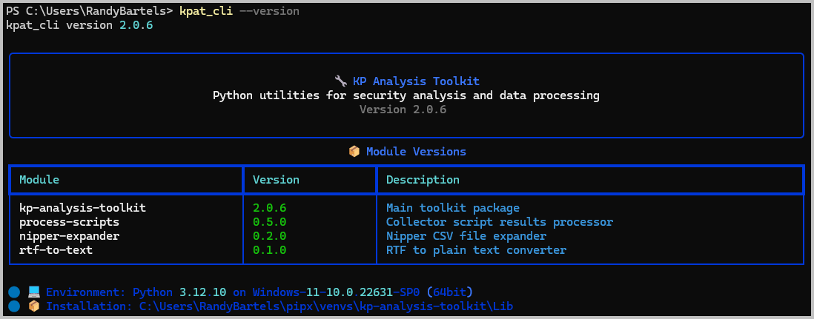
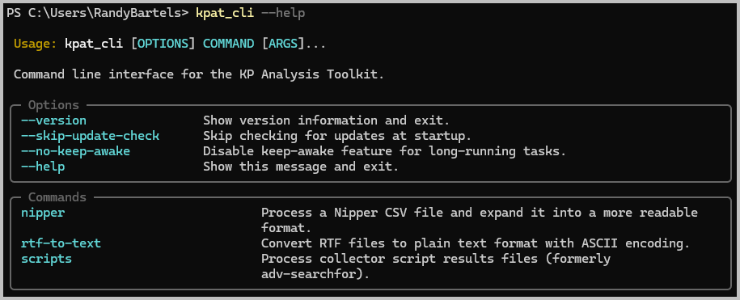

# Installation Guide

## Overview

Installing KPAT is very simple, but requires the `pipx` [Python package management utility](https://pipx.pypa.io/latest/installation/).  Once installed, this utility will handle installing, updating and maintaining the Toolkit.

## Prerequisites

### System Requirements
- Windows 10 or later (recommended: Windows 11)
- PowerShell 5.1 or later
- Python 3.12 or later

### Knowledge Requirements
- Basic Powershell navigation ([PowerShell Primer](powershell-primer.md))

### Required Files/Data
- None

## Getting Started

### First Steps -- PIPX Installation
**Windows Installation**

1. Install Python from [Python Software Foundation](https://python.org) if not already installed (already installed for KP laptops)
2. Launch Windows Terminal (already installed on Windows 11)
3. Run the following commands to install `pipx`

    ```powershell
    # Install PIPX using Python's built-in package manager
    py -m pip install pipx

    # Update the system path variable so that PIPX commands are always available
    py -m pipx ensurepath

    # Close and reopen your terminal window
    ```

**MacOS Installation**

The default version of Python on MacOS is inadequate, so you'll need to either download and install a current version from [Python Software Foundation](http://python.org) or use `homebrew` to install a current version.

Once installed, the process is identical to the Windows installation, except that we replace the `py` --> `python3`:

```bash
# Install PIPX using Python's built-in package manager
python3 -m install pipx

# Update the system path variable so that PIPX commands are always available
python3 -m pipx ensurepath

# Close and reopen your terminal window
```

**Linux Installation**

The only difference for Linux is that `pipx` is available as an OS package.

```bash
# For Ubuntu/Debian-based systems
apt-get install pipx

# For Redhat/RPM-based systems
dnf install pipx

# If not available as an OS package
python3 -m pip install --user pipx

# Update the system path variable so that PIPX commands are always available
python3 -m pipx ensurepath

# Close and reopen your terminal window
```

### Install the Analysis Toolkit
With `pipx` installed, there's just one more step to installing the Toolkit.

```powershell
# Install the Toolkit using PIPX
pipx install kp-analysis-toolkit
```

This will download the installation packages from the official [Python Package Index](https://pypi.org/project/kp-analysis-toolkit/).

### Test the Installation
```powershell
# Test the installation
kpat_cli --version
```



***Note:*** The first attempt to run the command may take a bit longer as Windows Defender performs an AV scan on the program files.

### Basic Usage

#### Primary Command
The toolkit is available under one common command: `kpat_cli`.  Help is available throughout by appending `--help` to the end of any other command:

```powershell
# Access the help pages
kpat_cli --help
```



## Related Documentation

- [Installation Guide](installation.md)
- [Processing Script Results](scripts.md)
- [Other Related Guides](index.md)

---
