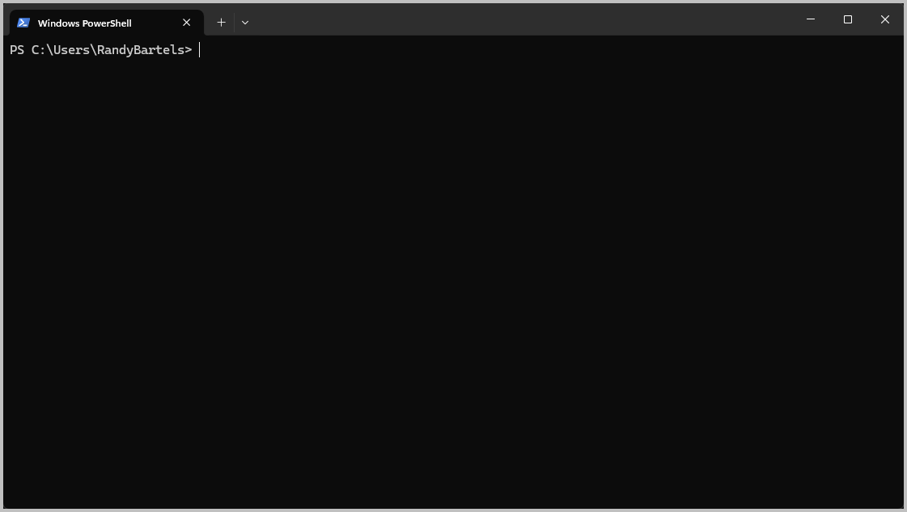
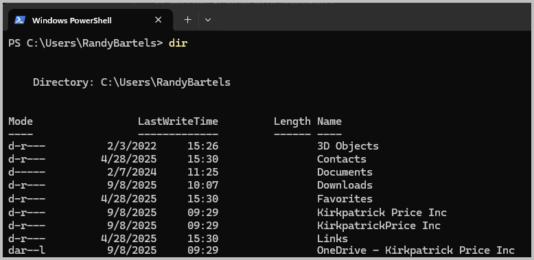

# PowerShell Primer for File Management

## Overview

This guide provides essential PowerShell skills for technical staff who may not be familiar with command line interfaces. PowerShell is the default command line interface on Windows and is recommended to run KPAT tools and manage files.

## Getting Started with PowerShell

### Opening PowerShell

**Windows 11 (Default Method):**

1. Click the Start button or press `Windows` key
2. Type `terminal` and press Enter
3. Windows Terminal will open with PowerShell as the default tab

**Alternative Method:**

1. Press `Windows + R` to open the Run dialog
2. Type `powershell` and press Enter

### Understanding the PowerShell Window

When PowerShell opens, you'll see:

- A blue or dark window (depending on your theme)
- A prompt that looks like: `PS C:\Users\YourName>`
- A blinking cursor where you can type commands



The prompt shows:

- `PS` - Indicates this is PowerShell
- `C:\Users\YourName` - Your current location (directory/folder)
- `>` - Ready for your command

PowerShell replaces the truly ancient `cmd.exe` command line interface.  All PowerShell commands follow a `verb-noun` format such as `Get-ChildItem` or `Remove-Item`.  For backwards compatability and to cut down on some of the typing, aliases are provided for legacy commands as well as for many of the Linux variants.  For instance:

- `Get-ChildItem` -- `dir`, `ls`
- `Remove-Item` -- `del`, `rm`

## Basic Navigation

### Where Am I?
To see your current location:
```powershell
# Show Present Working Directory (same as in the prompt)
pwd

# PowerShell-native command (long form)
Get-Location
```

This shows your "present working directory"

### Listing Files and Folders
To see what's in your current directory:
```powershell
# List files (short form)
dir

# List files (long form):
```powershell
Get-ChildItem
```



**Understanding the output:**

- Folders show as `<DIR>` or have a `d` in the attributes
- Names with spaces will be displayed normally
- This is exactly what you'd see if you used Explorer to view your `C:\Users\YourName` folder

### Changing Directories
To move to a different folder:
```powershell
# Move to your Downloads folder (relative path)
cd Downloads

# Move to your Downloads folder (long form / notice the verb-noun paring)
Set-Location Downloads

# Move to a specific folder (absolute path)
cd "C:\Users\YourName\Downloads"

# Move to a subfolder
cd ProjectFiles

# Move up one level (to parent folder)
cd ..

# Move up two levels
cd ..\..

# Move to the root of C: drive
cd C:\
```

**Important:** If a folder name has spaces, put it in quotes:
```powershell
cd "My Documents"
```

**PRO TIP:**

- ***Use `TAB` often*** -- type 3 or 4 keys and press `TAB`.  
    - Works for command, file/folder names, etc. 
    - Cuts down significantly on typos

## File and Folder Management

### Creating Folders
```powershell
# Create a new folder
mkdir "Analysis Results"

# Create nested folders (Long-form)
New-Item "Projects\2024\Analysis"
```

### Copying Files
```powershell
# Copy a single file
copy "source.txt" "destination.txt"

# Copy to another folder
copy "data.txt" "Results\data-backup.txt"

# Copy all files of a type
copy "*.txt" "TextFiles\"
```

### Moving Files
```powershell
# Move (rename) a file
move "oldname.txt" "newname.txt"

# Move to another folder
move "data.txt" "Archive\"

# Move all files of a type
move "*.log" "Logs\"
```

### Deleting Files and Folders
```powershell
# Delete a file
del "filename.txt"

# Delete all files of a type
del "*.tmp"

# Delete an empty folder
rmdir "EmptyFolder"

# Delete a folder and all its contents (be careful!)
rmdir "FolderName" -Recurse
```

**⚠️ Warning:** The `-Recurse` option will delete everything inside the folder. Use carefully!

## Working with File Paths

### Absolute vs Relative Paths

**Absolute paths** start from the drive root:
```powershell
# Absolute paths start from the drive letter (root)
C:\Users\YourName\Documents\data.txt
```

**Relative paths** start from your current location:
```powershell
# Relative paths start from the present working directory

# File in current folder
.\data.txt

# File in subfolder
.\Results\data.txt

# File in parent folder
..\data.txt

# File in parent folder's sibling (I guess that's your aunt/uncle's folder?)
..\other-folder\data.txt
```

### Special Path Shortcuts
```powershell
# Current directory
.

# Parent directory
..

# Your home folder (same as on Linux)
~

# Desktop (from home)
~\Desktop
```

### Handling Spaces in Names
When file or folder names contain spaces, use quotes:
```powershell
cd "Program Files"
copy "My File.txt" "Backup Folder\"
```

## Helpful Tips and Shortcuts

### Tab Completion
- Start typing a file or folder name
- Press `Tab` to auto-complete
- Press `Tab` multiple times to cycle through options

### Command History
- Press `↑` (up arrow) to see previous commands
- Press `↓` (down arrow) to go forward in history
- Press `Ctrl+R` to search command history

### Copy and Paste
- **Copy from PowerShell:** Select text, then right-click
- **Paste to PowerShell:** Right-click where you want to paste
- **Modern shortcut:** `Ctrl+C` to copy, `Ctrl+V` to paste

### Drag and Drop
- You can drag files from Windows Explorer into PowerShell
- The full path will be inserted automatically
- Useful for avoiding typing long paths

### Clear the Screen
```powershell
# Legacy command (CLear Screen)
cls

# PowerShell native command (long form)
Clear-Host

# Another alias
clear
```

Or press `Ctrl+L` (Windows Terminal)

## Common File Operations Examples

### Organizing Analysis Files
```powershell
# Create project structure
mkdir "Analysis-2024-09-08"
cd "Analysis-2024-09-08"
mkdir "Input"
mkdir "Output"
mkdir "Logs"

# Copy input files
copy "..\raw-data\*.txt" "Input\"

# List what we have
dir Input
```

### Finding Files
```powershell
# Find all Excel files
dir *.xlsx

# Find files recursively in all subfolders
dir *.txt -Recurse

# Find files modified today
dir | Where-Object {$_.LastWriteTime -gt (Get-Date).Date}
```

### Getting File Information
```powershell
# Show file details
dir "filename.txt" | Format-List

# Show file size in readable format
dir "filename.txt" | Select-Object Name, @{Name="Size(MB)";Expression={[math]::Round($_.Length/1MB,2)}}
```

## Troubleshooting Common Issues

### "File not found" errors
- Check spelling of file name
- Verify you're in the correct directory with `pwd`
- Use `dir` to see available files
- Use quotes around names with spaces

### "Access denied" errors
- You may need administrator privileges
- Try right-clicking PowerShell and selecting "Run as Administrator"
- Make sure the file isn't open in another program

### Path too long errors
- Try using shorter folder names
- Move files closer to the root directory

### Getting Help
For any PowerShell command, you can get help:
```powershell
# Get help for a command
Get-Help dir

# Get examples
Get-Help copy -Examples

# Get detailed help
Get-Help move -Detailed
```

## Next Steps

Once you're comfortable with these basics:
1. Practice navigating to your typical work folders
2. Try creating a test folder structure
3. Experiment with copying and moving files
4. Learn about specific KPAT commands in the relevant user guides

Remember: PowerShell is forgiving - you can always use `cd ..` to go back up a level if you get lost, and `dir` to see what's available in your current location.
