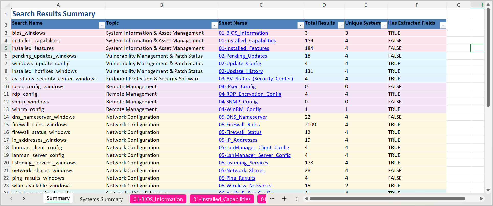
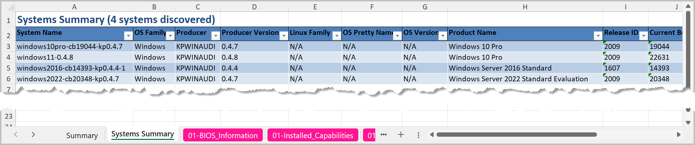
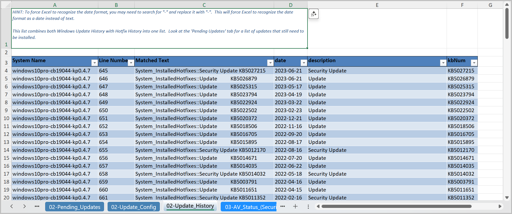
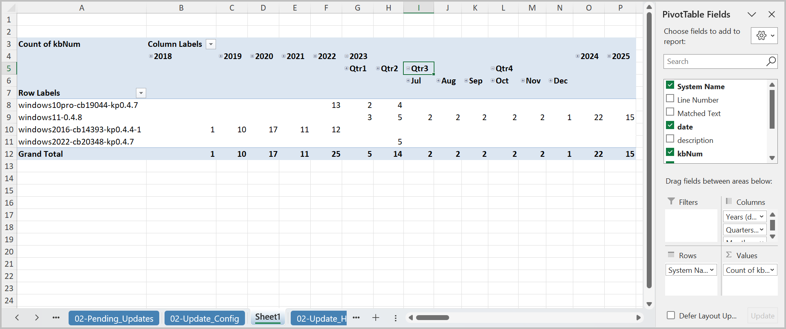
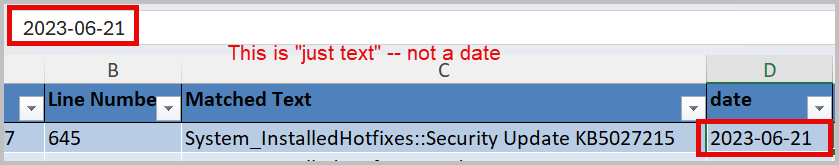
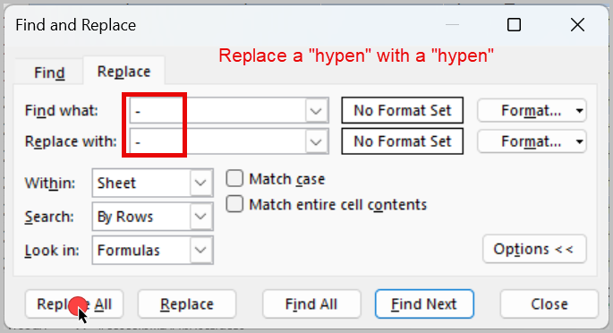
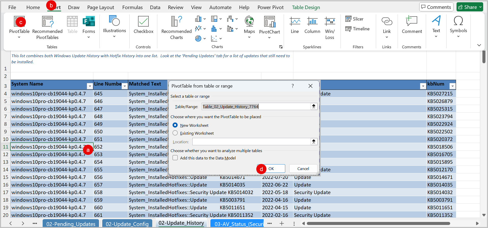
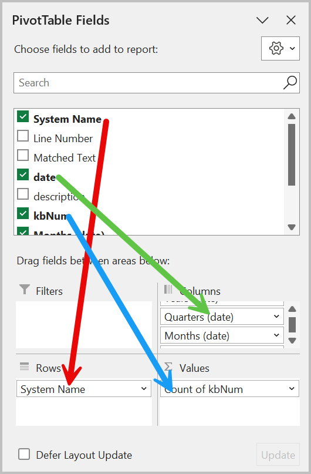
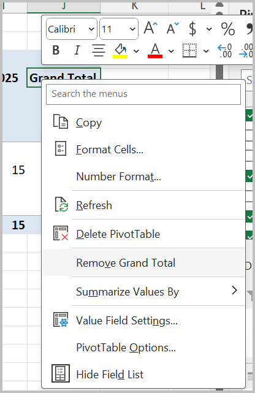

# Working with Script Results User Guide

## Overview

This guide provides tips and pointers for working with the result files generated by the `scripts` tool.  In it, you will learn:

- Where to find the result files
- How the result files are organized
- Tips and tricks for working with different kinds of data

## Prerequisites

### System Requirements
- Windows 10 or later (recommended: Windows 11)
- PowerShell 5.1 or later
- KP Analysis Toolkit installed (see [Installation Guide](../user-guides/installation.md))
- Completed set of script results processed by the `scripts` tool

### Knowledge Requirements
The collection scripts address a [wide range of topics](scripts-categories.md) related to Linux, MacOS and Windows operating systems.  Users should be familiar with the following:

- Operating systems being audited
- Auditing frameworks -- such as SOC2, HIPAA and PCI DSS -- through which the results will be interpreted
- Configuration management practices such as those published by the [Center for Internet Security](https://cisecurity.org/benchmarks)
- File system permission management
- Remote administration protocols such as Remote Desktop Protocol and SSH
- Use of centralized vs local user authentication mechanisms

### Required Files/Data
- Excel spreadsheets produced by the `kpat_cli scripts` command

## Getting Started

### Results Location
Script results will be located in the `results\` folder relative to the folder where the tool began searching for raw results files.

For instance, if you launched `kpat_cli scripts` as follows:

```powershell
# Launched from the Scripts Results folder
C:\Users\YourName\Downloads\Customers\Acme Corp\Script Results> kpat_cli scripts

# Launched with the -d parameter
C:\Users\YourName> kpat_cli scripts -d "Downloads\Customers\Acme Corp\Script Results\"
```

Then your results will be located in

```plaintext
C:\
└── Users\
    └── YourName\
        └── Downloads\
            └── Customers\
                ├── Acme Corp\
                │   ├── Script Results\                             < Search started here
                │   │   ├── prod_web\
                │   │   │   ├── linux-web-server-01.txt
                │   │   │   ├── linux-web-server-02.txt
                │   │   │   └── linux-haproxy-load-balancer-01.txt
                │   │   ├── prod_db\
                │   │   │   ├── linux-db-primary-01.txt
                │   │   │   ├── linux-db-secondary-01.txt
                │   │   │   └── linux-db-backup-01.txt
                │   │   ├── accounting\
                │   │   │   ├── windows-acct-workstation-01.txt
                │   │   │   ├── windows-acct-workstation-02.txt
                │   │   │   ├── macos-acct-workstation-03.txt
                │   │   │   └── windows-file-server-01.txt
                │   │   └── results\                                < Results saved here
                │   │       ├── Darwin_search_results_20250911_143022.xlsx
                │   │       ├── Linux_search_results_20250911_143022.xlsx
                │   │       └── Windows_search_results_20250911_143022.xlsx
                │   └── Other Documents\
                └── Beta Corp\
```

**Additional notes:**

- All OS findings will be grouped together into one file
    - `Linux_search_results....xlsx`: Linux database and webserver results
    - `Darwin_search_results....xlsx`: MacOS accounting workstation
    - `Windows_search_results....xslx`: Windows workstations and file server
- All files are timestamped to the date/time when the analysis was started
- Multiple runs will create new files in the same folder
- Running `kpat_scripts` in the `Beta Corp\...\` folder will create a new `Beta Corp\...\results\` folder

## Results File Organization
Beyond the basic OS-specific organization, the Excel workbooks are also organized in a structured, consistent manner to facilitate finding what you're looking for:

- Grouped by topics --> See [Categories](scripts-categories.md) for details
    - Color-matched worksheet tabs and Search Results Summary table
- Consistent naming of worksheets across operating systems --> "Pending Updates", "IP Addresses" and "Running Processes" includes the same information for `Linux`, `MacOS`, and `Windows`
- Summary Worksheet for search results with hyperlinks to the details
- System Summary worksheet with all OS details in one place

### Search Summary Tab


Information on this worksheet includes:

| Field Name | Description |
|---|---|
| Search Name | The unique search name defined in the audit search config file.<br><br>Useful information for troubleshooting with the application maintainer if results don't show what you expected |
| Topic | The [topic](scripts-categories.md) that the search result is part of |
| Sheet Name | Hyperlink to the Excel worksheet where the details are found |
| Total Results | The total of search results which matched this search configuration |
| Unique Systems | The total of unique systems which had at least one matching result |
| Has Extracted Fields | `True` if the search configuration mapped specific text onto named columns in the results <br>`False` if the search result is just the raw line of text from the original source file |

**Tips**

- Absolutely use the hyperlinks to navigate the results from this tab
- Excel appears to lack a `Back` button like your web browser has.  But the short key works:
    - Use `Alt-LeftArrow` to return to the Summary worksheet
- The colors between the rows in the table and worksheet tabs at the bottom are synchronized.  If they appear more vivid on the tabs, that's Excel's doing.

### System Summary Tab


Information on this worksheet includes:

| Field Name | Description |
|---|---|
| System Name | This is the `filename` where the results came from |
| OS Family | `Darwin`(MacOS), `Linux` or `Windows` OS family group |
| Producer | The collection script which produced the results (`KPMACAUDIT`, `KPNIXAUDIT`, `KPWINAUDIT`) |
| Producer Version | The version of the script that produced the results |
| Linux Family | `Deb` or `RPM` as broad categories of Linux distro families.<br><br>Most Linux OSes that we run into will trace their heritage either Debian- or RPM-based package mangement and configuration dialects.
| OS-specific Details | `Pretty Name`, `OS Version`, `Product Name`, `Release ID`, `Current Build` and  will all be filled in according to the OS Family |

**Tips**:

- Organize the results by:
    - Using folders to group by common characteristics
    - Renaming files to prepend a meaningful tag such as `prod_`, `endpoint_`, or `dba_` to the file
- Use `Producer Version` to confirm that returning clients used the newest version of the collection script
- For Windows-based systems, `Current Build` and `UBR` provide near-instant answers for:
    - Is the Operating System still supported by Microsoft?
    - Is the Operating System up-to-date with all available hotfixes and cumulative updates?

### Detailed Results


Each detailed search result worksheet includes the following:

| Field Name | Description |
|---|---|
| Comment | A comment box is included on most search results which provides hints, tips or other helpful information on how to use the results.  It should be formatted to display all of the text, but this isn't perfect, so you may need to increase the row height. |
| System Name | This is the `filename` where the results came from |
| Line Number | The matching line number from the source file |
| Matched Text | The matching text from which the results were extracted |
| Content-specific Fields | For many search results, the `Matched Text` is parsed out into specific fields |

### Working with Dated Results
Many of the search results extract date fields which can be used to determine the effectiveness of the control implementation over time.  By using Excel's PivotTable feature, we can turn these results into a calendar for a much more natural presentation.

The following PivotTable took less than 60 seconds to create and clearly depicts that some systems in the sample set haven't been patched since Q2 2023.  A serious finding indeed!


Using the results from the `Update History` worksheet, here are the steps to reproduce this Patching History calendar view:

1. **Convert all date-like fields:** Just because it looks like a date doesn't make it a date for Excel.  A neat trick is to `Search|Replace` some text with the same text.

    

    **Search and Replace...**

    

    Now they're all dates!

2. **Create a PivotTable:** Create a PivotTable on a new worksheet.

    1. Click anywhere inside the table
    2. Click "Insert" on the ribbon
    3. Click "PivotTable"
    4. Click "OK"

    

3. **Build the PivotTable:** Add the fields for the PivotTable

    1. System Name --> Rows
    2. KBNum --> Values
    3. Date --> Columns

    

4. **(Optional) Remove "Total" Columns:** You can optionally remove the "Quarter Total" and "Grand Total" columns.  As you expand the interesting years and quarters:

    1. Right-click on any "Total" column that's just cluttering up the displa
    2. Select "Remove..."

    

**That's it!!!** You now have a calendar view and can more easily spot the patterns in dated "Update History" results.


## Related Documentation

- [Installation Guide](installation.md)
- [Scripts Command](scripts.md)
- [Other Related Guides](index.md)

---

**Next Steps:** [Suggested follow-up actions or related functionality]
