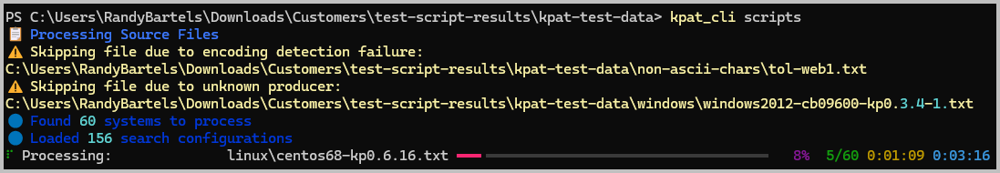
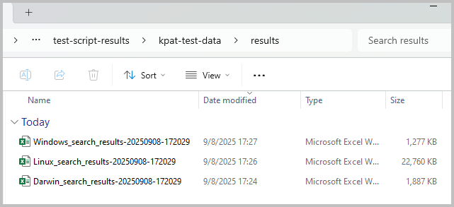
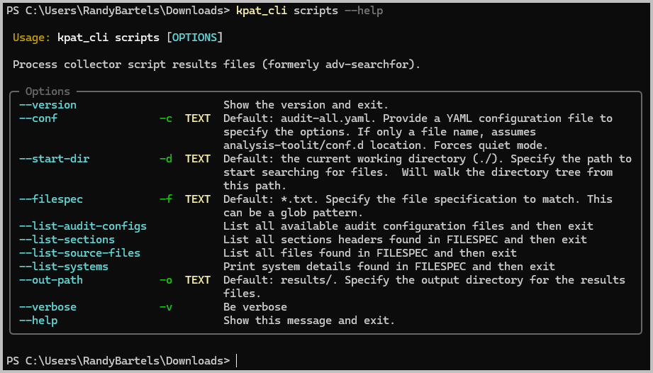
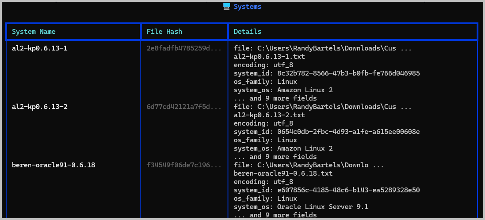
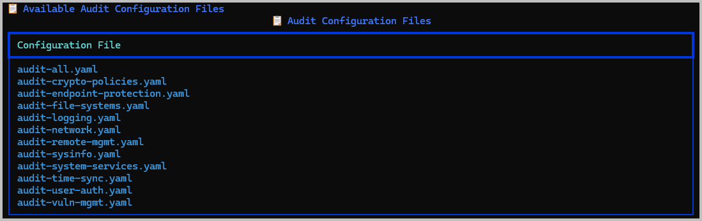
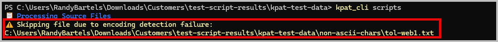

# Process Scripts User Guide

## Overview

The `kpat_cli scripts` command is the new-and-improved version of what used to be `adv-searchfor` in earlier versions of the toolkit.  Improvements include:

- Searches for all files starting at the current working directory or at a path provided by the user (`-d`)
- Processes all Windows, MacOS, and Linux systems concurrently -- no longer need to run them each separately
- Saves all results into separate OS-specific Excel workbook (one each for supported OS)
- Provides a search summary and a system summary worksheet

## Prerequisites

### System Requirements
- KP Analysis Toolkit installed (see [Installation Guide](../user-guides/installation.md))

### Knowledge Requirements
- Basic PowerShell (or other command line) skills ([PowerShell Primer](powershell-primer.md))
- System hardening and vulnerability management for operating systems being reviewed
    - Reference [CIS Benchmarks](https://www.cisecurity.org/cis-benchmarks) for hardening
- Excel skills for reviewing results
    - Basic Excel sort-and-filter
    - ***(Recommended)*** Basic Excel PivotTable skills -- helpful in reviewing time-stamped results such as monthly vulnerability management activities
    - ***(Advanced Use Cases)*** Excel PowerPivot -- only needed if you plan on doing advanced correlation across result sets

### Required Files/Data
- Script results from:
    - [`kpmacaudit`](https://github.com/kirkpatrickprice/macos-auditor) - MacOS data collection script
    - [`kpnixaudit`](https://github.com/kirkpatrickprice/linux-audit-scripts) -- Linux OS data collection script
    - [`kpwinaudit`](https://github.com/kirkpatrickprice/windows-audit-scripts/tree/main/kpwinaudit) - Windows OS data collection script

These collection scripts each produce a structured, text-based file that can be read by the `kpat_cli scripts` tool.  The results will be parsed and collated into OS-specific Excel spreadsheets for auditor review.

## Getting Started

### PowerShell Basics
See the [PowerShell Primer](powershell-primer.md) for additional help on getting started with PowerShell.

### Example 1: Process results from the collector scripts
**Use Case:** Customer has returned their script results based on the sample chosen by the auditor


**Steps:**

1. Unzip and organize the files into the most meaningful arrangement based on your project.  For example, create folders for:
    - Different operating systems
    - Function group such as "Workstations", "Developers" or "HR"
2. Launch PowerShell ([PowerShell Primer](powershell-primer.md))
3. Change to your project folder and run `kpat_cli scripts`

    ```powershell
    # Change to scripts folder
    cd "Downloads\Customers\Acme Corp\Scripts Results"

    # Run kpat_cli
    kpat_cli scripts
    ```

4. The tool will begin parsing all of the files it can find in the current folder and any sub-folders.  Warning messages will be displayed if it finds a file that it can't process.

    

5. Review the results in the `results/` folder
    - Results are stored in a `results/` folder relative to the folder where `kpat_cli` started its search from
    - There will be a separate Excel workbook for `Linux`, `Darwin` (MacOS), and `Windows` operating systems
    - Each file will be time-stamped to when you started the analysis

    

## Core Functionality

### Basic Usage

The typical command doesn't require any options or flags.  It will find and process any `.txt` files in the current folder and all sub-folders.

```powershell
kpat_cli scripts
```

### Advanced Options

Advanced options are available to display information about the internal workings of the `scripts` command and to change the default behavior.



#### Information Options

Each of the informational commands start with `--list-*` and will provide details about the inner workings of the `scripts` tool.  Options include:

| Command Option | Description | Default |
|---|---|---|
| `--list-audit-configs` | Show the list of available audit configurations | `audit-all.yaml` |
| `--list-source-files` | Show all of the files that will be discovered by the tool | N/A |
| `--list-systems` | Pre-process all discovered files to show the system details that will be used when extracting results | N/A |
| `--list-sections` | Not implemented and will be removed from a future version | N/A |

There are also `--verbose` options for each of these commands to increase the amount of information that will be shown.  This is helpful for troubleshooting.

```powershell
# Show System Info with verbose details
kpat_cli scripts --list-systems --verbose
```



#### Change the Output Folder
You can change the results folder to something else using the `--out-path` option.

```powershell
# Provide a different results folder
kpat_cli scripts --out-path "C:\Users\YourName\Downloads\Temp\"
```

The files will still be named using their OS-type and a timestamp, but they'll now be located in the `Temp` folder.

#### Change the starting folder
The typical workflow involves changing to the folder where you want to start the file search from.  But you can also override the starting folder when you start `kpat_cli scripts`:

```powershell
# Override the starting folder
kpat_cli scripts -d "C:\path\to\my\starting\folder"
```

#### Changing the Audit Configuration
The default configuration will process all Windows, MacOS and Linux systems (`audit-all.yaml`) that it can find when scanning folder the folder hiearchy.  You can override this behavior and force just one policy or operating system.

1. List the available audit configuration files

    ```powershell
    kpat_cli scripts --list-audit-configs
    ```

    

2. Override the default
    ```powershell
    # Extract only vulnerability management-related results
    kpat_cli scripts -c audit-vuln-mgmt.yaml
    ```

## Output and Results

### Output Files
All results are written into OS-specific Excel files.  The results for each search pattern are stored in separate worksheets, and a search summary and system summary worksheet will also be written:

- Starting folder (e.g. `C:\Users\YourName\Downloads\Customers\Acme Corp\scripts\`)
    - `results\` folder
        - Filename: <OSType\>_search_results_timestamp.xlsx
            - `Summary` worksheet
            - `System Summary` worksheet
            - ... Alphabetized search results worksheets

### Interpreting Results
See [Working with the Results](scripts-results.md)

## Troubleshooting

When `kpat_cli scripts` encounters errors in processing files or exporting results, it will note the error and continue with the next file.  The most common warning conditions are listed below:

### Common Issues

#### File encoding errors

Encoding errors occur when the source file's encoding can't be determined.  The most common file encodings are follows:

| Platform | Encoding |
|---|---|
| Linux | `utf-8`<br>`ascii` |
| MacOS | `utf-8`<br>`ascii` |
| Windows | `utf-8`<br>`utf-16` |

**Symptoms:**



**Solutions:**

Encoding errors indicate that either the file was not produced by one of the collection scripts or that it was corrupted.

- Try opening the file in VS Code, Notepad++ or Notepad.
- Compare the file with one that it is working; the structure of the file should be immediately evident.
- If the structure looks consistent, but you observe byte patterns or obscure characters, the file has become corrupted.

#### Unknown producer error

An `Unknown producer` error indicates the file was not created by one of the supported collection scripts.  The tool looks for one of the following, and if it can't find it, this error is reported:

- `KPMACVERSION`: Produced by `kpmacaudit.sh`
- `KPNIXVERSION`: Produced by `kpnixaudit.sh`
- `KPWINVERSION`: Produced by `kpwinaudit.ps1`

### Getting Help
```powershell
kp-analysis-toolkit [module] --help
```

## Related Documentation

- [Working with Results](scripts-results.md)
- [Installation Guide](installation.md)
- [Other Related Guides](index.md)

---